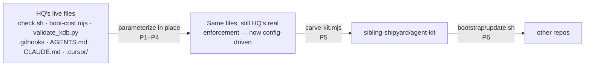

# agent-kit — extract the HQ agent setup into a portable kit

> Status: Current · Owner: Tech Lead · Verified: 2026-09-01 · Issues: —

## Context

HQ's agent setup — routing gate, role docs, ADR discipline, `.githooks` + CI enforcement — works
across Claude Code, Codex, and Cursor today, in one repo. The athlete works across several repos.
None of the mechanism is HQ-specific; it has just never left HQ.

## Decision

**Extract in place, then carve out** — the same pattern `carve-skeleton.mjs` already uses for
`engine/`: that directory isn't a redesigned copy, it's HQ's actual running code, copied verbatim.
No parallel "generic" tree built ahead of proof. Parameterize HQ's live scripts where they hardcode
HQ specifics, run them as HQ's real enforcement for a while, then carve.

**The two hardcoded spots, and the fix — both land in HQ's real files, not a copy:**
1. `check.sh`'s `add_check` calls are HQ's stack (`npm run check`, `compose-soul --check`, `python3
   -m unittest`). Move them into `platform/scripts/checks.conf` (one line per check:
   `name|dir|cmd|policy`); `check.sh` reads the conf. The KB checks (`validate_kdb.py`) stay
   hardcoded in the script — every consumer runs them, so they don't belong in a conf.
2. `boot-cost.mjs`'s `ROLES` array is a hardcoded transcription of HQ's role docs. Move it to
   `platform/scripts/boot-manifest.json` — same "transcribed, not parsed" reasoning the script's
   own comment already gives, just relocated so the `.mjs` stops being repo-specific.

Both changes must be **behavior-neutral**: `checks.conf` reproduces today's exact check list,
`boot-manifest.json` reproduces today's exact `ROLES` array. Diff `check.sh` / `boot-cost.mjs`
output before and after each change — same rigor `compose-soul --check` already applies to drift.

Everything else that's already generic gets marked, not moved: `.githooks/{pre-commit,pre-push}`,
`kdb/scripts/{validate_kdb.py,gen_adr_index.py,adr_readability.py}` (the KB-format and staleness
rules — the soul-history guard stays an HQ-only addendum, not exported), `CLAUDE.md`,
`.cursor/rules/routing-gate.mdc`. `AGENTS.md` § How all agents work gets wrapped in
`<!-- AGENT-KIT:START/END -->` markers **in place** — the marker is what the carve script reads,
so there's no separate template file to keep in sync with the prose everyone actually boots from.

## Phases

| id | files | deps | owner |
|---|---|---|---|
| P1 | `platform/scripts/{check.sh,checks.conf}` | — | Backend Builder |
| P2 | `platform/scripts/{boot-cost.mjs,boot-manifest.json}` | — | Backend Builder |
| P3 | `AGENTS.md`, `kdb/doc-style.md`, `.github/CONVENTIONS.md` (add `AGENT-KIT` markers, no prose change) | — | Backend Builder |
| P4 | `platform/scripts/gen-codeowners.py`, `CODEOWNERS` | — | Backend Builder |
| P5 | `platform/agent-kit/carve-kit.mjs`, `.github/agents/_template.md`, `kdb/decisions/0000-template.md` (copy target, no edit) | P1–P4 | Backend Builder |
| P6 | `platform/agent-kit/bootstrap/{update.sh,VERSION,README.md}` | — | Backend Builder |
| P7 | `kdb/decisions/0036-*.md`, `docs/eng-docs/agent-kit.md`, `AGENTS.md` (§ What This Repo Is) | P1–P6 | Tech Lead |

P1–P4 and P6 touch disjoint files and run in parallel. P5 depends on P1–P4 landing (it copies
their output). P7 closes the plan.

### What each phase holds

1. **P1 — check.sh.** Generic runner unchanged; check list moves to `checks.conf`. Prove
	behavior-neutral: `bash platform/scripts/check.sh` runs the identical eight checks, same order.
2. **P2 — boot-cost.mjs.** `ROLES` read from `boot-manifest.json` at runtime. Prove behavior-neutral:
	`node platform/scripts/boot-cost.mjs --json` byte-identical to today's, modulo the `generated_at`
	field.
3. **P3 — markers, no prose edits.** Wrap the sections that are genuinely portable (delegation,
	execution loop, P0–P3, voice, Learnings cap, doc-style typed phases, generic CONVENTIONS rules)
	in `<!-- AGENT-KIT:START id="..." /END -->`. HQ-specific prose (the routing table, soul rules,
	monorepo band layout) stays outside the markers. This PR changes zero rendered behavior — it's
	pure annotation.
4. **P4 — CODEOWNERS.** `gen-codeowners.py` reads `AGENTS.md`'s routing table (already the one
	source for who owns what) and emits `CODEOWNERS`. Immediate HQ win, independent of the kit:
	replaces a table that's asserted in `AGENTS.md`, `tech-lead.md`, and `cyclops.md` with zero
	cross-check today.
5. **P5 — carve-kit.mjs.** Mirrors `carve-skeleton.mjs`'s copy-map exactly: reads the marked
	sections + `checks.conf`/`boot-manifest.json` (as starter/example, not copied verbatim —
	consumer repos get their own) + `.githooks/` + `kdb/scripts/{validate_kdb.py minus soul-history
	guard,gen_adr_index.py,adr_readability.py}` + adapters + two new generic templates
	(`.github/agents/_template.md`, since HQ's own role docs are HQ-specific content, not a
	template). Writes `sibling-shipyard/agent-kit`.
6. **P6 — bootstrap/update.sh.** The one genuinely new, kit-only asset — HQ has no analog, since HQ
	*is* the source, not a consumer. POSIX shell + `python3`, no node, no agent required. `--check`
	reports drift against the pinned `VERSION`, `--dry-run` writes nothing, idempotent.
7. **P7 — dogfood + docs.** Install the carved kit into a scratch clone of a different real repo.
	ADR 0036 records the in-place-then-carve pattern (and why: `carve-skeleton.mjs` precedent, zero
	duplication window); `docs/eng-docs/agent-kit.md` is the reference doc.

## Done when

1. P1–P4 land with **zero behavioral diff** to HQ's own `check.sh`, `boot-cost.mjs`, and rendered
	`AGENTS.md` — verified by the before/after diffs named in each phase, not asserted.
2. `python3 platform/scripts/gen-codeowners.py` output matches `AGENTS.md`'s routing table; HQ's
	`CODEOWNERS` is real and reviewed.
3. `node platform/agent-kit/carve-kit.mjs` produces a tree that installs clean into an empty repo:
	`bash bootstrap/update.sh <fresh-repo>` stamps a working KB, `validate_kdb.py` passes un-modified.
4. **Propagation test.** Bump a rule in HQ's `validate_kdb.py`, carve again, tag it. A consumer
	repo's next `check.sh` run picks it up with no file touched (it's `.githooks`-invariant); a
	marked `AGENTS.md` section needs one `update.sh` run; a repo pinned to an old tag is reported
	stale, not silently behind.
5. `grep -riE 'claude|cursor|codex|antigravity'` over the carved tree, excluding `adapters/`, is
	empty.
6. Deleting the carved tree's `adapters/` entirely leaves a repo whose rules still work and still
	enforce — `.githooks` is invariant, not an adapter.
7. HQ's own `check.sh` and `validate_kdb.py` still pass at every phase — this plan never has HQ red.

## Rejected

- **Building `platform/agent-kit/` as a parallel tree, parameterized from scratch, dogfooded
	elsewhere before touching HQ.** The original shape of this plan. Two live copies of the same
	enforcement during the exact window meant to prove "improvements propagate without drift" is
	the drift risk this whole plan exists to remove.
- **Porting the 6-agent roster or the routing table itself.** Coach Phelps, Cyclops, and the
	specific ownership boundaries are HQ's domain, not the kit's. The kit ships the *mechanism*
	(routing gate lives in `AGENTS.md` §1, never a hook; role docs; ADRs) with placeholder content.

## Deferred

- **Actually running `carve-kit.mjs` against a new GitHub repo** (creating
	`sibling-shipyard/agent-kit`) is a deliberate operator action, same as any `coach-skeleton`
	carve — athlete's call on timing, not automatic on P5 landing.
- **P2** — Claude Code plugin + marketplace wrapping the same `bootstrap/update.sh`.
- **P3** — boundary-drift CI check: a PR's changed-files list against `CODEOWNERS`, `warn` today,
	`block` once P4 has run for a while. Prove it at HQ first.
