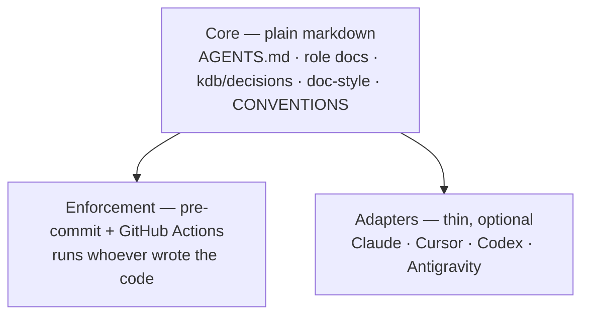

# agent-kit — extract the HQ agent setup into a portable kit

> Status: Current · Owner: Tech Lead · Verified: 2026-08-21

## Context

The agent setup here — routing table, role docs, ADR discipline, doc style, enforcement — is
the most reusable thing HQ has built, and it is welded to this repo. The athlete works in
Claude Code, Cursor, Codex and Antigravity, so the kit must be provider-agnostic: plain files
first, per-tool adapters last.

## Decision

Build `platform/agent-kit/` in HQ, install it into other repos with one shell script, carve it
to its own repo later — the `coach-skeleton` pattern, and `platform/` is where operator IP lives
(ADR 0011).

Three tiers, in dependency order:

**The routing gate lives in `AGENTS.md` §1, never in a hook.** Cursor, Codex and Antigravity
have no hooks; anything only in the hook is lost there. The Claude SessionStart hook restates
the table as a booster and is allowed to be deleted without loss.

**Enforcement is what makes agnosticism hold.** A rule an agent can ignore is a suggestion. CI
and the git hook fire regardless of which tool produced the diff.

## Phases

| id | files | deps | owner |
|---|---|---|---|
| P1 | `platform/agent-kit/{install.sh,README.md,VERSION}` | — | Bob |
| P2 | `platform/agent-kit/templates/**` | P1 | Bob |
| P3 | `platform/agent-kit/tools/kdb/**`, `templates/workflows/validate-kb.yml` | P1 | Bob |
| P4 | `platform/agent-kit/adapters/**` | P1 | Bob |
| P5 | `platform/agent-kit/skills/**` | P1 | Bob |
| P6 | `kdb/decisions/0027-*.md`, `docs/eng-docs/agent-kit.md`, `AGENTS.md` | P2–P5 | Tech Lead |

P2–P5 touch disjoint trees and can run in parallel once P1 lands.

### What each phase holds

1. **P1 — installer.** `bash install.sh <repo> [area ...]`. POSIX shell + `python3` only: no node,
	no npm, no agent required to run it. Never overwrites an existing file. `--check` reports drift
	against `VERSION` instead of writing.
2. **P2 — core templates.** Root `AGENTS.md` (routing table + How-all-agents-work rules: execution
	loop, delegation, P0–P3, scope guard, voice, Learnings), per-area `AGENTS.md`, role-doc template,
	`CONVENTIONS.md`, `doc-style.md`, eng-docs README, ADR template + README, issue template. Every
	file provider-neutral — no tool named anywhere in tier 1.
3. **P3 — enforcement.** `validate_kdb.py` + `gen_adr_index.py` + `pre-commit`, lifted from
	`kdb/scripts/` and de-HQ'd. Two new checks: **12,000-char cap per rules file** (Antigravity's hard
	limit) and the role-doc `## Learnings` byte cap. Plus `validate-kb.yml` for Actions.
4. **P4 — adapters.** `CLAUDE.md` → `@AGENTS.md`; `.claude/settings.json` + generic `session-start.sh`
	that reads the routing table out of `AGENTS.md` instead of hardcoding roles; `.cursor/rules/`
	only for glob-scoped rules AGENTS.md cannot express. Codex and Antigravity read `AGENTS.md`
	as-is — their adapter is a README note, no files.
5. **P5 — skills.** `kb-scaffold` and `design-doc-style` move from account-synced copies into the
	repo as the source of truth, generalized off HQ specifics. Synced copies get dropped once the kit
	installs them.
6. **P6 — dogfood + docs.** Install into a scratch clone, run the validators, then ADR 0027 (kit
	home + carve-later) and `docs/eng-docs/agent-kit.md`.

## Done when

1. `bash platform/agent-kit/install.sh /tmp/fresh-repo ui api` stamps a working KB into an empty
	git repo, and `python3 tools/kdb/validate_kdb.py` passes there.
2. Re-running the installer changes nothing (idempotent), and `--check` reports clean.
3. Tier 1 contains no provider name — `grep -riE 'claude|cursor|codex|antigravity' templates/` is
	empty.
4. Deleting the whole `adapters/` tree leaves a repo whose rules still work and still enforce.
5. HQ's own validators still pass — nothing here moves HQ files yet.

## Deferred

- **P2** — migrate HQ itself onto the kit (`.claude/`, `kdb/scripts/` become installed copies).
	Dogfooding is what stops it rotting, but it is a real path migration; do it after one other repo
	proves the kit.
- **P2** — carve `platform/agent-kit/` out to `sibling-shipyard/agent-kit` with a `carve-kit.mjs`
	mirroring `carve-skeleton.mjs`.
- **P3** — Claude Code plugin + marketplace wrapping the same installer.
- **P3** — `install.sh --update` that migrates an already-installed repo across kit versions.
