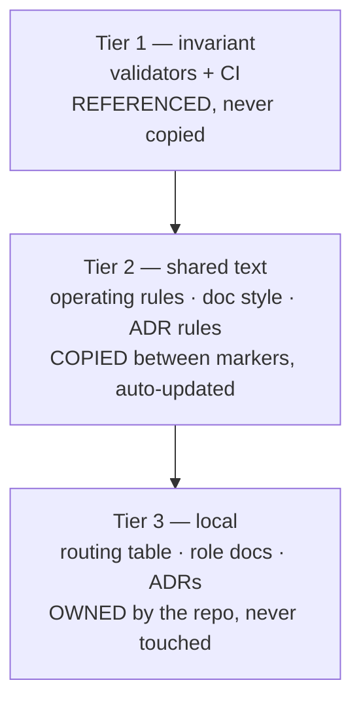

# agent-kit — extract the HQ agent setup into a portable kit

> Status: Current · Owner: Tech Lead · Verified: 2026-08-21

## Context

The agent setup here — routing table, role docs, ADR discipline, doc style, enforcement — is
the most reusable thing HQ has built, and it is welded to this repo. The athlete works in
Claude Code, Cursor, Codex and Antigravity, so the kit must be provider-agnostic: plain files
first, per-tool adapters last.

## Decision

Build `platform/agent-kit/` in HQ, carve it to its own repo later — the `coach-skeleton` pattern,
and `platform/` is where operator IP lives (ADR 0011).

**Split the kit by who owns each file.** An installer that copies everything produces one fork of
the kit per repo, so an improvement has to be hand-carried five times. That is the failure mode
this design exists to avoid.

| Tier | Lives where | How an improvement reaches a repo |
|---|---|---|
| Invariant | `agent-kit` repo | Nothing to do — reusable workflow pinned at `@v1` |
| Managed text | Each repo, inside markers | `update.sh` rewrites the block; CI flags drift |
| Local | Each repo | Never — it is the repo's own content |

1. **Tier 1 — reusable workflow.** Each repo gets one line:
	`uses: sibling-shipyard/agent-kit/.github/workflows/validate-kb.yml@v1`. Validators live once,
	in the kit. Provider-agnostic by construction: it is CI, not an agent. (Private kit + private
	consumers needs Actions access enabled on the kit repo — check before locking the tag scheme.)
2. **Tier 2 — managed blocks.** Agents read local files, so shared rule text must be present in
	each repo. Wrap it in `<!-- AGENT-KIT:START -->` / `<!-- AGENT-KIT:END -->` — the same marker
	trick as the existing `ADR-INDEX` block. `update.sh` rewrites only between markers, so local
	edits outside them survive. CI fails when a block drifts from the pinned `VERSION`, which turns
	staleness from a hope into a check.
3. **Tier 3 — local.** Routing table, role docs, ADRs, area conventions. Stamped once at install,
	then the kit has no opinion.

**Bootstrap is ~50 lines per repo:** `.agent-kit/{update.sh,VERSION}`. Install is one `curl`.
Rollout of an improvement: tag the kit, then `update.sh` per repo — or nothing at all for tier 1.

**The routing gate lives in `AGENTS.md` §1, never in a hook.** Cursor, Codex and Antigravity have
no hooks; anything only in the hook is lost there. The Claude SessionStart hook restates the table
as a booster and can be deleted without loss.

**Enforcement is what makes agnosticism hold.** A rule an agent can ignore is a suggestion. CI and
the git hook fire regardless of which tool produced the diff.

**The two skills stop being skills.** `kb-scaffold` and `design-doc-style` are Claude-account-level:
Cursor and Codex cannot see them and they do not propagate. Their content becomes tier-2 managed
blocks. Cost: no `/design-doc-style` command in Claude. Gain: it works in all four tools and
updates with the kit.

## Phases

| id | files | deps | owner |
|---|---|---|---|
| P1 | `platform/agent-kit/{bootstrap/update.sh,VERSION,README.md}` | — | Bob |
| P2 | `platform/agent-kit/blocks/**` (tier-2 managed text) | P1 | Bob |
| P3 | `platform/agent-kit/{tools/kdb/**,workflows/validate-kb.yml}` (tier 1) | P1 | Bob |
| P4 | `platform/agent-kit/templates/**` (tier-3 one-time stamps) | P1 | Bob |
| P5 | `platform/agent-kit/adapters/**` | P1 | Bob |
| P6 | `kdb/decisions/0027-*.md`, `docs/eng-docs/agent-kit.md`, `AGENTS.md` | P2–P5 | Tech Lead |

P2–P5 touch disjoint trees and can run in parallel once P1 lands.

### What each phase holds

1. **P1 — bootstrap.** `update.sh` (POSIX shell + `python3`, no node, no agent) fetches the pinned
	kit version, rewrites managed blocks, reports drift under `--check`, writes nothing under
	`--dry-run`. Idempotent.
2. **P2 — managed blocks.** The How-all-agents-work rules (execution loop, delegation, P0–P3, scope
	guard, voice, Learnings), `doc-style.md`, ADR rules, `CONVENTIONS.md`, plus the two ex-skills.
	Every block provider-neutral — no tool named in tier 1 or 2.
3. **P3 — invariant.** `validate_kdb.py` + `gen_adr_index.py` + `pre-commit`, lifted from
	`kdb/scripts/` and de-HQ'd, behind a reusable workflow. Three checks beyond today's: managed-block
	drift, **12,000-char cap per rules file** (Antigravity's hard limit), role-doc `## Learnings`
	byte cap.
4. **P4 — one-time stamps.** Root `AGENTS.md` shell with the marker slots, per-area `AGENTS.md`,
	role-doc template, ADR template + README, issue template. Written once, never rewritten.
5. **P5 — adapters.** `CLAUDE.md` → `@AGENTS.md`; `.claude/settings.json` + a generic
	`session-start.sh` that reads roles out of `AGENTS.md` rather than hardcoding them;
	`.cursor/rules/` only for glob-scoped rules AGENTS.md cannot express. Codex and Antigravity read
	`AGENTS.md` as-is — their adapter is a README note, no files.
6. **P6 — dogfood + docs.** Install into a scratch clone, run the validators, then ADR 0027 (kit
	home, tier split, carve-later) and `docs/eng-docs/agent-kit.md`.

## Done when

1. `curl`-bootstrapping into an empty git repo stamps a working KB, and the reusable workflow
	passes there.
2. Re-running `update.sh` changes nothing; `--check` reports clean.
3. **Propagation test — the one that matters.** Change a validator in the kit, tag it. A consumer
	repo picks it up with no file edit at all (tier 1) and with one `update.sh` run (tier 2). A repo
	still pinned to the old tag is *reported stale by CI*, not silently drifted.
4. Local edits outside the markers survive an update.
5. Tiers 1–2 contain no provider name — `grep -riE 'claude|cursor|codex|antigravity' blocks/ tools/`
	is empty.
6. Deleting the whole `adapters/` tree leaves a repo whose rules still work and still enforce.
7. HQ's own validators still pass — nothing here moves HQ files yet.

## Deferred

- **P2** — migrate HQ itself onto the kit (`.claude/`, `kdb/scripts/` become installed copies).
	Dogfooding is what stops it rotting, but it is a real path migration; do it after one other repo
	proves the kit.
- **P2** — carve `platform/agent-kit/` out to `sibling-shipyard/agent-kit` with a `carve-kit.mjs`
	mirroring `carve-skeleton.mjs`.
- **P3** — Claude Code plugin + marketplace wrapping the same installer.
- **P3** — a `latest` channel for repos that would rather float than pin a tag.
