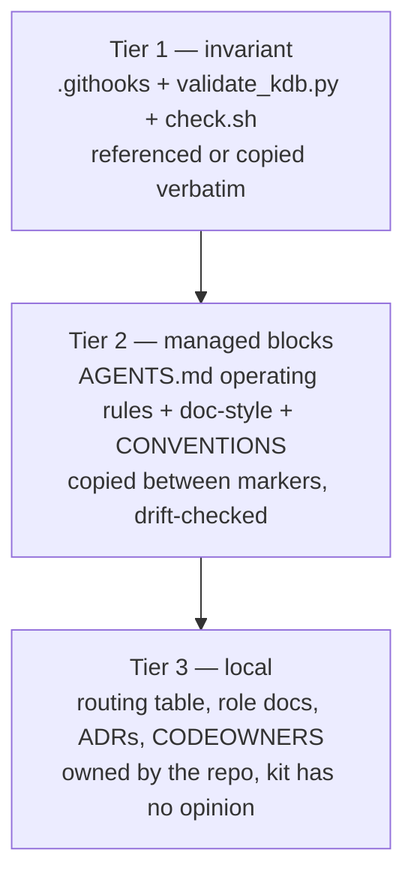

# agent-kit — extract the HQ agent setup into a portable kit

> Status: Current · Owner: Tech Lead · Verified: 2026-09-01 · Issues: —

## Context

HQ's agent setup — routing gate, role docs, ADR discipline, `.githooks` + CI enforcement — works
across Claude Code, Codex, and Cursor today, in one repo. The athlete works across several repos.
None of the mechanism is HQ-specific; it has just never left HQ.

## Decision

Build `platform/agent-kit/` in HQ — carve to its own repo later, `coach-skeleton`'s pattern
(ADR 0011). Lift the existing scripts near-verbatim; parameterize the two places they hardcode HQ.

**The two hardcoded spots, and the fix:**
1. `check.sh`'s `add_check` calls are HQ's stack (`npm run check`, `compose-soul --check`, `python3
   -m unittest`). Split it: a generic runner (tier 1, unchanged) reads its check list from
   `platform/agent-kit/checks.conf` (tier 3, one line per repo: `name|dir|cmd|policy`). The KB
   checks (`validate_kdb.py`) are always appended — they don't belong in the conf.
2. `boot-cost.mjs`'s `ROLES` array is a hardcoded transcription of HQ's role docs. Move it to
   `platform/agent-kit/boot-manifest.json` (tier 3) — same "transcribed, not parsed" reasoning the
   script's own comment gives, just relocated so the `.mjs` stops being repo-specific.

Everything else — ADR linting, path-existence checking, staleness, the Learnings cap, the git
hooks, the pointer-adapter pattern (`CLAUDE.md`, `.cursor/rules/`) — is copied as-is.

## Phases

| id | files | deps | owner |
|---|---|---|---|
| P1 | `platform/agent-kit/{bootstrap/update.sh,VERSION,README.md}` | — | Backend Builder |
| P2 | `platform/agent-kit/tools/{kdb/**,check.sh,boot-cost.mjs}` (tier 1) | P1 | Backend Builder |
| P3 | `platform/agent-kit/blocks/**` (tier-2 managed text) | P1 | Backend Builder |
| P4 | `platform/agent-kit/templates/**` (tier-3 one-time stamps, incl. CODEOWNERS generator) | P1 | Backend Builder |
| P5 | `platform/agent-kit/adapters/**` | P1 | Backend Builder |
| P6 | `kdb/decisions/0036-*.md`, `docs/eng-docs/agent-kit.md`, `AGENTS.md` | P2–P5 | Tech Lead |

P2–P5 touch disjoint trees, run in parallel once P1 lands.

### What each phase holds

1. **P1 — bootstrap.** `update.sh`: POSIX shell + `python3`, no node, no agent required. Fetches
	the pinned kit tag, rewrites tier-2 managed blocks, `--check` reports drift, `--dry-run` writes
	nothing. Idempotent — a second run changes nothing.
2. **P2 — invariant.** `check.sh` generalized to read `checks.conf`; `validate_kdb.py` +
	`gen_adr_index.py` + `adr_readability.py` + `boot-cost.mjs` lifted verbatim, de-HQ'd per the two
	fixes above. `.githooks/{pre-commit,pre-push}` copied unchanged — they're already generic.
3. **P3 — managed blocks.** `AGENTS.md` § How all agents work (delegation, execution loop, P0–P3,
	voice, Learnings cap), `kdb/doc-style.md`, the generic parts of `.github/CONVENTIONS.md`, ADR
	template + README, issue template. Wrapped in `<!-- AGENT-KIT:START/END -->` markers, same trick
	as the `ADR-INDEX` block already uses. Provider-neutral — no tool named in tier 1 or 2.
4. **P4 — one-time stamps.** Root `AGENTS.md` shell with marker slots + a routing-table stub,
	per-area `AGENTS.md`, role-doc template with a `## Learnings` slot, `checks.conf` and
	`boot-manifest.json` starter files. A `gen-codeowners.py` that reads the same routing table
	`AGENTS.md` already carries and emits `CODEOWNERS` — one source instead of a second table
	someone forgets to update.
5. **P5 — adapters.** `CLAUDE.md` → `@AGENTS.md`; `.cursor/rules/routing-gate.mdc` pointer; a
	README note for Codex and Antigravity (both read `AGENTS.md` natively, no file needed).
	`.claude/settings.json` + hooks are optional boosters — the README says outright they may catch
	a problem earlier, never exclusively.
6. **P6 — dogfood + docs.** Install into a scratch clone of a different real repo (not a throwaway
	empty one — `checks.conf` needs a real toolchain to prove it against). ADR 0036 records the kit's
	home and the tier split; `docs/eng-docs/agent-kit.md` is the reference doc.

## Done when

1. `bash platform/agent-kit/bootstrap/update.sh <fresh-repo>` stamps a working KB, and
	`python3 tools/kdb/validate_kdb.py` passes there un-modified.
2. `--check` reports clean on a second run; a local edit outside the markers survives an update.
3. **Propagation test.** Bump a rule in `validate_kdb.py` in the kit, tag it. A consumer repo's
	next `check.sh` run (tier 1, no file touched) picks it up; `AGENTS.md` § How all agents work
	needs one `update.sh` run (tier 2); a repo pinned to the old tag is reported stale, not silently
	behind.
4. `grep -riE 'claude|cursor|codex|antigravity' blocks/ tools/` is empty.
5. Deleting `adapters/` entirely leaves a repo whose rules still work and still enforce — `.githooks`
	is tier 1, not an adapter.
6. `gen-codeowners.py`'s output matches `AGENTS.md`'s routing table on a fresh stamp.
7. HQ's own `check.sh` and `validate_kdb.py` still pass — nothing here moves HQ's files yet.

## Rejected

- **Porting the 6-agent roster or the routing table itself.** Coach Phelps, Cyclops, and the
	specific ownership boundaries are HQ's domain, not the kit's. The kit ships the *mechanism*
	(routing gate lives in `AGENTS.md` §1, never a hook; role docs; ADRs) with placeholder content.

## Deferred

- **P2** — migrate HQ itself onto the kit (`.claude/`, `kdb/scripts/`, `platform/scripts/check.sh`
	become installed copies, `checks.conf` + `boot-manifest.json` externalize HQ's hardcoded bits).
	Do after one other repo proves the kit.
- **P2** — carve `platform/agent-kit/` out to `sibling-shipyard/agent-kit`.
- **P3** — Claude Code plugin + marketplace wrapping the same bootstrap.
- **P3** — boundary-drift CI check: a PR's changed-files list against the routing table's declared
	scope, `warn` today, `block` once `gen-codeowners.py` output is trusted. Prove it at HQ first.
