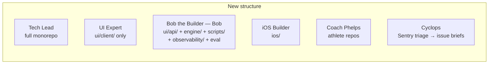

# Agent-Layer Restructure

> Status: Plan · Owner: Tech Lead · Created: 2026-08-30

## Context

The system has outgrown the original agent boundaries. Bob is underloaded — his scope
(`engine/core/`, `scripts/`, `user_data/`) covers a small fraction of the backend work. UI Expert
owns two different jobs: the React dashboard (`ui/client/`) and the entire serverless backend
(`ui/api/` — Gemini orchestration, coach-chat, auth, observability, eval). Those are different
domains competing for one agent's context window.

Sentry is now live across all three surfaces (ADR 0032, #585). The test structure has been
reorganized into layers. The agent layer should catch up.

## The Restructure

### Ownership map

| Agent | Before | After |
|---|---|---|
| **Tech Lead** | Full monorepo | Same — gains Cyclops oversight |
| **UI Expert** | All of `ui/` | `ui/client/` only — components, widgets, styling, dashboard UX |
| **Bob** | `engine/core/`, `scripts/`, `user_data/` | **Bob the Builder** — adds `ui/api/`, `ui/observability/`, `ui/scripts/`, all `ui/api/` tests |
| **iOS Builder** | `ios/` only | Same |
| **Coach Phelps** | Athlete repos only | Same |
| **Cyclops** *(new)* | — | Sentry event triage → incident briefs |

### Doc ownership shifts

| Doc | From | To |
|---|---|---|
| `coach-chat-flow.md` + sub-docs | UI Expert | Bob the Builder |
| `gemini-flow.md` | UI Expert | Bob the Builder |
| `github-auth.md` | UI Expert | Bob the Builder |
| `llm-provider-current.md` | Tech Lead | Bob the Builder |
| `env-vars.md` | Tech Lead | Bob the Builder |
| `coach-data-schema.md` | (unlisted) | Bob the Builder |
| Widget Design Philosophy | UI Expert | UI Expert (stays) |

### Cyclops — Sentry triage agent

Reads Sentry events and produces a one-page incident brief:

1. What broke (error, stack, tags: `turn_mode`, `upstream_status`, `athlete_id`).
2. Which file(s) are involved (`file:line`).
3. Which agent owns the fix.
4. Suggested root cause + fix direction.
5. Recommended priority (P0/P1/P2).

**v1:** manual trigger, paste-based. **v2 (deferred):** Sentry API skill + webhook auto-triage.

Cyclops's detailed tooling section will be fleshed out after the Sentry architecture doc lands.

## Stack-Ranked Improvements

### P0 — Ship with the restructure

1. Role doc rewrites (Bob the Builder, UI Expert trim, Cyclops skeleton, AGENTS.md, tech-lead.md).
2. ADR 0034 for the restructure.
3. Learnings migration between role docs.

### P1 — Shortly after

4. Bob the Builder owns eval harness explicitly (#329).
5. Cyclops Sentry skill (MCP or API skill with `SENTRY_AUTH_TOKEN`).
6. Observability eng-doc — one page mapping the full Sentry architecture.
7. Structured logging convergence (lightweight `log()` helper for breadcrumb context).
8. Cross-surface error mapping (shared taxonomy between iOS + web).

### P2 — Athlete's call

9. Cyclops v2: auto-triage via webhook.
10. Agent boot-time scope check.
11. `ui/api/` as a conceptually separate TS package.
12. Proactive Cyclops digest (weekly summary).
13. Agent-to-agent incident coordination.

## Deliverables

- [ ] ADR `0034-agent-layer-restructure.md`.
- [ ] Rewritten `.github/agents/bob-the-builder.md` → Bob the Builder.
- [ ] Trimmed `.github/agents/ui-expert.md` (frontend only).
- [ ] New `.github/agents/cyclops.md` (skeleton).
- [ ] Updated `AGENTS.md` (routing table, team table).
- [ ] Updated `.github/agents/tech-lead.md` (Team table).
- [ ] Learnings migration between role docs.

## Open Decisions

- **Naming:** "Bob the Bob the Builder" vs "Bob the Builder" vs keep "Bob the Builder"
- **Cyclops v1 tooling:** paste-only (ships now) vs Sentry API skill (needs `SENTRY_AUTH_TOKEN`)
- **ADR number:** 0034 (0030–0033 are taken)
