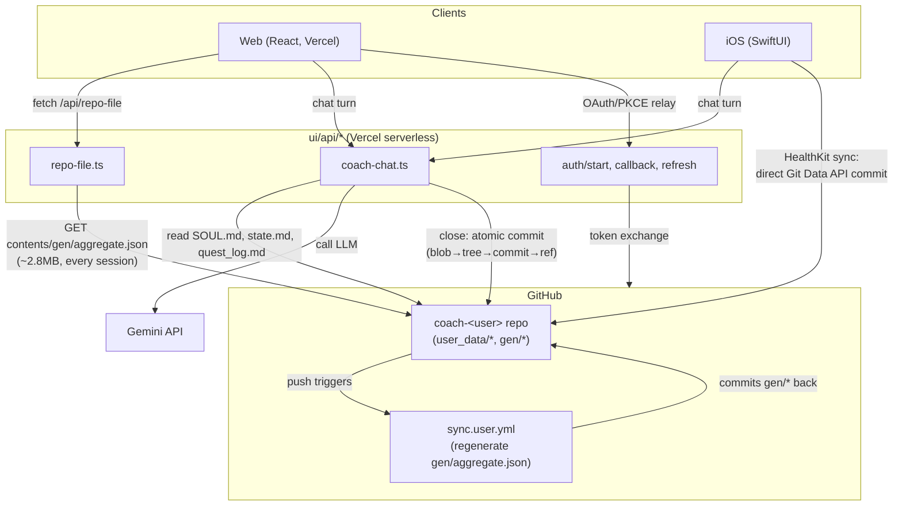
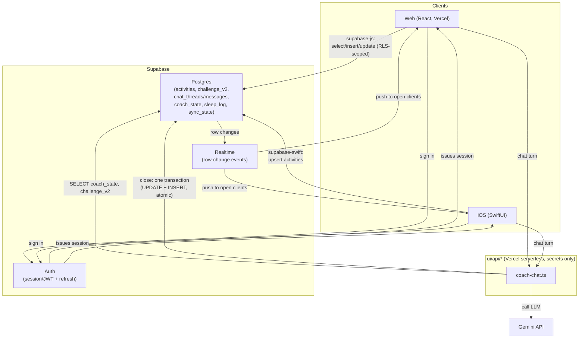
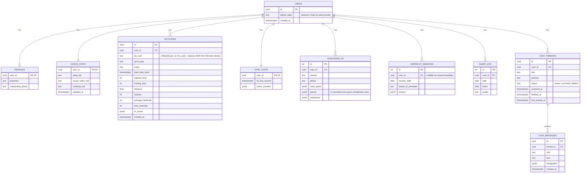

# Research: Backend options to replace GitHub-as-datastore

> Status: Current · Owner: Tech Lead · Verified: 2026-08-16

## Context

Every user repo (`coach-<user>`, forked from `coach-skeleton`) currently uses its own GitHub
repo as the entire persistence layer — auth, storage, and sync all ride on GitHub's OAuth +
Git Data API. `docs/eng-docs/scaling-plan.md` already flags this as a ceiling and sketches an
eventual move to "Postgres + object store... with GitHub demoted to an optional sync target."

I want to move now rather than at the informal ~10k-user trigger, for UX (real-time, no
per-turn full-file re-fetch) as well as engineering health. If I adopt a backend, GitHub
comes out entirely as a *datastore* — the code (this monorepo, `coach-phelps-hq`) stays on
GitHub as normal source control, deployed via Vercel as today. What changes is only the
per-user data layer: one `coach-<user>` GitHub repo per athlete goes away, replaced by rows
in a shared database. This doc extends the earlier recommendation (Supabase) with the full
mechanics of how every current GitHub-dependent feature — coach chat, iOS HealthKit sync,
the dashboard read path, auth — would actually work post-migration, plus per-user storage
sizing. Still research only, no code changes, no ADR filed yet.

## Industry context (why this shape, not another)

Nobody runs production apps with one GitHub repo per user as the database — that pattern
here is a byproduct of the coach being a BYO-Claude-Code file-editing agent, not a normal
app-architecture choice. The standard shape for a mobile+web app with per-user data and an
AI layer is:
- **Code**: one repo (or a few), deployed via CI/CD (Vercel/Railway/Fly/AWS). Already true
  here for `ui/` on Vercel — unaffected by this change.
- **User data**: a managed relational database (Postgres is the default today — Supabase,
  Neon, RDS) or a document store if data is loosely shaped (Firestore/DynamoDB). Multi-tenant
  via a `user_id` column + row-level security, not one DB/repo per user.
- **Auth**: a dedicated provider (Supabase Auth, Clerk, Auth0, Firebase Auth) decoupled from
  any developer-tool identity like GitHub.
- **Blob storage**: S3-compatible object storage, separate from the relational DB, only for
  actual binary data (images/video) — this app currently has none.
- **Mobile**: talks to the backend via that provider's native SDK, same DB as web.

This repo already follows the standard pattern for code; this doc is about bringing the data
half onto the same standard pattern, using Supabase as the concrete implementation of "managed
Postgres + Auth + Realtime + Storage."

## What GitHub is actually being asked to do today

Per-user data lives entirely as files in `user_data/`:

| File | Size today (golden dataset, ~6mo) | Shape | Growth |
|---|---|---|---|
| `activities/hist/*.json` | ~172KB across 165 files (~1KB/file) | one file per workout | **+1 file per synced activity, unbounded** |
| `activities/match_history.json` | bundled in above | structured badminton parse | grows with activities |
| `ledger/challenge_v2.json` | 6.3KB | one JSON blob, `completed_dates[]`/`missed_dates[]` arrays | **unbounded, never pruned** |
| `coach/chat_history.json` | capped | thread list, max 7 threads | bounded (ADR 0012) |
| `coach/state.md` | ~14KB cited as a risk in scaling-plan | free text, rewritten each session | grows slowly, no pruning |
| `coach/coach_notes.md` | — | append-only journal | unbounded |
| `coach/sleep_log.json` | ~1KB/6mo | one entry/night | linear, small |
| `gen/aggregate.json` | **~2.8MB** (confirmed in `ui/api/repo-file.ts` comments — base64 wrapping is avoided specifically because it exceeds ~1MB) | fully regenerated every sync run, whole-file | not persistent state, rebuildable, but this is the one file the *entire dashboard* fetches on every session |

**Raw byte growth is roughly linear per user** — maybe 300-500KB/year of real source data.
The 2.8MB `aggregate.json` is a derived/rebuildable artifact, not new information, but it's
the file the UI actually pays to fetch every session (see "Read path" below).

**The actual scaling problem is git-specific, not data-volume:** every sync is a new commit;
git keeps every commit's blobs forever, never pruned. Years of daily HealthKit syncs + chat
closes means `.git` history grows with total **operation count** (clone cost, GitHub API
5000 req/hr/token cap), not user count alone — the closest thing to "exponential" here.

Five ADRs (0001, 0009, 0012, 0013, 0014) exist specifically to hand-build things a normal DB
backend gives for free: auth scoping, session/token lifecycle, atomic multi-row writes,
concurrency control, unique-key dedup. That's the real cost: constant hand-rolled plumbing,
not dollars.

## Current flow (GitHub-as-datastore)

Every read is a live GitHub API call; every write is a git commit (with hand-rolled
atomicity/retry/dedup); a background Action regenerates the one big derived file the
dashboard depends on.

## Proposed flow (Supabase)

Ordinary reads/writes go client → Supabase directly (RLS replaces the per-repo token
isolation); only the Gemini-calling chat endpoint still needs a server hop, because the LLM
key can't ship to the client. No background regeneration job — derived views update live.

## How each current feature actually works today, in full

I read the real code (`ui/api/coach-chat.ts`, `ui/api/_lib/githubGitData.ts`,
`ios/CoachHQ/CoachHQ/Services/{GitHubAuthManager,HealthKitSyncManager,GitHubAPIClient}.swift`,
`ui/api/repo-file.ts`, `ui/client/src/hooks/useRepoData.ts`, `engine/.github/workflows/sync.user.yml`,
`engine/scripts/{regenerate_derived.py,build-aggregate.mjs}`) to get this exactly right, not
from the design docs alone.

### Coach chat (web + iOS), today

Both clients hit one endpoint, `ui/api/coach-chat.ts`. Per ordinary turn: reads exactly two
files fresh from GitHub (`user_data/coach/state.md`, `gen/quest_log.md` — **not**
`chat_history.json`, which is only touched at close/list time; SOUL is no longer fetched per repo,
it's bundled at build time into `ui/api/_generated/soul.ts` per ADR 0022 and held in a shared
Gemini explicit cache, `coach-chat/_lib/soulCache.ts`), calls Gemini (`gemini-flash-latest`,
non-streaming, `responseSchema`-constrained JSON, `maxOutputTokens: 2048` — shrunk from 16384 once
the closing ask stopped requiring `state.md` to be reproduced back), returns the reply. No GitHub
write on an ordinary turn — the client holds the running conversation in memory.

A deterministic regex (`isCloseSignal`, not the model) detects "wrap up"/"that's it for
today"/etc. On close: Gemini's `file_updates` are filtered through a hardcoded writable-file
allowlist, then everything (data file updates + a **freshly re-read-and-merged**
`chat_history.json`) commits in **one atomic Git Data API commit**: blob upload per file →
read ref → read HEAD tree → create tree → create commit → move ref (fast-forward only, retried
on 422/non-fast-forward as a tagged-retryable 409). `chat_history.json`'s write specifically
re-reads-and-re-merges on every retry attempt (not computed once) — this is the ADR 0012
same-day amendment that fixed a lost-update race under concurrent requests (e.g. a close vs.
another tab's delete). Retention: newest 7 threads (active+archived) survive; soft-deleted
threads are exempt from the cap. Network-level failures (not HTTP error responses) are never
blindly retried, specifically because a close-commit could already have landed before the
response was lost.

iOS's chat client is a thin wrapper around the same endpoint — **no Gemini or Git Data API
logic on-device for chat**; that only exists for HealthKit sync (see below), implemented
independently in Swift (not shared code with the TS version — a deliberate ADR 0012 rejection
of cross-runtime code-sharing).

### iOS HealthKit sync, today

Event-driven only — no polling/cron. Triggered by a manual "Sync Now" tap or an
`HKObserverQuery` background wakeup on new HealthKit workouts. `syncNewWorkouts()`: reads
`sync_state.json` for the watermark → queries HealthKit since that date → lists existing
`hist/` filenames for dedup → per workout, computes HR stats/zones, assigns a sequential
display name (mutating an in-memory counters dict), dedups again against existing filenames
by embedded UUID (ADR 0014's `hk_<date>_<uuid>.json` naming) → bundles all new activity files
**plus the updated `sync_state.json`** into one commit (same 6-step blob→tree→commit→ref
pattern as coach-chat, independently implemented in `GitHubAPIClient.swift`). That commit
landing on `main` is what fires `sync.user.yml` downstream — the app itself never calls
GitHub Actions.

Auth: OAuth/PKCE is entirely server-side (the app just opens an `ASWebAuthenticationSession`
against the web app's `/api/auth/start`); the app receives a `coachhq://callback` with tokens,
stores access + refresh token + expiry in Keychain (`kSecAttrAccessibleWhenUnlockedThisDeviceOnly`,
explicitly excluded from iCloud sync). Access tokens are GitHub's normal 8h token; refresh
tokens are GitHub's 6-month token, exchanged via the web app's `/api/auth/refresh` (needs
`client_secret`, which never lives on-device) — a `refreshTask` cache prevents concurrent
refresh races. `AppRouter`'s `AppState` (`.bootstrapping`/`.unauthenticated`/`.needsSetup`/`.active`)
is derived purely from these `GitHubAuthManager` published properties, including a
GitHub-specific `selectedRepo` (repo slug) concept with no non-GitHub analog.

### Dashboard read path, today

One file, one call: `ui/api/repo-file.ts` fetches `gen/aggregate.json` (~2.8MB) from GitHub's
Contents API using the raw media type (base64 would blow past GitHub's ~1MB inline cap).
Caching is exactly two layers, both thin: `Cache-Control: private, max-age=180` on the HTTP
response (comment: "data changes at most once/day, short cache is plenty"), and a
module-scoped JS variable in `useRepoData.ts` that dedupes repeated calls within one browser
session (cleared on hard reload). No server-side cache, no ETag, no partial/incremental fetch
— every session, on first load, is a live 2.8MB GitHub round trip. Every dashboard page
(`Home`, `Workouts`, `MonthlyAnalytics`, `CoachChat`, sport-analytics pages, workout timer)
reads its own slice off this one shared object rather than fetching independently.

`gen/aggregate.json` itself is produced by real computation, not passthrough: `sync.user.yml`
(triggered only by iOS pushes touching `hist/**`/`challenge_v2.json`/`sleep_log.json`) runs
`regenerate_derived.py` (thin orchestrator calling `generate_quest_log.py`,
`generate_quest_history.py`, ~700+ lines total of quest-state derivation) then
`build-aggregate.mjs` (assembles the aggregate, applies a 7-day cutoff prune to sessions,
sorts activities). The web "Sync" trigger button (`trigger-sync.ts`) was already removed
(commit `b281cfe`) — sync is iOS-push-only today, another sign the git-centric design keeps
narrowing rather than widening.

## What each of those looks like on Supabase

### Schema (Postgres tables, one shared schema for all users — continues ADR 0006's direction)

Retention (ADR 0012's 7-thread cap) becomes a scheduled job or trigger:
`DELETE FROM chat_threads WHERE user_id = ? AND status != 'deleted' AND id NOT IN (SELECT id
FROM chat_threads ... ORDER BY last_activity_at DESC LIMIT 7)`.

`SOUL.md` and the engine files stay exactly where they are — those are *product/code*, not
per-user data, and were never meant to be per-user anyway (they're a committed copy fanned
out from HQ, per `scaling-plan.md` §4).

### Coach chat, post-migration

- **Per-turn context read** becomes 2 queries instead of 3 GitHub file fetches: `SELECT
  state_md FROM coach_state WHERE user_id = ?` (SOUL.md can be bundled at build time or
  fetched once and cached — it's shared across all users, not per-user data, so it doesn't
  need a DB round trip at all) and `SELECT ... FROM challenge_v2 WHERE user_id = ?` (or a
  `quest_progress` view if quest-log text needs recomputing). These are single-digit-
  millisecond indexed lookups instead of live GitHub API calls with a 25s timeout budget and
  retry/backoff logic — removes the biggest latency source in the current flow.
- **Close-session write** becomes one Postgres transaction: `BEGIN; UPDATE coach_state SET
  state_md = ...; UPDATE challenge_v2 SET quests = ...; INSERT INTO chat_messages ...; UPDATE
  chat_threads SET last_activity_at = now(); COMMIT;` — this *is* what
  `commitFilesAtomic()`'s blob→tree→commit→ref dance was hand-building. Postgres gives atomicity
  natively; the entire `githubGitData.ts` file (182 lines of retry/idempotency logic) goes away.
- **The lost-update race ADR 0012 had to patch** (re-reading `chat_history.json` fresh on
  every retry) is a non-issue under Postgres: `UPDATE ... WHERE id = ?` inside a transaction
  with the default isolation level handles concurrent writers correctly without app-level
  re-merge logic. If you want to be extra safe on the "don't reactivate a thread someone just
  deleted" case, that becomes a `WHERE status != 'deleted'` clause in the same UPDATE, not a
  separate resolve-and-throw dance.
- **Retention (7-thread cap)**: a Postgres trigger or a scheduled Supabase Edge Function,
  same logic as `applyRetention()` today, just SQL instead of JS array filtering.
- **Realtime win**: Supabase Realtime can push `chat_messages` inserts to any other open
  client (e.g. web + iOS open at once) without either side polling — not something GitHub
  offers at all today (the current design doesn't even attempt this).
- **Gemini call itself is unchanged** — this migration doesn't touch the LLM layer, only what
  it reads from/writes to.

### iOS HealthKit sync, post-migration

- Auth: `supabase-swift`'s `SupabaseClient.auth` replaces `GitHubAuthManager` almost
  entirely — session storage, refresh-token rotation, and the refresh-race guard
  (`refreshTask`) are all handled by the SDK's own `GoTrueClient`, removing most of the
  custom Keychain code and the whole PKCE-relay-through-the-web-app design (Supabase Auth
  supports native PKCE directly, no `client_secret` needs to live server-only if you use its
  built-in flow — or keep GitHub as just an *OAuth provider* into Supabase Auth if you want to
  preserve "sign in with GitHub" as a login option without it being the datastore).
- Sync writes: the entire 6-step blob→tree→commit→ref sequence collapses to one call —
  `supabase.from("activities").upsert(newActivities, onConflict: "user_id,hk_uuid")` — a
  single network round trip instead of up to 6+ (blob per file, ref read, tree read, tree
  create, commit create, ref move, plus a possible retry loop). Dedup becomes a real unique
  constraint instead of listing `hist/` and string-matching filenames — removes the
  `listFiles()` call and the two manual dedup passes in `syncNewWorkouts()` entirely.
  `sync_state.json` becomes one `UPDATE sync_state SET hk_last_synced = ?, name_counters = ?`
  in the *same transaction* as the activity insert — real atomicity instead of "must be in
  the same git commit."
- `AppState`'s GitHub-specific fields (`selectedRepo`, `pendingSetupLogin`, App-install
  detection) mostly disappear — under Supabase, "is this user set up" becomes "does a
  `profiles` row exist," a plain existence check, not a GitHub App installation-state machine.
  `AppRouter`'s `deriveState()` gets simpler, not more complex.
- Background delivery (`HKObserverQuery` → `syncNewWorkouts()`) is unchanged — that's a
  HealthKit-side mechanism, orthogonal to the backend.

### Dashboard read path, post-migration

- `ui/api/repo-file.ts`'s single 2.8MB-file fetch goes away. Instead, the dashboard queries
  exactly the tables/columns each page actually needs — `Home.tsx` doesn't need to download
  workout templates or full chat history just to render the quest widget.
- The **real computation** currently done by `generate_quest_log.py` / `generate_quest_history.py`
  / `build-aggregate.mjs` becomes either: (a) Postgres views/materialized views recomputed on
  write, or (b) computed on read in the API layer with normal SQL aggregation instead of
  Python/Node scripts reading whole JSON files into memory. Either removes the "regenerate
  and commit the entire aggregate file on every sync" pattern — updates become incremental
  (one row changes, not one 2.8MB file rewritten). The `sync.user.yml` GitHub Action for
  `gen/*` regeneration disappears (replaced by DB triggers or on-write logic in the app),
  removing another whole moving part.
- Realtime subscriptions mean the dashboard can update live when new activities land instead
  of only refreshing on next full load — direct UX improvement, not just an internals
  simplification.
- The current `schema_version` gate (`SUPPORTED_SCHEMA_VERSION` duplicated across
  `useRepoData.ts`/`build-data.mjs`/`build-aggregate.mjs`) maps onto normal Postgres schema
  migrations (a migrations table + versioned SQL files) — a much more standard mechanism than
  a hand-checked integer in three separate files.
- Local dev (`import.meta.env.DEV` path using `shared/golden-dataset/`) is unaffected — that's
  already static fixture data, not live GitHub reads, and can point at a local/seeded Supabase
  instance instead with the same golden-dataset generator.

### What gets deleted outright

- `ui/api/_lib/githubGitData.ts` (blob/tree/commit/ref + retry/idempotency plumbing)
- `ui/api/repo-file.ts`, `ui/api/auth/{start,callback,refresh,install-redirect}.ts` and the
  whole GitHub App / OAuth / PKCE relay design
- `ios/CoachHQ/CoachHQ/Services/GitHubAPIClient.swift`'s commit logic, most of
  `GitHubAuthManager.swift`'s token/Keychain/refresh-race code
- `engine/.github/workflows/sync.user.yml`, `validate-data.yml`'s JSON-parse-only checks
  (replaced by real schema constraints in Postgres, which is strictly stronger)
- ADRs 0001 (repo-per-user), 0009 (refresh-token sliding session), most of 0012's
  git-specific mechanics, 0014's filename-dedup scheme — all superseded, not just obsolete

## Storage sizing under Postgres

Using the same golden-dataset numbers as the source of truth:

| Data | Per-user footprint | Notes |
|---|---|---|
| `activities` rows | ~165 rows / 172KB JSON-equivalent per ~6mo → as normalized columns, **meaningfully smaller than the JSON files** (no repeated key names, no whitespace, `jsonb` only for the truly variable `hr_zones`/`best_efforts` fields) — roughly 0.3-0.5KB/row typical for this shape | scales to maybe 300-400 activities/year for an active athlete → ~150-200KB/year |
| `challenge_v2` | ~6.3KB JSON today; as `jsonb` columns, similar or smaller | if normalized into a `quest_completions` table instead of date arrays, this becomes ~1 row per completion (tiny, indexed) rather than one growing array |
| `chat_threads` + `chat_messages` | capped at 7 threads by design (ADR 0012 policy carries over) | bounded regardless of account age — maybe 50-150KB max per user |
| `coach_state` (state.md/coach_notes.md/roadmap.md as text) | ~14-30KB total, slow linear growth | same growth profile as today, just no git overhead |
| `sleep_log` | ~1KB/6mo | tiny |
| Postgres row/index overhead | ~20-30% on top of raw data for indexes, per typical Postgres sizing guides | still rounds to nothing at this per-user scale |

**Net: well under 1MB/user/year of real data**, and critically — **no git-history multiplier**.
Today's actual bottleneck (operation-count-driven `.git` bloat, one commit per sync/chat-close,
kept forever) simply doesn't exist in Postgres: a row gets updated in place; there's no
"every write duplicates history forever" cost unless you deliberately add it (e.g. an audit
log table, which you can size and prune on purpose instead of inheriting it for free from git).

So: **growth stays linear, and the "hidden exponential" (git history × operation frequency ×
years) goes away entirely** rather than just growing slower.

## Cost projection

| Users | Estimated total data | Supabase tier | Cost |
|---|---|---|---|
| 2 (today) | <1MB | Free (500MB DB) | $0 |
| 100 (friends invite) | ~50-100MB | Free | $0 |
| 1,000 | ~0.5-1GB | Pro ($25/mo base, 8GB DB included) | $25/mo |
| 10,000 | ~5-10GB | Pro (still within 8GB, or Team tier if you want more compute/support) | $25-599/mo depending on tier chosen, but base Pro likely holds for years given this footprint |

Realtime and Auth costs scale with MAU/concurrent connections, not storage — Supabase's Pro
tier includes 100k MAU and enough concurrent realtime connections that a coaching app's usage
pattern (a handful of chat turns + syncs per user per day, not high-frequency polling) stays
well inside included limits at every scale modeled here. The dominant cost driver at 10k
users is more likely the Gemini API bill (unchanged by this migration) than Supabase itself.

## Migration shape (high level, not scoped for execution yet)

1. Design the Postgres schema above; decide how much to normalize (`challenge_v2` as one
   `jsonb` blob is the low-risk first cut — mirrors today's shape 1:1; normalizing
   `quest_completions` into rows is a good P2 follow-up once the migration itself has landed).
2. Stand up Supabase Auth. Decide: keep "Sign in with GitHub" as one OAuth *provider* option
   (cheap, familiar) vs. drop GitHub from auth entirely (email/magic-link or other providers)
   — either way, GitHub stops being the datastore either way.
3. Port write paths: iOS `HealthKitSyncManager` → `supabase-swift` upsert; web
   `coach-chat.ts` → Supabase transaction, deleting `githubGitData.ts`'s retry/idempotency
   code (Postgres transactions replace it outright).
4. Port read paths: `ui/api/repo-file.ts` + `useRepoData.ts`'s single-file fetch → targeted
   Supabase queries per page; retire `gen/aggregate.json` and the Actions pipeline that builds it.
5. Decide what (if anything) still needs git: nothing per-user. The **engineering** repo
   (`coach-phelps-hq`) keeps using git normally — only the per-user data layer changes.
   `SOUL.md` propagation (currently a committed copy per fork) could simplify to "shared,
   versioned in HQ, fetched or bundled at build/session time" since there's no longer a
   per-user repo to fan it out into.
6. File a new ADR superseding 0001 (repo-per-user), 0009 (GitHub refresh-token session), and
   updating 0012/0014's mechanics to their Postgres equivalents. Update `scaling-plan.md` §9
   and the M1-M4 milestones in `ROADMAP.md` — this migration effectively replaces
   what M2-M4 currently describe in GitHub terms.

## Verification

Research doc, no code changes — nothing to test yet. Once a direction is approved: a short
ADR (`kdb/decisions/0016-*.md`) recording the choice, then a real migration plan scoped as
its own execution loop (plan → approve → subagents implement → review → PR), broken into
schema design, auth migration, and write/read-path ports as separate PRs given the blast
radius — this touches nearly every serverless function in `ui/api/` and several iOS services.
