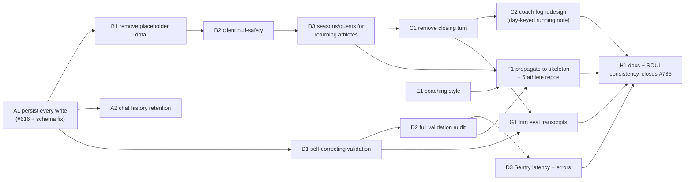

# Coach-chat commit redesign

> Status: Current · Owner: Tech Lead · Verified: 2026-09-01

## Context

Live FSP testing on a fresh athlete repo found `quest_create` silently dropping the athlete's
stated goal and habits. Root cause traced past the prompt-wording level (the closed #674 "fix")
into two structural bugs. A placeholder `main_quest` seeded at carve time fools the completion
gate. And `fspIncrementalWrites` discards every ordinary-turn write once a profile is complete —
already tracked as #616. Its blast radius turned out to be much larger than one field. For a
**returning athlete**, Gemini's own response schema returns *zero* action fields on an ordinary
turn — established athletes cannot save a profile change, injury, or quest update outside a
formal close, ever, today. Chasing that surfaced a cluster of related gaps worth fixing together.
Placeholder data sits elsewhere in the carve template too. Chat history deletes past 7 threads.
Validation stops at text-length caps (#736). A coaching-style preference (`accountability` /
`encouragement` / `analysis`) was deliberately removed and is now needed back with real SOUL
wiring. And every schema/carve change here needs propagating to the 5 live athlete repos, not just
future carves — tracked against the existing #703 batched-migration epic (child issue #760).
Along the way, `platform/scripts/validate-soul.mjs`'s known writable-set gap (#735) gets closed too,
since this redesign is already editing the exact SOUL sections that bug lives next to.

## Decision / goal

Every coach-chat turn commits whatever it produces, immediately, for every athlete in every mode —
no data waits on a formal "close." That one change cascades. The closing-turn concept itself
becomes removable (own PR). Chat history can safely retain everything instead of deleting older
threads (own PR). And `coach_note` becomes a day-keyed row, updated in place by whichever turn's
own Gemini call already touches that day — no separate trigger, no separate call, no dependency on
"the athlete pressed End Conversation" at all.
Placeholder data removal, returning-athlete quest/season access, a full validation audit (not
deferred), Sentry latency profiling, coaching-style restoration, propagating all of it to the real
athlete repos, trimming the eval-transcript suite to match, and a final docs/SOUL consistency pass
are each their own milestone.

## Milestones (execution order)

| PR | Milestone | Outcome | Final base | Files (primary) | LLD | Result |
|---|---|---|---|---|---|---|
| A1 | A — Stop losing data | Every turn commits its writes, for every athlete, every mode | `main` | `ui/api/coach-chat/_lib/fspWrites.ts`, `coachTurn.ts`, `coachReplySchema.ts` | [`ccr-a1-persist-writes-lld.md`](ccr-a1-persist-writes-lld.md) | #616 closed, daily-flow writes persist |
| A2 | A — Stop losing data | Chat history never deletes; clients still see only the latest 7 | A1 | `ui/api/coach-chat/_lib/chatThreads.ts`, response-building call sites | [`ccr-a2-history-retention-lld.md`](ccr-a2-history-retention-lld.md) | Full history retained, ADR supersedes #0012 |
| B1 | B — No placeholder data | `main_quest`/`timezone` genuinely absent until real | A1 | `platform/scripts/carve-skeleton.mjs`, `coachQuestFiles.ts`, `coachIntents.ts` | [`ccr-b1-quest-placeholder-lld.md`](ccr-b1-quest-placeholder-lld.md) | Completion gates can't be fooled again |
| B2 | B — No placeholder data | Client renders "no quest yet" instead of crashing | B1 | `ui/client/src/components/home-warm/*` | [`ccr-b2-quest-client-lld.md`](ccr-b2-quest-client-lld.md) | Fresh-athlete dashboard safe |
| B3 | B — No placeholder data | Returning athletes can set a new quest/season; old season auto-resolves | B2 | `coachReplySchema.ts`, `coachIntents.ts` | [`ccr-b3-seasons-quests-returning-lld.md`](ccr-b3-seasons-quests-returning-lld.md) | Quest/season parity for every athlete |
| C1 | C — Simplify session model | No more closing turn, no End Conversation button | B3 | `closeSignal.ts` (deleted), `coachTurn.ts`, web + iOS composer | [`ccr-c1-remove-closing-turn-lld.md`](ccr-c1-remove-closing-turn-lld.md) | One turn shape, everywhere |
| C2 | C — Simplify session model | `coach_note` becomes a day-keyed row, updated inline, no separate trigger | C1 | `coachReplySchema.ts`, `coachIntents.ts`, `turnWrites/*.ts` | [`ccr-c2-coach-log-lld.md`](ccr-c2-coach-log-lld.md) | Zero extra Gemini calls, no dependency on a close |
| D1 | D — Reliability | Validation failures self-correct instead of losing data | A1 | `coachReplySchema.ts`, `geminiClient.ts`, `coachIntents.ts` | [`ccr-d1-validation-lld.md`](ccr-d1-validation-lld.md) | Closes #736, no silent data loss on bad output |
| D2 | D — Reliability | Every `user_data/` field gets a real shape/enum check, not just what D1 touched | D1 | `coachIntents.ts`, `turnWrites/*.ts`, `validate-data.yml`, `coachReplySchema.ts` | [`ccr-d2-validation-audit-lld.md`](ccr-d2-validation-audit-lld.md) | No unvalidated field left, incl. Claude/BYOB writes |
| D3 | D — Reliability | GitHub + backend latency visible in Sentry, validation failures captured | D2 | `ui/api/_lib/sentry.ts` | [`ccr-d3-sentry-latency-lld.md`](ccr-d3-sentry-latency-lld.md) | Matches existing Gemini latency instrumentation |
| E1 | E — Coaching style | `coaching_style` back, and it actually changes how Coach talks | none | `coachMemoryFiles.ts`, `platform/soul/*.md`, `carve-skeleton.mjs` | [`ccr-e1-coaching-style-lld.md`](ccr-e1-coaching-style-lld.md) | Independent, can land anytime |
| F1 | F — Propagate everywhere | Skeleton + all 5 athlete repos reflect the final schema, real backfilled values | B3, D2, E1 | 6 separate repo PRs, not HQ code | [`ccr-f1-repo-migration-lld.md`](ccr-f1-repo-migration-lld.md) | Closes #760 (child of #703) |
| G1 | G — Update tests | Eval transcripts trimmed to 10-14, covering current behavior only | C1, D1 | `ui/api/coach-chat/_tests/coach-chat-eval/transcripts/`, `docs/eng-docs/coach-chat-testing.md` | [`ccr-g1-eval-transcripts-lld.md`](ccr-g1-eval-transcripts-lld.md) | No dead-behavior tests, new coverage for what shipped |
| H1 | H — Final consistency | Every doc and SOUL layer reflects the shipped state | C2, D3, F1, G1 | `docs/eng-docs/*`, `platform/soul/A_identity.md`, `SOUL_HISTORY.md` | [`ccr-h1-docs-soul-consistency-lld.md`](ccr-h1-docs-soul-consistency-lld.md) | Closes #735; this plan's own docs deleted, folded into eng-docs |

Each PR gets its own LLD, named `ccr-<pr-code>-<topic>-lld.md` — the prefix matches the PR column
above, so the files sort in execution order. Read this doc for the shape of the whole redesign;
read the LLD for the PR you're actually building.

## Done when

Every LLD's own "Done when" is met, and `bash platform/scripts/check.sh --quiet` is green on each
PR. A live re-test on a fresh scratch athlete repo confirms three things. FSP goal, habits, and
injuries all land in the same conversation regardless of when profile fields complete. An
established athlete's ordinary "I'm 76kg now" persists without closing. And `quests.json` /
`profile.json` show no skeleton-init placeholder data after carve. H1's own "Done when" (docs, SOUL,
and this plan itself all reflecting shipped reality) is the redesign's actual finish line.

## Deferred

- C2's documented fallback (reactive day-boundary backfill via `waitUntil`) and real scheduled cron,
  both only if C2's chosen day-keyed design doesn't hold up in practice — see that LLD's own
  Fallback section, not re-derived here.
