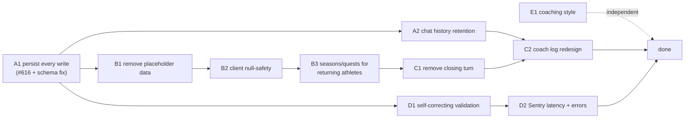

# Coach-chat commit redesign

> Status: Current · Owner: Tech Lead · Verified: 2026-09-01

## Context

Live FSP testing on a fresh athlete repo found `quest_create` silently dropping the athlete's
stated goal and habits. Root cause traced past the prompt-wording level (the closed #674 "fix")
into two structural bugs. A placeholder `main_quest` seeded at carve time fools the completion
gate. And `fspIncrementalWrites` discards every ordinary-turn write once a profile is complete —
already tracked as #616. Its blast radius turned out to be much larger than one field: for a
**returning athlete**, Gemini's own response schema returns *zero* action fields on an ordinary
turn, so today established athletes cannot save a profile change, injury, or quest update outside
a formal close, ever. Chasing that surfaced a cluster of related gaps worth fixing together:
placeholder data elsewhere in the carve template, chat history's 7-thread deletion, no validation
past text-length caps (#736), and a coaching-style preference (`accountability` / `encouragement`
/ `analysis`) that was deliberately removed and is now needed back with real SOUL wiring.

## Decision / goal

Every coach-chat turn commits whatever it produces, immediately, for every athlete in every mode —
no data waits on a formal "close." That one change cascades. The closing-turn concept itself
becomes removable (own PR). Chat history can safely retain everything instead of deleting older
threads (own PR). And a coach_note narrative summary needs a new trigger that isn't "the athlete
pressed End Conversation" — still being worked out, see the coach-log LLD's open questions.
Placeholder data removal, returning-athlete quest/season access, validation hardening, and Sentry
latency profiling are independent gaps found along the way, each its own milestone.

## Milestones (execution order)

| PR | Milestone | Outcome | Final base | Files (primary) | Result |
|---|---|---|---|---|---|
| A1 | A — Stop losing data | Every turn commits its writes, for every athlete, every mode | `main` | `ui/api/coach-chat/_lib/fspWrites.ts`, `coachTurn.ts`, `coachReplySchema.ts` | #616 closed, daily-flow writes persist |
| A2 | A — Stop losing data | Chat history never deletes; clients still see only the latest 7 | A1 | `ui/api/coach-chat/_lib/chatThreads.ts`, response-building call sites | Full history retained, ADR supersedes #0012 |
| B1 | B — No placeholder data | `main_quest`/`timezone` genuinely absent until real | A1 | `platform/scripts/carve-skeleton.mjs`, `coachQuestFiles.ts`, `coachIntents.ts` | Completion gates can't be fooled again |
| B2 | B — No placeholder data | Client renders "no quest yet" instead of crashing | B1 | `ui/client/src/components/home-warm/*` | Fresh-athlete dashboard safe |
| B3 | B — No placeholder data | Returning athletes can set a new quest/season; old season auto-resolves | B2 | `coachReplySchema.ts`, `coachIntents.ts` | Quest/season parity for every athlete |
| C1 | C — Simplify session model | No more closing turn, no End Conversation button | B3 | `closeSignal.ts` (deleted), `coachTurn.ts`, web + iOS composer | One turn shape, everywhere |
| C2 | C — Simplify session model | `coach_note` generated without depending on a close | A2, C1 | `ui/api/coach-message.ts`, new day-summary path | **Open — see LLD, not finalized** |
| D1 | D — Reliability | Validation failures self-correct instead of losing data | A1 | `coachReplySchema.ts`, `geminiClient.ts`, `coachIntents.ts` | Closes #736, no silent data loss on bad output |
| D2 | D — Reliability | GitHub + backend latency visible in Sentry, validation failures captured | D1 | `ui/api/_lib/sentry.ts` | Matches existing Gemini latency instrumentation |
| E1 | E — Coaching style | `coaching_style` back, and it actually changes how Coach talks | none | `coachMemoryFiles.ts`, `platform/soul/*.md`, `carve-skeleton.mjs` | Independent, can land anytime |

Each PR gets its own LLD (linked from the table above via filename pattern
`chat-commit-redesign-<topic>-lld.md`). Read this doc for the shape of the whole redesign; read
the LLD for the PR you're actually building.

## Done when

Every LLD's own "Done when" is met, and `bash platform/scripts/check.sh --quiet` is green on each
PR. A live re-test on a fresh scratch athlete repo confirms: FSP goal + habits + injuries all land
in the same conversation regardless of when profile fields complete, an established athlete's
ordinary "I'm 76kg now" persists without closing, and `quests.json`/`profile.json` show no
skeleton-init placeholder data after carve.

## Deferred

- Real scheduled cron for coach_log, if the reactive backfill (C2) proves insufficient once athlete
  count grows past a handful.
- Broadening validation beyond the fields this pass actually touched (full schema audit is D1's
  job for the fields it lists, not every field in every file).
