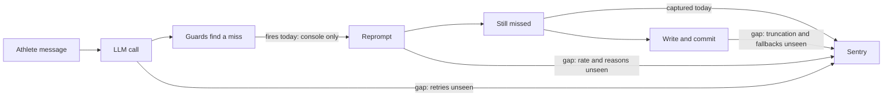

# Chat observability and guard gaps

> Status: Plan · Owner: Tech Lead · Created: 2026-09-19 · LLD: [`chat-observability-and-guards-lld.md`](chat-observability-and-guards-lld.md)

## Context

Round-2 live testing kept finding the same failure: the model says it saved something and does not.
Ten fixes shipped, then the First Session took three more rounds. Two gaps sit behind that. Sentry
only sees a problem after it survives a reprompt, so nobody can see how often reprompts fire. And
the guards are uneven: several run on the First Session only, and some fields have no guard at all.

The audit behind every claim is in the LLD.

## Decision

Measure first, then guard. Add the missing signals so each gap has a number, then build guards
only for the gaps the numbers show are real. Three milestones, six PRs, one milestone each by default.

The high-rate signals go on the existing LLM span as attributes, not as Sentry events. About 18% of
turns reprompt, and a warning event per reprompt would burn the free quota.

## Stack

| PR  | milestone  | outcome                                                                         | final base | files                                                                         | owner | parallel with | result                                                                                                                         |
| --- | ---------- | ------------------------------------------------------------------------------- | ---------- | ----------------------------------------------------------------------------- | ----- | ------------- | ------------------------------------------------------------------------------------------------------------------------------ |
| 1   | M1 Signals | Every reprompt, retry and extra call is countable per turn                      | main       | `requestCoachReply.ts`, `llmAdapters/*`, `sentry.ts`                          | Bob   | 2             | Sentry shows reprompt rate by detector                                                                                         |
| 2   | M1 Signals | Silent fallbacks and truncation are recorded                                    | 1          | `silentFixups.ts`, `firstWeekCompile.ts`, `turnCompletion.ts`, `turnWrites/*` | Bob   | 1             | Each fallback appears as a fixup kind                                                                                          |
| 3   | M1 Signals | First Session completion and stuck sessions are visible                         | 2          | `turnCompletion.ts`, `buildTurnWrites.ts`                                     | Bob   | none          | Funnel event and a stuck event with the missing fields                                                                         |
| 4   | M2 Detect  | First Session and daily gaps get log-only detectors                             | 3          | `turnReplyValidation.ts`, `requestCoachReply.ts`                              | Bob   | none          | Miss rate per gap, no extra model calls                                                                                        |
| 5   | M3 Guard   | Detectors with real misses become reprompts                                     | 4          | `turnReplyValidation.ts`, `requestCoachReply.ts`                              | Bob   | none          | Reprompt fires live and the write lands                                                                                        |
| 6   | M3 Guard   | Retry layers share one time budget; the auto-note stops leaking into the prompt | 5          | `requestCoachReply.ts`, `coachLlmClient.ts`, `silentFixups.ts`                | Bob   | none          | A turn can no longer run past its limit; this plan and its LLD are deleted, with anything durable folded into `gemini-flow.md` |

## Done when

1. Each new signal has been seen in Sentry from a live run, one per PR.
2. No new signal fires as a warning event at turn rate.
3. Every gap in the LLD has a number, a fix, or a written reason it stays open.
4. `platform/scripts/check.sh --quiet` and the affected live scenarios pass.

## Deferred

- A separate OpenRouter key for live tests. The dev key is the production key, so live tests spend production
  quota and a leaked dev key exposes production. Until then: check headroom before every run and rotate the key if it leaks.
- A harness switch that forces a reprompt so guards can be exercised on demand.
- Daily reprompts for `season_start` and `memory_update`. They are the noisiest to pattern-match.
