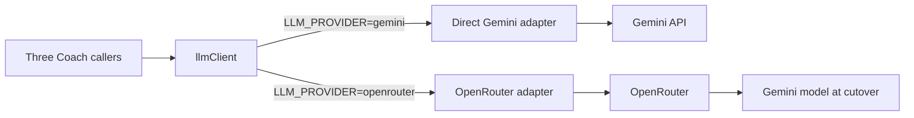
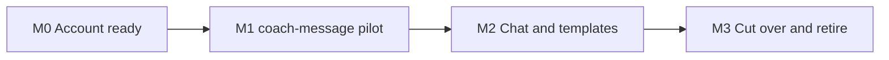

# OpenRouter migration

> Status: Current · Owner: Tech Lead · Verified: 2026-09-05 · Issue: #713

## Context

Cost is now the driver. `geminiModel.ts:11` pins `gemini-pro-latest` because flash went 0/5
under the real ~13K-token prompt (#668), and every chat turn pays pro rates for that whole
system instruction. OpenRouter is not itself cheaper — it passes provider pricing through. What
it buys is the ability to leave pro safely: one config value picks the model, and its provider
routing covers the capacity failures that forced the pin.

## Goal



Both adapters ship together. Production stays on direct Gemini until OpenRouter passes the
same checks; only one adapter runs per request, so there are no shadow calls.

## Sequencing — read before planning any PR

`coach-message` migrates first, alone. Its single call
(`ui/api/coach-message/_lib/coachMessage.ts:761`) sends one prompt and takes a `{body: string}`
schema at 180 output tokens: no soul cache, no `coachReplySchema`, no reprompt loop. The 17-PR
chat redesign stack (#769 → #824) also leaves that file untouched, while J2 (#821) moves chat's
whole `_lib/` tree. Chat therefore waits for that stack; `coach-message` does not.

Precursor, merged: #827 (PR 831) fixed `coach-message`'s output budget, which thinking tokens
had made unusable. PR 1 inherits the corrected budget straight from `main`.

One external dependency, outside this plan:

| Dependency | Why it blocks |
|---|---|
| #670 (PR 810) | The 24-transcript baseline. Gates the **chat** cutover only — `coach-message` has no transcript coverage |

**#638 (PR 823) is no longer a PR 1 dependency.** PR 1's Gemini adapter writes the
`x-goog-api-key` header natively, so 823 gates nothing here. #831 merged while 823 was open,
leaving 823's `coachMessage.test.ts` hunk conflicting. #821 (J2) also moves every file 823
touches (`coachWorkoutFiles.ts` to `_lib/decide/`; `geminiClient.ts` and `soulCache.ts` to
`_lib/gemini/`) — landing 823 before J2 is a rename-vs-edit conflict, after is a small patch.
823 lands after J2, by its own owner.

## OpenRouter readiness gate

Three **Before build** rows are account work and belong to Skanda; the other two are build work.
Every row must be green before production flips.

| Gate | When | Owner | Result |
|---|---|---|---|
| OpenRouter account | Before build | Skanda | Done. Key exists; `$20/month` cap set at both account and key level; secret is `OPENROUTER_API_KEY` in Vercel Production and Preview |
| Account data policy | Before build | Skanda | Done. ZDR required on all five provider families; free endpoints that train on request data are off. Google ZDR routes Gemini via Vertex, not AI Studio |
| Request provider policy | Before build | Bob the Builder | Every OpenRouter call sends an explicit provider allow-list, `require_parameters` and denied data collection in its own body. The allow-list is `Google` (Vertex), never `Google AI Studio` |
| Rollback | Before build | Skanda | `LLM_PROVIDER` defaults to `gemini`; changing it requires a Vercel deployment, and the previous deployment is the rollback. **The rollback is only real while the direct Gemini key has credit** — on a depleted key the fallback returns 429 on every call, and on a free-tier key `gemini-pro-latest` is quota 0 |
| Contract probe | Before build | Bob the Builder | Done 2026-09-04, against `buildProactivePrompt` output for a **fixture** athlete (6,924 prompt tokens; real athlete files give 12,295 — see Measured below). `google/gemini-3.8-flash` via `only: ["google-vertex"]`, `reasoning: {effort: "low"}`, `max_tokens: 1024` returns a valid strict-schema `{body}`: `finish=stop`, 0 reasoning tokens, $0.0053 |
| Current baseline (#670) | Before chat cutover | Skanda | All transcripts pass on direct Gemini, with the real bundled SOUL; record commit SHA, model and result |
| Chat contract probe | Before chat cutover | Bob the Builder | A synthetic request proves the cutover Gemini model accepts the full `coachReplySchema.ts` through strict JSON Schema |
| Deterministic suite | Before each cutover | Bob the Builder | `npm run check`, `npm run lint`, `npm run format:check` and `npm test` pass |
| Live parity | Before chat cutover | Bob the Builder | OpenRouter passes the real-SOUL transcripts plus chat, proactive-message and onboarding-template smoke checks |

US-only data residency is not a gate. Exact provider slugs are fixed in the contract probe,
before athlete health context is sent through OpenRouter.

## Measured on real athlete data, 2026-09-05

The contract probe above used a hand-built athlete. Pointing `loadProactiveContext` at a live
athlete repo instead roughly doubles the prompt, so every figure derived from 6,924 tokens is low.
Full method, the DeepSeek sweep and the ZDR delta are in `docs/eng-docs/chat-provider-bench.md`.

| | one activity | four activities |
|---|---|---|
| Prompt tokens | 12,295 | 14,444 |
| Cost per call, `google/gemini-3.8-flash` | $0.0094 | $0.0110 |
| Latency, median of 3 | 2.4s | 1.9s |

Three findings that change how the next measurement gets taken:

1. **Vertex discounts an exact repeat of the whole prompt, not a shared prefix.** Two prompts
   sharing a 6,876-token opening — the entire soul, instructions and few-shots — and differing
   only in the athlete block reported `cached_tokens: 0` on the second. A discount appears only
   when the whole prompt repeats byte for byte, which production never does. Measure caching with
   a varying tail, or the harness reports a discount production never receives.
2. **An unpinned OpenRouter model measures its routing, not the model.** `deepseek/deepseek-v4-flash`
   has 15 provider endpoints of very different speed, and unpinned calls landed on a different one
   each time, reading 15–59s. Pinned to one provider with reasoning off, the same prompt runs
   ~2–3s. Pin the provider before drawing any conclusion about a model.
3. **The ZDR account policy is enforced, and provably.** Five of those 15 endpoints are refused
   with `ZDR violation (account settings)`. That is the audit evidence the readiness gate wants;
   the resolved provider on a span still is not.

Two smaller ones worth not rediscovering: `GET /api/v1/generation` returns 404 under this
account's `data_collection: "deny"`, so per-call cost must come from `usage: {include: true}` in
the request body. And a free-tier `GEMINI_API_KEY` has a hard quota of 0 on `gemini-pro-latest`
(which resolves to `gemini-3.1-pro`), so a free key cannot exercise the pin in
`ui/api/_lib/geminiModel.ts` at all.

## Flipping the flag takes three steps, and two of them are silent

**Deploy the code, set the variable, then rebuild.** All three, in that order.

**A redeploy rebuilds the same commit.** It does not pick up newer code. Production ran
`bc83c6e` (2026-09-04) for a full day after `llmClient` landed on `main`, so `LLM_PROVIDER` sat
there meaning nothing — no adapter existed to read it. Redeploying twice changed nothing, because
each redeploy rebuilt the same pre-adapter commit. Promote a deployment built from current `main`,
or push a commit that touches `ui/`; a redeploy alone never ships new code.

**Then set the variable and rebuild.** Vercel resolves environment variables when a deployment is
built, so a deployment created before the variable existed never sees it. Nothing warns you.

A deployment missing `LLM_PROVIDER` runs direct Gemini while you believe it runs OpenRouter, so a
green pilot proves the opposite of what it looks like. Worse, a deployment missing
`COACH_CHAT_BRANCH` falls back to `"main"` and commits a test message into an athlete's real
history. Both were live on a Preview during the 2026-09-05 pilot; the check below caught them.

Comparing timestamps is necessary but **not sufficient** — it says the variable was present, not
that the code that reads it was. Before trusting any run, check both:

```
GET https://api.vercel.com/v13/deployments/<host>        -> createdAt
GET https://api.vercel.com/v9/projects/<id>/env          -> updatedAt per key
```

Build time must be later, **and** the deployment's commit must contain the adapters. The cheap
check for the second one is the span: no `llm.adapter` attribute at all means pre-adapter code,
not a misconfigured flag. `COACH_CHAT_BRANCH` belongs on Preview and Development only — production
must fall through to `"main"`, which is where a real athlete's message belongs.

**Proof of which adapter ran comes from Sentry, not from the reply.** The span carries
`llm.adapter`, and a passing reply looks identical either way:

```
dataset=spans  query=span.op:gen_ai.*  field=llm.adapter  field=environment
```

OpenRouter's credits meter is not the instrument — it lags a couple of minutes, and reading it too
early says "no charge" for a call that was in fact billed.

## Locked decisions

- `coach-message` is the pilot. Chat and template adjustment follow it, not alongside it.
- A provider swap alone saves nothing. The saving is the model change it unlocks, measured by
  `chat-coach-bench.md`; the pilot proves the seam, not the price.
- Direct Gemini keeps `soulCache.ts` and its explicit cached-content record while the fallback lives.
- OpenRouter owns its caching; its adapter does not emulate Gemini cache names or Edge Config records.
- Direct Gemini and OpenRouter have separate model ids. Gemini stays the model during cutover.
- The pilot runs `google/gemini-3.8-flash` on the OpenRouter side while direct Gemini stays on
  `gemini-pro-latest`. #668 pinned pro after flash returned 504s and a 503 under the chat prompt,
  which was capacity, not quality — the failure class OpenRouter's provider routing exists to
  cover. `coach-message` has no flash evidence either way, so the pilot is where we get it.
- OpenRouter's `~`-prefixed `-latest` slugs are its own floating aliases, not Google's: they expose
  no endpoint list, so a provider allow-list cannot be pinned to one. Every model id here names a
  version. Vertex and AI Studio price identically and Vertex's parameter set is a superset, so
  requiring ZDR costs neither money nor capability.
- Thinking tokens count against the output budget, and `gemini-pro-latest` cannot be taken out of
  thinking mode (`thinkingBudget: 0` is a 400, "This model only works in thinking mode"). This is
  Google's constraint, not OpenRouter's — direct Gemini and OpenRouter behave the same way. It is
  why `coachMessage.ts`'s `maxOutputTokens: 180` is already failing in production, tracked
  separately from this plan; PR 1 inherits a corrected budget rather than introducing one.
- OpenRouter is the better side of this constraint. `reasoning: {effort: "low"}` on
  `google/gemini-3.8-flash` returns 0 reasoning tokens and a valid reply. Direct
  `gemini-pro-latest` cannot be pushed below ~400 thinking tokens on the same prompt.
- The resolved provider/model on a span cannot prove the ZDR pin held. With `only: ["google-vertex"]`
  pinned, OpenRouter answers `provider: "Google"` and echoes the slug requested (observed 2026-09-05,
  4 runs) — the same strings an unpinned call would return. The pin is enforced by the request body
  and the account data policy, and those are what an audit reads.
- Telemetry records the selected adapter, configured model, and OpenRouter's resolved provider/model.
- No runtime Edge Config flag and no dual-send comparison. A deployment flips the environment flag.
- Retire the fallback after two stable weeks and successful chat, proactive-message and onboarding-template checks.

## Milestones



| # | Size | Milestone | State | Result |
|---|---|---|---|---|
| 0 | S | Account ready | ✅ done 2026-09-04 | The key, spend limit, data policy and rollback are locked; no code |
| 1 | M | `coach-message` pilot | ✅ done 2026-09-05 | `llmClient` and both adapters shipped; proactive messages proven on OpenRouter against a live Preview deployment, with real athlete files and a real commit |
| 2 | M | Chat and templates | not started | The remaining two callers reach the model through `llmClient`; production still selects Gemini for chat |
| 3 | M | Cut over and retire | not started | OpenRouter is stable for two weeks, the direct adapter is removed and the ADR records the decision |

## PR stack

| PR | milestone | outcome | final base | files | owner | parallel with | result |
|---|---|---|---|---|---|---|---|
| 1 | 1 | `llmClient`, both adapters, `coach-message` only, telemetry and tests | `main` | `ui/api/_lib/`, `ui/api/coach-message.ts`, `ui/api/coach-message/_lib/`, `ui/api/coach-message/_tests/`, `ui/api/_lib/_tests/` | Bob the Builder | — | ✅ merged — PRs 833, 843, 856, 857, 858 |
| 2 | 2 | Chat and template adjustment move onto `llmClient` | PR 1, after the chat stack lands | `ui/api/coach-chat.ts`, `ui/api/coach-chat/_lib/`, `ui/api/coach-chat/_tests/`, `ui/scripts/eval-coach-chat.ts`, `.github/workflows/eval-coach-chat.yml` | Bob the Builder | — | not started |
| 3 | 3 | Remove direct Gemini after the observation gate; ADR, docs and plan cleanup | PR 2 | `ui/api/`, `ui/scripts/`, `.github/workflows/eval-coach-chat.yml`, `docs/eng-docs/`, `kdb/decisions/`, `docs/plans/chat-openrouter-migration.md` | Bob the Builder + Tech Lead | — | not started |

Nothing runs in parallel: each milestone proves the base used by the next one. PR 2 cannot open
until #821 has merged, or its diff fights that rename.

## Done when

1. Direct Gemini and OpenRouter implement one internal contract, covered at each HTTP boundary.
2. Chat, proactive messages and template adjustment all route through `llmClient`.
3. Gemini through OpenRouter matches the green direct-Gemini gate with the real SOUL.
4. Production completes the two-week observation gate and each of the three paths succeeds.
5. The Gemini fallback, key, cache records and flag are removed; the ADR and current-state docs ship.

## Deferred

- Choosing a non-Gemini production model on measured quality — `chat-coach-bench.md`, P1.
- Leaving `gemini-pro-latest` on the **chat** path (#668). It needs the bench; the pilot does not.
- Streaming responses (#270), history compaction (#572), model routing and shadow comparisons.
- Cache tuning and sticky session ids until production usage shows a cost or latency problem.
