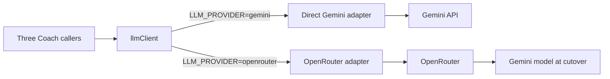
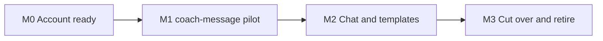

# OpenRouter migration

> Status: Current · Owner: Tech Lead · Verified: 2026-09-04 · Issue: #713

## Context

Cost is now the driver. `geminiModel.ts:11` pins `gemini-pro-latest` because flash went 0/5
under the real ~13K-token prompt (#668), and every chat turn pays pro rates for that whole
system instruction. OpenRouter is not itself cheaper — it passes provider pricing through. What
it buys is the ability to leave pro safely: one config value picks the model, and its provider
routing covers the capacity failures that forced the pin.

## Goal

Both adapters ship together. Production stays on direct Gemini until OpenRouter passes the
same checks; only one adapter runs per request, so there are no shadow calls.

## Sequencing — read before planning any PR

`coach-message` migrates first, alone. Its single call
(`ui/api/coach-message/_lib/coachMessage.ts:761`) sends one prompt and takes a `{body: string}`
schema at 180 output tokens: no soul cache, no `coachReplySchema`, no reprompt loop. The 17-PR
chat redesign stack (#769 → #824) also leaves that file untouched, while J2 (#821) moves chat's
whole `_lib/` tree. Chat therefore waits for that stack; `coach-message` does not.

Two external dependencies, both outside this plan:

| Dependency | Why it blocks |
|---|---|
| #638 (PR 823) | Adds the shared Gemini base-URL and auth-header module, the seam `llmClient` replaces. Merge it first or PR 1 rewrites it |
| #670 (PR 810) | The 24-transcript baseline. Gates the **chat** cutover only — `coach-message` has no transcript coverage |

## OpenRouter readiness gate

The four **Before build** rows are account work and belong to Skanda. Every row must be green
before production flips.

| Gate | When | Owner | Result |
|---|---|---|---|
| OpenRouter account | Before build | Skanda | Production key exists, spend limit is set and the secret name is fixed |
| Data handling | Before build | Skanda | ZDR, denied data collection, required parameters and an explicit provider allow-list are locked |
| Rollback | Before build | Skanda | `LLM_PROVIDER` defaults to `gemini`; changing it requires a Vercel deployment, and the previous deployment is the rollback |
| Contract probe | Before build | UI Expert | A synthetic request proves the cutover model accepts the proactive `{body}` schema through strict JSON Schema |
| Current baseline (#670) | Before chat cutover | Skanda | All transcripts pass on direct Gemini, with the real bundled SOUL; record commit SHA, model and result |
| Chat contract probe | Before chat cutover | UI Expert | A synthetic request proves the cutover Gemini model accepts the full `coachReplySchema.ts` through strict JSON Schema |
| Deterministic suite | Before each cutover | UI Expert | `npm run check`, `npm run lint`, `npm run format:check` and `npm test` pass |
| Live parity | Before chat cutover | UI Expert | OpenRouter passes the real-SOUL transcripts plus chat, proactive-message and onboarding-template smoke checks |

US-only data residency is not a gate. Exact provider slugs are fixed in the contract probe,
before athlete health context is sent through OpenRouter.

## Locked decisions

- `coach-message` is the pilot. Chat and template adjustment follow it, not alongside it.
- A provider swap alone saves nothing. The saving is the model change it unlocks, measured by
  `chat-coach-bench.md`; the pilot proves the seam, not the price.
- Direct Gemini keeps `soulCache.ts` and its explicit cached-content record while the fallback lives.
- OpenRouter owns its caching; its adapter does not emulate Gemini cache names or Edge Config records.
- Direct Gemini and OpenRouter have separate model ids. Gemini stays the model during cutover.
- Telemetry records the selected adapter, configured model, and OpenRouter's resolved provider/model.
- No runtime Edge Config flag and no dual-send comparison. A deployment flips the environment flag.
- Retire the fallback after two stable weeks and successful chat, proactive-message and onboarding-template checks.

## Milestones

| # | Size | Milestone | Result |
|---|---|---|---|
| 0 | S | Account ready | The key, spend limit, data policy and rollback are locked; no code |
| 1 | M | `coach-message` pilot | `llmClient` and both adapters exist; proactive messages run on OpenRouter in production |
| 2 | M | Chat and templates | The remaining two callers reach the model through `llmClient`; production still selects Gemini for chat |
| 3 | M | Cut over and retire | OpenRouter is stable for two weeks, the direct adapter is removed and the ADR records the decision |

## PR stack

| PR | milestone | outcome | final base | files | owner | parallel with | result |
|---|---|---|---|---|---|---|---|
| 1 | 1 | `llmClient`, both adapters, `coach-message` only, telemetry and tests | `main` (after #823) | `ui/api/_lib/`, `ui/api/coach-message.ts`, `ui/api/coach-message/_lib/`, `ui/api/coach-message/_tests/`, `ui/api/_lib/_tests/` | UI Expert | — | |
| 2 | 2 | Chat and template adjustment move onto `llmClient` | PR 1, after the chat stack lands | `ui/api/coach-chat.ts`, `ui/api/coach-chat/_lib/`, `ui/api/coach-chat/_tests/`, `ui/scripts/eval-coach-chat.ts`, `.github/workflows/eval-coach-chat.yml` | UI Expert | — | |
| 3 | 3 | Remove direct Gemini after the observation gate; ADR, docs and plan cleanup | PR 2 | `ui/api/`, `ui/scripts/`, `.github/workflows/eval-coach-chat.yml`, `docs/eng-docs/`, `kdb/decisions/`, `docs/plans/chat-openrouter-migration.md` | UI Expert + Tech Lead | — | |

Nothing runs in parallel: each milestone proves the base used by the next one. PR 2 cannot open
until #821 has merged, or its diff fights that rename.

## Done when

1. Direct Gemini and OpenRouter implement one internal contract, covered at each HTTP boundary.
2. Chat, proactive messages and template adjustment all route through `llmClient`.
3. Gemini through OpenRouter matches the green direct-Gemini gate with the real SOUL.
4. Production completes the two-week observation gate and each of the three paths succeeds.
5. The Gemini fallback, key, cache records and flag are removed; the ADR and current-state docs ship.

## Deferred

- Choosing a non-Gemini production model on measured quality — `chat-coach-bench.md`, P1.
- Leaving `gemini-pro-latest` (#668). It needs the bench, and PR 1 makes the switch a config change.
- Streaming responses (#270), history compaction (#572), model routing and shadow comparisons.
- Cache tuning and sticky session ids until production usage shows a cost or latency problem.
