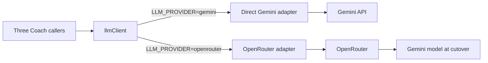
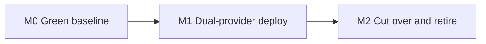

# OpenRouter migration

> Status: Current · Owner: Tech Lead · Verified: 2026-08-31 · Issue: #713

## Context

Three call sites still own Gemini request and response plumbing. #726 already moved all three
onto `ui/api/_lib/geminiModel.ts`, so no caller is stranded on Flash. The remaining job is a
reversible provider switch, not model-id consolidation.

## Goal

Both adapters ship together. Production stays on direct Gemini until OpenRouter passes the
same checks; only one adapter runs per request, so there are no shadow calls.

## OpenRouter readiness gate

The four **Before build** rows unblock implementation. Every row must be green before production flips.

| Gate | When | Result |
|---|---|---|
| Current baseline (#670) | Before build | All 24 transcripts pass on direct Gemini, with the real bundled SOUL; record commit SHA, model and result |
| OpenRouter account | Before build | Production key exists, spend limit is set and the secret name is fixed |
| Data handling | Before build | ZDR, denied data collection, required parameters and an explicit provider allow-list are locked |
| Rollback | Before build | `LLM_PROVIDER` defaults to `gemini`; changing it requires a Vercel deployment, and the previous deployment is the rollback |
| Contract probe | Before cutover | A synthetic request proves the cutover Gemini model accepts the full `coachReplySchema.ts` through strict JSON Schema |
| Deterministic suite | Before cutover | `npm run check`, `npm run lint`, `npm run format:check` and `npm test` pass |
| Live parity | Before cutover | OpenRouter passes the 24 real-SOUL transcripts plus chat, proactive-message and onboarding-template smoke checks |

US-only data residency is not a gate. Exact provider slugs are fixed in the contract probe,
before athlete health context is sent through OpenRouter.

## Locked decisions

- Direct Gemini keeps `soulCache.ts` and its explicit cached-content record while the fallback lives.
- OpenRouter owns its caching; its adapter does not emulate Gemini cache names or Edge Config records.
- Direct Gemini and OpenRouter have separate model ids. Gemini stays the model during cutover.
- Telemetry records the selected adapter, configured model, and OpenRouter's resolved provider/model.
- No runtime Edge Config flag and no dual-send comparison. A deployment flips the environment flag.
- Retire the fallback after two stable weeks and successful chat, proactive-message and onboarding-template checks.

## Milestones

| # | Size | Milestone | Result |
|---|---|---|---|
| 0 | M | Build-ready baseline (#670) | Direct Gemini is green; the account, data policy and rollback are locked |
| 1 | M | Dual-provider deploy | Both adapters pass deterministic tests and the contract probe; production still selects Gemini |
| 2 | M | Cut over and retire | OpenRouter is stable for two weeks, the direct adapter is removed and the ADR records the decision |

## PR stack

| PR | milestone | outcome | final base | files | owner | parallel with | result |
|---|---|---|---|---|---|---|---|
| 1 | 0 | Make the paid gate green and representative | `main` | `ui/scripts/eval-coach-chat.ts`, `ui/api/coach-chat/_tests/coach-chat-eval/**`, `.github/workflows/eval-coach-chat.yml` | UI Expert | — | |
| 2 | 1 | Provider-neutral client, both adapters, three callers, telemetry and tests | PR 1 | `ui/api/_lib/`, `ui/api/coach-chat.ts`, `ui/api/coach-message.ts`, `ui/api/coach-chat/_lib/`, `ui/api/coach-message/_lib/`, matching `ui/api/**/_tests/`, `.github/workflows/eval-coach-chat.yml` | UI Expert | — | |
| 3 | 2 | Remove direct Gemini after the observation gate; ADR, docs and plan cleanup | PR 2 | `ui/api/`, `ui/scripts/`, `.github/workflows/eval-coach-chat.yml`, `docs/eng-docs/`, `kdb/decisions/`, `docs/plans/chat-openrouter-migration.md` | UI Expert + Tech Lead | — | |

Nothing runs in parallel: each milestone proves the base used by the next one.

## Done when

1. Direct Gemini and OpenRouter implement one internal contract, covered at each HTTP boundary.
2. Chat, proactive messages and template adjustment all route through `llmClient`.
3. Gemini through OpenRouter matches the green direct-Gemini gate with the real SOUL.
4. Production completes the two-week observation gate and each of the three paths succeeds.
5. The Gemini fallback, key, cache records and flag are removed; the ADR and current-state docs ship.

## Deferred

- Choosing a non-Gemini production model on measured quality — `chat-coach-bench.md`, P1.
- Streaming responses (#270), history compaction (#572), model routing and shadow comparisons.
- Cache tuning and sticky session ids until production usage shows a cost or latency problem.
