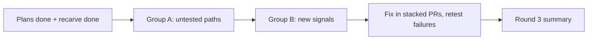

# Chat round 3 testing

> Status: Plan · Owner: Tech Lead · Created: 2026-09-19 · LLD: [`chat-round3-testing-lld.md`](chat-round3-testing-lld.md)

## Context

**Round 3 runs only when everything before it is done:** the doc overhaul, the repo hygiene sweep,
the chat observability plan, and the platform skeleton recarve. Not before, and not in parts.
Testing earlier means testing twice, because those plans change the signals, the SOUL wording and
what a new athlete's repo contains.

Round 2 passed every scenario, but some paths never ran live. And the observability plan adds
signals that only a live turn can prove. This round covers those two things and nothing else.

## Decision

Two groups, run in this order. A test that fails is fixed in its own stacked PR, reviewed, and
retested, the same cycle as round 2. Only failing scenarios and their neighbours rerun.

| Group             | What                                                                                                                                                                                                                                                                 | Why it is here                                              |
| ----------------- | -------------------------------------------------------------------------------------------------------------------------------------------------------------------------------------------------------------------------------------------------------------------- | ----------------------------------------------------------- |
| A. Untested paths | First Session with named days, zero days, a Sunday, native onboarding hints; a returning athlete changing availability; a second injury or habit mid-intake; worst-case latency; a fresh repo made from the recarved skeleton; every athlete repo after the backfill | Round 2 never ran them live, or ran them only as unit tests |
| B. New signals    | Each Sentry signal, detector and reprompt the observability plan adds, one triggering message and one benign message each                                                                                                                                            | Nothing has proved them against a real model                |

The scenario table, triggers and expected results are in the LLD.

## Done when

1. Every scenario in the LLD has a passing run, checked off the branch and, for group B, in Sentry.
2. Every failure has a cause written down and a fix PR or a written reason it stays open.
3. Results, costs and raw logs are in one round-3 test PR, not in fix PRs.
4. The summary lists what was not run and why.

## Not in scope

- Rerunning the whole round-2 suite. The SOUL wording PR of the doc overhaul runs
  `fsp-end-to-end` and `daily-basic` in its own PR.
- iOS and the hosted web UI. This is the coach-chat backend only.

## Deferred

- A separate OpenRouter key. Round 3 spends the production budget unless that is fixed first.
- A harness switch that forces a reprompt, so guards can be exercised on demand.
