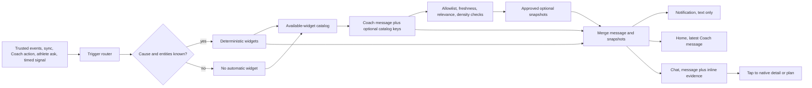
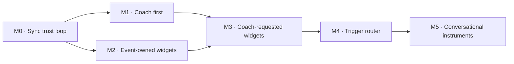

# Coach conversation widgets roadmap

> Status: Current · Owner: Tech Lead · Verified: 2026-08-23

## Context

Coach currently speaks in `ui/api/coach-chat.ts`, while Home widgets and their cross-platform
snapshots live on a separate path under `home-warm/` and ADR 0005. The goal is one relationship
surface: Coach notices real events, speaks first when useful, and brings the right evidence into
Chat. This roadmap sets product outcomes; each milestone gets its own worker plan before build.

## Goal

## Locked decisions

- The system owns triggers, IDs, measurements, and rendering. Gemini writes prose and may choose
  only opaque keys from a server-built candidate catalog.
- Known events attach their evidence automatically. Coach-requested widgets are optional, validated,
  and never required to understand the message.
- Notification, Home, and Chat use the same persisted Coach words; each surface chooses its own
  density. Chat may show two widgets at most.
- Attachments are versioned cross-platform snapshots with stable deep links. Unknown versions are
  ignored, never fatal. Source-event success never depends on Coach or notification delivery.

## Roadmap

| milestone | outcome | size | done when |
|---|---|---:|---|
| M0 · Sync trust loop | Exact synced activity list → real thinking dots → Coach reply. See `coach-sync-message-trial.md`. | M | One batch creates one grounded, durable turn on web and iOS; retry is idempotent. |
| M1 · Coach first | The real message replaces “Coach is on it,” becomes the first Home card, and deep-links to its thread. | M | Notification, Home, and Chat show the same words and open the same conversation. |
| M2 · Event-owned widgets | Plan edits, reconciled sessions, and quest writes attach their own cards automatically. | L | Every shipped write action has one deterministic attachment mapping and a no-data fallback. |
| M3 · Coach-requested widgets | Coach may request an allowlisted comparison, trend, plan, or recent-session view. | M | Invented, stale, duplicate, and excessive requests are dropped while the prose still works. |
| M4 · Proactive trigger router | Recovery, plan drift, milestones, and time can start a Coach turn without a fresh sync. | L | Every trigger has evidence, cooldown, idempotency, privacy policy, and an off switch. |
| M5 · Conversational instruments | Athlete and Coach can act on selected inline widgets, such as moving a planned session. | L | One reversible interaction completes in Chat and updates every surface from the same source. |

M0 → M1 is the critical trust path. M2 may begin after the attachment contract in M0 is stable.
Do not start M3 until automatic widgets are useful without model judgement.

## Risks and open questions

- Background delivery may require a server-owned GitHub App token rather than a live iOS session.
- Lock-screen privacy, quiet hours, frequency, and per-trigger controls need an explicit product call.
- Thread history needs compact snapshots so evidence survives cache eviction without copying full data.
- M4 needs ranking and cooldown rules before more triggers become more noise.

## Rough, not committed

- Coach can pin a useful conversation widget back to Home.
- Inline plan and quest cards become shared objects both sides can discuss and safely change.
- The system learns which proactive messages earn replies, without optimizing for notification taps.

Current seams: `ui/api/coach-chat.ts`, `ui/api/coach-chat/_lib/chatThreads.ts`,
`ui/client/src/components/coach-chat/`, `ui/client/src/components/home-warm/`,
`ios/CoachHQ/CoachHQ/Views/CoachChatView.swift`, and `ios/CoachHQ/CoachHQ/Views/WarmInstrumentHomeView.swift`.
