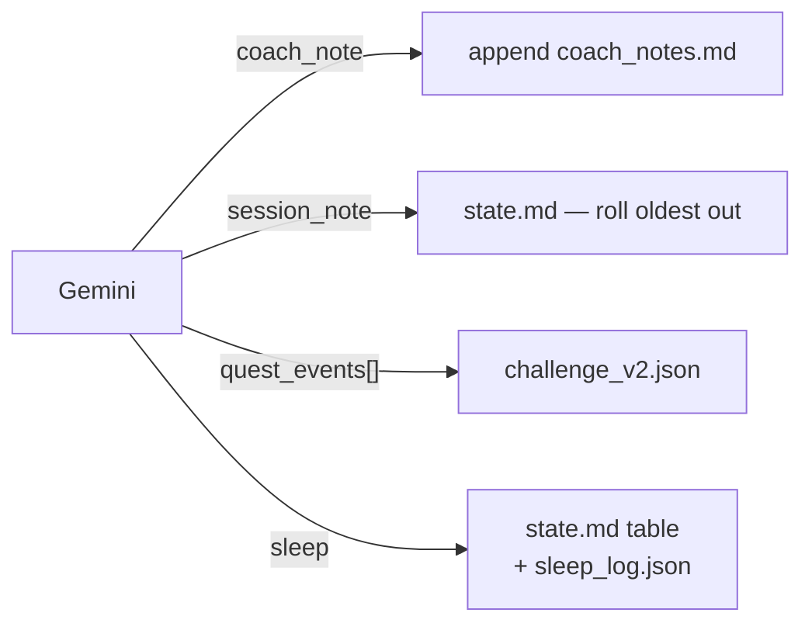

# Coach intent schema — model reports, server writes

> Status: Current · Owner: Tech Lead · Verified: 2026-08-12 · Author: Akash · **P1 of 3** (P0 = [`coach-commit-mvp.md`](../eng-docs/coach-commit-mvp.md), Skanda · P2 = [`ledger-split-plan.md`](ledger-split-plan.md))

## Context

Today the model must produce the write itself: an exact-match `old_string` copied character-for-
character out of a 14KB `state.md`, or an RFC 7396 merge patch encoded as a JSON string. Both fail
silently. Audit of `coach-skanda-2003`: 5 closes, 0 files saved.

The commit itself is **not** broken — those 5 closes each committed `chat_history.json` fine.
`commitFilesAtomic` works. Coach files are dropped before they ever reach it.

P0 proves the fix on one file — the model says what happened, the server writes it. P1 applies the
same move to every remaining coach file.

## Decision

Model emits facts. Server owns all mechanics.

| Field | Shape | Server does |
|---|---|---|
| `coach_note` | string | Append dated entry (shipped in P0) |
| `session_note` | string | Drop oldest of 3, add newest |
| `quest_events` | `[{quest_id, date, status}]` | Apply per quest type, stamp `last_updated_*` |
| `sleep` | `{date, hours}` | Write **both** files — pairing can't be half-done |

Sleep lands in two files because the coach never reads `sleep_log.json` at boot — its context is
`state.md` only (`B_engine.md` §1 step 4). `sleep_log.json` feeds the pipeline and UI instead
(`B_engine.md` file-roles table). That is duplication, and the model has been half-doing it for
exactly that reason. Server-side pairing removes the correctness risk now; P2 removes the
duplication.

No `old_string` anywhere. No merge patch anywhere. No field requires the model to have seen the
file's current content.

## What gets deleted

- `applyStringEdits` / `applyJsonMergePatch` call sites for these four files (`ui/api/_lib/fileEdits.ts`).
- The "How to propose a file change" prompt block, `ui/api/coach-chat.ts:602-624` (~20 lines).
- `platform/soul/B_engine.md` §12's git commands and pre-commit checklist. It names 8 paths the
  server allowlist rejects (`roadmap.md`, `rendered quest context`, `archive/**`) — dead since ADR 0021.
  Rewrite as: reflect, report, confirm. Recompose via `platform/scripts/compose-soul.mjs`.

## Build order

Runs in parallel with P0. Only step 5 waits on Skanda.

**0 — Prerequisite: quest ids.** `rendered quest context` renders quest **names**, not ids
(`ui/api/coach-chat/_lib/coachContext.ts:542`). `quest_events` needs ids. Add an id column.
→ *Verify:* regenerate a quest log, ids visible. Without this, step 2 has nothing to assert on.

**1 — Appliers, in a new file.** `ui/api/coach-chat/_lib/coachIntents.ts`. One pure function per field:
current content in, new content out. No imports from `coach-chat.ts` — Skanda is editing
`resolveFileUpdate` (~819-855) and the commit call (~1199), so a new file means zero conflict.
→ *Verify:* vitest, fixture in / string out. No GitHub, no Gemini.

**2 — Schema + prompt.** Add the four fields to `responseSchema` (`coach-chat.ts:404`). Rewrite the
closing-turn prompt to ask for facts, delete the file-edit-format block (`:602-624`).
→ *Verify:* `npm run eval:coach-chat` against a live key. It calls `askGemini()` directly and never
touches GitHub. Add golden transcripts asserting a real quest id comes back, a real sleep number,
and no merge patches.

**3 — SOUL §12 rewrite.** `platform/soul/B_engine.md`. Reflect, report, confirm. Drop the git
commands and the 8 rejected paths. Recompose via `platform/scripts/compose-soul.mjs`, commit layer
+ composed together.
→ *Verify:* evals still pass; closing prompt token count drops (`[coach-chat] Gemini usage:`).

**4 — Drop the closing fetch from 5 files to 2.** Once the server owns the mutations, the model
only needs `state.md` + `rendered quest context`. This kills the `currentContent === undefined` drop path
(`coach-chat.ts:823`) outright.
→ *Verify:* token count drops again; no `proposed without its current content` lines remain.

**5 — Wire appliers into the close path.** ~5 lines. Needs Skanda's `COACH_CHAT_BRANCH` so
end-to-end testing can't write to a live athlete's `main`.
→ *Verify:* one real close writes all four files on a test branch.

## Done when

- One close writes `state.md`, `challenge_v2.json`, `sleep_log.json`, `coach_notes.md` correctly.
- A quest tick lands from `quest_events` alone — no merge patch anywhere in the response.
- Sleep reported once updates both files. Verified by grep, not by trusting the model.
- `npm run test` and `npm run eval:coach-chat` pass. Golden transcripts on the new schema.

## Deferred

- P2 — `current_week.json` stays on `merge_patch`. Genuinely judgment-heavy (session identity,
  provenance, schema v1). Needs its own intent design, not a rushed field.
- P2 — `injury_flags` stays free-form for now. Same reason.
- P2 — kill the sleep duplication. One source of truth, coach reads it from generated context the
  way it already reads `rendered quest context`. Falls out of the ledger split naturally.
- P3 — Gemini function-calling so the coach reads data on demand instead of pre-loaded files.
  Attacks prompt size, costs round trips. Own ADR.

## Scope guard

Four fields. No ledger restructuring — that's P2, and it must not start until this lands, or every
ledger change becomes a prompt change too.
