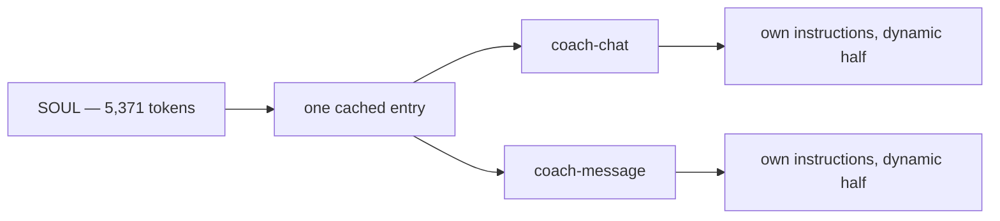
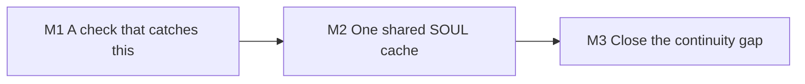

# coach-message: build it properly

> Status: Blocked on the OpenRouter migration · Owner: Tech Lead · Verified: 2026-09-04 · Issue: #828

## Context

`coach-message` shipped as a proof of concept (#320, PR #543) and has not been revisited. Three things measured on 2026-09-04 show what that left
behind. It pays full input price on a 5,371-token SOUL it re-sends every call. coach-chat never
reads the message it produces. And no test in the suite touches a real model, which is why a
Google-side change to thinking mode broke production in silence. This plan is the cleanup. It starts **after** the OpenRouter migration lands, so the
adapters and `llmClient` seam already exist to build on.

## Goal

One cached SOUL serves both callers. Each keeps its own instructions and few-shots in the dynamic
half, where they belong.

## What is already fine — do not "optimise" it

`loadProactiveContext` is not a raw dump. Every field passes a `project*` allow-list with length
caps (`coachMessage.ts:510` onward): 16 activity fields, `effort_shape` sliced to 12 blocks,
injuries filtered to `status === "active"`. Against `shared/golden-dataset/`, projection keeps 98%
of an already-lean 681-byte activity — about 166 tokens each. The athlete payload is not the cost.
The uncached static prefix is.

## Measured baseline

| Thing | Value | How |
|---|---|---|
| SOUL share of the proactive prompt | 5,371 of ~6,859 tokens (78%) | section split of `buildProactivePrompt` output |
| SOUL share of chat's cached prefix | 5,371 of 5,795 tokens (93%) | `staticSystemText(SOUL)` |
| Cache discount coach-message receives | none | 3 identical back-to-back calls, `cachedContentTokenCount = 0` each |
| Thinking-token variance, same prompt | 893 → 1,519 | 3 runs, `gemini-pro-latest` |

## Milestones

| # | Size | Milestone | Result |
|---|---|---|---|
| 1 | S | A check that catches this | One scheduled job calls the real model through `llmClient` and fails on an invalid reply |
| 2 | M | One shared SOUL cache | `coach-chat` and `coach-message` resolve the same cache entry; coach-message's input bill drops ~90% |
| 3 | S | Close the continuity gap | coach-chat knows what the last proactive message said, or an ADR records why it should not |

## PR stack

| PR | milestone | outcome | final base | files | owner | parallel with | result |
|---|---|---|---|---|---|---|---|
| 1 | 1 | Live-model smoke check on a schedule, failing loudly on a truncated or unparseable reply | `main` | `ui/scripts/`, `.github/workflows/`, `ui/api/_lib/_tests/` | Bob the Builder | — | |
| 2 | 2 | Cache SOUL alone; both callers move their own instructions into the dynamic half | PR 1 | `ui/api/_lib/`, `ui/api/coach-chat/_lib/`, `ui/api/coach-message/_lib/`, matching `_tests/`, `docs/eng-docs/gemini-flow.md` | Bob the Builder | — | |
| 3 | 3 | coach-chat reads `latest_message.json`, or an ADR says why not | PR 2 | `ui/api/coach-chat/_lib/`, `ui/api/coach-chat/_tests/`, `kdb/decisions/` | Bob the Builder | — | |

## Done when

1. A real-model check runs on a schedule and fails on a truncated or unparseable reply.
2. One cache entry serves both callers, and `cachedContentTokenCount` is non-zero on coach-message.
3. Output budgets are derived from a measured thinking ceiling, not a constant tuned to a retired model.
4. The chat/proactive continuity gap is closed or explicitly declined in an ADR.

## Deferred

- Trimming the athlete payload — measured, already lean. Reopen only with a number.
- Shrinking SOUL itself. Separate concern, coach quality owns it.
- Proactive-message quality scoring — #714 and `chat-coach-bench.md` cover it.
