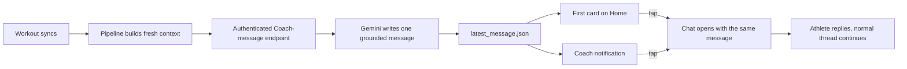

# Proactive Coach message

> Status: Current · Owner: Tech Lead · Verified: 2026-08-23

## Context

The iOS sync toast says “Coach is on it,” but no Coach turn happens: `HealthKitSyncManager.swift`
uploads workouts, `sync.user.yml` rebuilds derived data, and Home keeps showing the weekly
`current_week.coach_read`. Trust needs the promise completed. A synced workout should lead to one
real, grounded Coach message that opens a conversation, without turning every metric into commentary.

## Decision

Coach speaks once after each sync batch, after derived data is fresh. The exact message appears in
the notification, as the first card on Home, and as the opening turn when tapped. It lives in a new
athlete-owned `user_data/coach/latest_message.json`, not in the weekly `coach_read` and not in
`coach_log.json`; those remain weekly judgement and private continuity respectively.

For MVP, iOS calls the endpoint after `WidgetSnapshotStore.refreshAfterSync` observes a fresh
dashboard snapshot. The endpoint uses the signed-in athlete's existing GitHub token and the shared
Gemini key. Athlete repos gain no Gemini secret, and sync still succeeds if Coach generation fails.

## Message contract

`latest_message.json` carries `schema_version`, a unique `id`, `created_at`, the source-qualified
`activity_ids`, `body`, and a `conversation_seed_id`. Replaying the same activity set is idempotent.
Several workouts in one sync produce one message. A newer successful message replaces the previous
one; failure leaves the previous message untouched and sends no false Coach notification.

Heart rate is summarized, never dumped into Gemini. Before iOS reduces the full sample set to the
display curve, it also writes an `effort_shape` into `user_data/activities/streams/<uuid>.json`:
at most 12 human-sized time blocks, each carrying start/end seconds, median BPM, 90th-percentile BPM,
dominant zone, and covered seconds. The prompt renderer combines that with the activity's existing
average, peak, zone time, sensor coverage, and `vs_usual` values.

Missing coverage stays explicit. HR alone cannot prove fatigue, fitness, recovery, or cardiac drift;
those claims need pace or power, repeated-session evidence, or the athlete's report. Coach receives
the effort shape whenever HR exists, but mentions it only when it adds something useful.

Tap must not call the ordinary fresh greeting. Web routes to `/coach-chat` with the conversation
seed; iOS selects Chat with the same seed. The first athlete reply sends that Coach turn as prior
conversation context, then the existing chat lifecycle takes over.

## Voice contract

The prompt gets the synced batch, deterministic comparisons such as `gen/athlete_insights.json`, the
compact HR effort shape, a current live week when available, active injury flags, and recent Coach
continuity. The reply is one thought in 1–3 short sentences: notice something real, respond as a
human, then ask only when an answer would change the coaching. No stat dump, invented cause,
diagnosis, generic praise, or forced question.

- Strong: “You held that together late. That's the part I noticed. How did the last ten minutes feel?”
- Easy: “Good choice keeping this one easy. That's you protecting the work you've already done.”
- Rough: “I saw it. That one looked heavy. Don't fix it from the numbers yet. Tell me what felt off.”
- Batch: “Two sessions landed together. Good work, but I care more about how you've come out of them.”
- HR: “Your heart rate kept settling between pushes. Did the recoveries feel as controlled as they looked?”

Few-shots cover these five shapes and an eval checks grounding, warmth, brevity, safety, and whether
the question was earned. Challenging messages are welcome; relentless congratulations are not trust.

## Done when

1. One new sync batch creates at most one message after derived data is fresh.
2. Notification, Home, and Chat show the same Coach words; Home shows them first.
3. Tapping continues from that message with no duplicate greeting.
4. Retries and duplicate workflow commits cannot create duplicate messages.
5. Gemini or write failure cannot fail sync, erase the last message, or claim Coach responded.
6. HR summaries use full samples, preserve gaps, stay within 12 blocks, and never reach Gemini as raw points.
7. Golden cases for strong, easy, rough, batched, HR, missing-HR, and partial-coverage sessions pass review.

## Deferred

- Messages when no foreground iOS session survives long enough to call the endpoint.
- Quiet hours, notification-preview privacy controls, and per-athlete frequency controls.
- A message inbox or history beyond the single latest conversation seed.
- Proactive Coach messages triggered by recovery, plan drift, or milestones rather than a sync.

Current touchpoints: `ios/CoachHQ/CoachHQ/Services/HealthKitSyncManager.swift`,
`ios/CoachHQ/CoachHQ/Models/HRStream.swift`, `ios/CoachHQ/CoachHQ/Services/WidgetSnapshotStore.swift`,
`engine/.github/workflows/sync.user.yml`, `docs/eng-docs/healthkit-richer-signals.md`,
`ui/client/src/components/home-warm/widgets/CoachReadCard.tsx`, and `ui/api/coach-chat.ts`.
