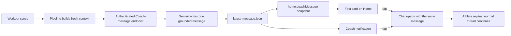
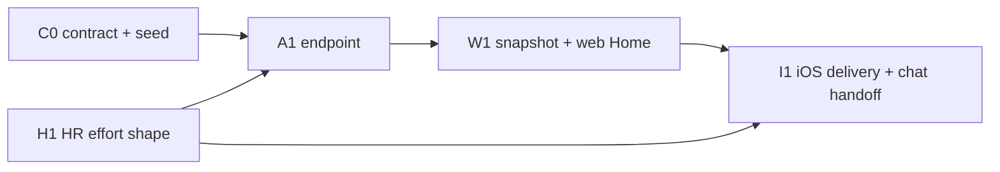

# Proactive Coach message

> Status: Current · Owner: Tech Lead · Verified: 2026-08-23

## Context

The iOS sync toast says “Coach is on it,” but no Coach turn happens: `HealthKitSyncManager.swift`
uploads workouts, `sync.user.yml` rebuilds derived data, and Home keeps showing the weekly
`current_week.coach_read`. Trust needs the promise completed. A synced workout should lead to one
real, grounded Coach message that opens a conversation, without turning every metric into commentary.

## Decision

Coach speaks once after each sync batch, after derived data is fresh. The exact message appears in
the notification, as the first card on Home, and as the opening turn when tapped. It lives in a new
athlete-owned `user_data/coach/latest_message.json`, not in the weekly `coach_read` or private
`coach_log.json`. A fresh carve seeds `{ "schema_version": 1, "message": null }`.

For MVP, iOS calls `ui/api/coach-message.ts` after `WidgetSnapshotStore.refreshAfterSync` observes a
fresh dashboard snapshot. The route is one new Vercel function; the current 8-of-12 count leaves
ADR 0017 headroom. It uses the athlete's existing GitHub token and the shared Gemini key, so athlete
repos gain no Gemini secret and sync still succeeds if Coach generation fails.

## Message contract

`latest_message.json.message` is null or carries a unique `id`, `created_at`, source-qualified
`activity_ids`, `body`, and `conversation_seed_id`. Replaying the same sorted activity-id set is
idempotent. Several workouts in one sync produce one message. A newer successful message replaces
the previous one; failure leaves the previous message untouched and sends no false notification.

The route writes through ADR 0012's `commitFilesAtomic` with a resolved entry. If the sync bot moves
athlete `main`, the helper retries from fresh HEAD and re-reads `latest_message.json`; the resolver
keeps an identical or newer message rather than clobbering it. Exhausted retries return failure,
leave the prior message intact, and schedule no Coach notification.

Heart rate is summarized, never dumped into Gemini. Before iOS reduces the full sample set to the
display curve, it also writes an `effort_shape` into `user_data/activities/streams/<uuid>.json`:
at most 12 human-sized time blocks, each carrying start/end seconds, median BPM, 90th-percentile BPM,
dominant zone, and covered seconds. The prompt renderer combines that with the activity's existing
average, peak, zone time, sensor coverage, and `vs_usual` values.

Missing coverage stays explicit. HR alone cannot prove fatigue, fitness, recovery, or cardiac drift;
those claims need pace or power, repeated-session evidence, or the athlete's report. Coach receives
the effort shape whenever HR exists, but mentions it only when it adds something useful.

ADR 0005 stays the Home boundary. `ui/api/widget-snapshots.ts` fetches `latest_message.json` beside
the existing dashboard snapshot and emits optional `home.coachMessage` with message id, timestamp,
body, and seed id; it does not wait for or trigger a second pipeline run. Web Home and iOS
`WidgetSnapshotStore` both consume that field.

`conversation_seed_id` is `local-proactive-<message.id>`, a local-only thread not yet present in
`chat_history.json`. Web opens `/coach-chat?seed=<id>`; iOS Home and notification `userInfo` pass the
same id through `MainTabView`. Neither calls the fresh greeting: each client materializes the divider
plus exact Coach message, caches it, and sends it as prior context on the athlete's first reply. The
existing close path writes that same thread through `buildChatWrite`, applying ADR 0012's seven-thread
retention. An unopened seed consumes no history slot.

The implementation adds an ADR for the new latest-message lifecycle and snapshot projection. The
activity-grain `effort_shape` extends ADR 0027's existing HR sidecar decision without a new grain.

## Voice contract

The prompt gets the synced batch, deterministic comparisons such as `gen/athlete_insights.json`, the
compact HR effort shape, a current live week when available, active injury flags, and recent Coach
continuity. The reply is one thought in 1–3 short sentences: notice something real, respond as a
human, then ask only when an answer would change the coaching. No stat dump, invented cause,
diagnosis, generic praise, or forced question.

- Strong: “You held that together late. That's the part I noticed. How did the last ten minutes feel?”
- Easy: “Good choice keeping this one easy. That's you protecting the work you've already done.”
- Rough: “I saw it. That one looked heavy. Don't fix it from the numbers yet. Tell me what felt off.”
- Batch: “Two sessions landed together. Good work, but I care more about how you've come out of them.”
- HR: “Your heart rate kept settling between pushes. Did the recoveries feel as controlled as they looked?”

Few-shots cover these five shapes and an eval checks grounding, warmth, brevity, safety, and whether
the question was earned. Challenging messages are welcome; relentless congratulations are not trust.

## Implementation phases

| id | files | deps | owner |
|---|---|---|---|
| **C0 · contract + seed (S)** | `kdb/decisions/0029-proactive-coach-message.md` `kdb/decisions/README.md` `platform/scripts/carve-skeleton.mjs` `docs/eng-docs/skeleton-layout.md` `docs/eng-docs/coach-data-schema.md` | none | Tech Lead |
| **H1 · HR effort shape (M)** | `ios/CoachHQ/CoachHQ/Models/HRStream.swift` `ios/CoachHQ/CoachHQ/Services/HRAnalysis.swift` `ios/CoachHQ/CoachHQ/Services/HealthKitSyncManager.swift` `ios/CoachHQ/CoachHQTests/HRAnalysisTests.swift` `docs/eng-docs/ios-sync.md` `docs/eng-docs/healthkit-richer-signals.md` `docs/eng-docs/healthkit-richer-signals-lld.md` | none | iOS Builder |
| **A1 · generation + atomic write (M)** | `ui/api/coach-message.ts` `ui/api/coach-message/_lib/coachMessage.ts` `ui/api/coach-message/_tests/coachMessage.test.ts` `ui/api/README.md` | C0, H1 | UI Expert |
| **W1 · snapshot + web Home (M)** | `ui/api/widget-snapshots.ts` `ui/api/auth/_lib/generate-widget-snapshots-from-dashboard-snapshot.ts` `ui/api/auth/_lib/generate-widget-snapshots-from-dashboard-snapshot.bundle.js` `ui/api/auth/_lib/generate-widget-snapshots-from-dashboard-snapshot.bundle.d.ts` `ui/api/auth/_tests/generate-widget-snapshots-from-dashboard-snapshot.test.ts` `ui/client/src/components/home-warm/snapshots.ts` `ui/client/src/components/home-warm/warmHomeSnapshots.ts` `ui/client/src/components/home-warm/WarmInstrumentHome.tsx` `ui/client/src/components/home-warm/WarmInstrumentWidgets.tsx` `ui/client/src/components/home-warm/widgets/CoachReadCard.tsx` `ui/client/src/components/home-warm/widgets/CoachMessageCard.tsx` `ui/client/src/components/home-warm/warm-instrument.css` `ui/client/src/hooks/useWidgetSnapshots.ts` `ui/client/src/pages/Home.tsx` `shared/golden-dataset/README.md` `shared/golden-dataset/latest_message.json` `shared/golden-dataset/generate-repo-data.mjs` `shared/golden-dataset/widget_snapshots.json` | C0, A1 | UI Expert |
| **I1 · iOS delivery + chat handoff (L)** | `ios/CoachHQ/CoachHQ.xcodeproj/project.pbxproj` `ios/CoachHQ/CoachHQ/CoachHQApp.swift` `ios/CoachHQ/CoachHQ/Models/WidgetSnapshots.swift` `ios/CoachHQ/CoachHQ/Services/CoachMessageAPIClient.swift` `ios/CoachHQ/CoachHQ/Services/HealthKitSyncManager.swift` `ios/CoachHQ/CoachHQ/Services/WidgetSnapshotStore.swift` `ios/CoachHQ/CoachHQ/Services/CoachChatLocalCache.swift` `ios/CoachHQ/CoachHQ/Views/MainTabView.swift` `ios/CoachHQ/CoachHQ/Views/WarmInstrumentHomeView.swift` `ios/CoachHQ/CoachHQ/Views/CoachChatView.swift` `ios/CoachHQ/CoachHQTests/CoachMessageSeedTests.swift` `docs/plans/coach-proactive-message.md` | H1, A1, W1 | iOS Builder |

## Done when

1. A fresh carve contains a valid null `latest_message.json`; one sync batch creates at most one message.
2. A sync-bot HEAD move retries safely; duplicate or newer messages are never overwritten.
3. `home.coachMessage` carries the exact notification text without a second pipeline run.
4. Home shows it first, and tap continues the same local seed with no duplicate greeting.
5. Closing that conversation persists one normal retained `chat_history.json` thread.
6. Gemini or write failure cannot fail sync, erase the last message, or claim Coach responded.
7. HR summaries use full samples, preserve gaps, stay within 12 blocks, and never send raw points.
8. Strong, easy, rough, batch, HR, missing-HR, partial-coverage, conflict, and seed cases pass review.

## Deferred

- Messages when no foreground iOS session survives long enough to call the endpoint.
- Quiet hours, notification-preview privacy controls, and per-athlete frequency controls.
- A message inbox or history beyond the single latest conversation seed.
- Proactive Coach messages triggered by recovery, plan drift, or milestones rather than a sync.

Current touchpoints: `platform/scripts/carve-skeleton.mjs`, `docs/eng-docs/skeleton-layout.md`,
`docs/eng-docs/ios-sync.md`, `docs/eng-docs/healthkit-richer-signals-lld.md`,
`ui/api/_lib/githubGitData.ts`, `ui/api/widget-snapshots.ts`, `ui/api/coach-chat/_lib/chatThreads.ts`,
`ui/client/src/components/home-warm/WarmInstrumentHome.tsx`, and
`ios/CoachHQ/CoachHQ/Services/WidgetSnapshotStore.swift`.
