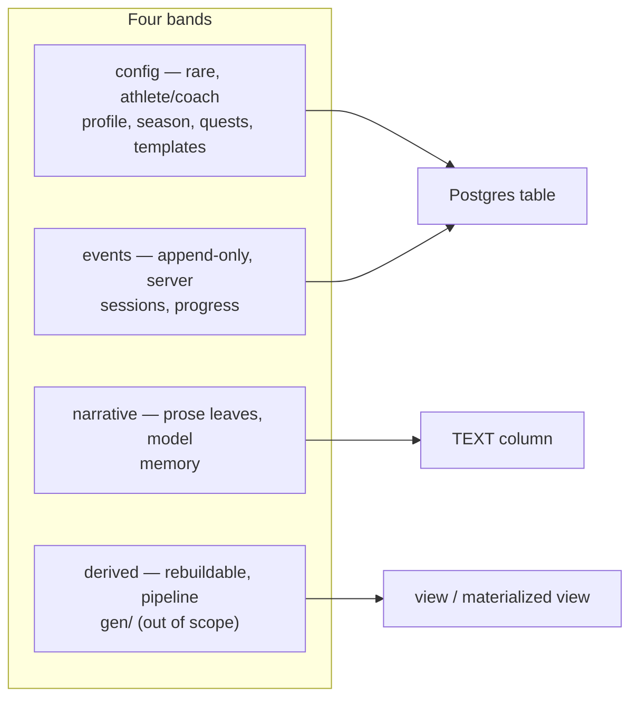
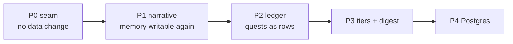

# Coach schema redesign — bands, not files

> Status: Current · Owner: Tech Lead · Verified: 2026-08-16 · Author: Akash · Issue: [#378](https://github.com/sibling-shipyard/coach-hq/issues/378) · Field shapes: [`coach-schema-redesign-lld.md`](coach-schema-redesign-lld.md)
>
> **Supersedes on ship:** [`ledger-split-plan.md`](ledger-split-plan.md) (its 5 open questions are answered in the LLD).
> **Absorbs:** `rolling_state.json` from PR #374 — that PR lands first and is migrated in P1, by design.

## Context

Coach's living memory does not work. `state.md` is read every turn and **written by nothing** —
the closing turn was stripped to `coach_note` only for reliability (`ui/api/coach-chat.ts:16`,
`validUpdates` starts from `[]` at :257). So continuity is spread across three overlapping files at
three retentions — `coach_notes.md` (append-only, never read back), `rolling_state.json` (last 3,
read), `state.md` § Recent Session Notes (last 3, unwritable) — and the one Coach reads is frozen.

The cause is structural: storage, prompt, and SOUL text are the same object, so no file can change
shape without changing what the model reads. Every fix so far has added a file instead. This
redesign covers the **coach-owned surface only** — `user_data/coach/*`, `user_data/ledger/*`,
`user_data/activities/workout_plans/*`. Out of scope: `activities/hist/`, `gen/`, and sleep
(removed in a parallel workstream).

## Decision

Organize by **write-cadence and owner**, not by file or format. Four bands, each with one storage
shape and one 1:1 mapping to a Postgres object later.

Three rules carry the design:

1. **Storage is never the prompt.** A render layer builds the model's view from storage, so later
   phases swap storage without touching SOUL or the prompt. This is what makes the migration
   phased instead of chaotic — it is P0, and it changes no data.
2. **Structure the container, keep the leaves prose.** `memory.json` holds Learned Patterns and
   Coaching Priorities as free text, addressable by key. The server writes one key; no exact-match
   string surgery on a 14KB file. That kills the bug class without flattening the memory into
   fields, which is where "Coach knows me" actually lives (`coach-memory.md`).
3. **Every write carries provenance.** `{updated_at, updated_by, trace_id}` on mutable files,
   `{id, ts, actor, trace_id}` on event rows. Today git history is the only forensic trail and the
   DB move would lose it. Cheap now, impossible to backfill.

### File map

`state.md` is **deleted** — it decomposes into three files plus a rendered view. `coach_notes.md`,
`rolling_state.json`, and `archive/*.md` collapse into one append-only event log; they were always
the same thing at different retentions.

| Band | Target | Replaces |
|---|---|---|
| config | `coach/profile.json` | `state.md` § Athlete Profile + Equipment, `coach_since` |
| narrative | `coach/memory.json` | `state.md` § Baseline, RPE, Priorities, Learned Patterns, Injury Flags |
| events | `coach/sessions.json` | `coach_notes.md`, `rolling_state.json`, `state.md` § Recent Session Notes, `archive/*.md` |
| config | `ledger/season.json` | `challenge_v2.json` § season + phase |
| config | `ledger/quests.json` | `challenge_v2.json` § main_quest, quests[], weekly_targets, graduated |
| events | `ledger/progress.json` | `completed_dates[]`, `missed_dates[]`, `excused_dates[]`, `main_quest.sessions[]` |
| config | `ledger/progressions.json` | `challenge_v2.json` § milestones |

Unchanged this pass: `chat_history.json` (ADR 0012, bounded, works), `current_week.json` and
`workout_plans/*` (already id-shaped — they gain provenance only), `plugins.json`.

### Write side — one intent per phase, never a batch

The model reports a fact; the server owns every mechanic. Intents are **id-addressed and
idempotent**, so a retry cannot double-apply — which is also what a Postgres transaction wants.

| Intent | Payload | Server does | Idempotent on | Phase |
|---|---|---|---|---|
| `coach_note` | `string` | append row to `sessions.json` | `trace_id` | P0 (shipped) |
| `memory_update` | `{key, text}` | replace one leaf in `memory.json` | key + `trace_id` | P1 |
| `quest_event` | `{quest_id, date, status}` | upsert row in `progress.json` | `(quest_id, date)` | P2 |
| `profile_update` | `{key, value}` | set one field in `profile.json` | key + `trace_id` | P2 |

**Add exactly one field per phase.** PR #374's own history is the evidence: `title` was removed for
degenerate output, `session_note` reproduced the same repetition loop and dropped `session_closed`
on the same turn, and reusing the already-proven `coach_note` worked. Response-schema surface is
the scarcest resource in this system — spend it one field at a time, behind evals.

### Read side — tiers with a budget

The output side is already solved — `maxOutputTokens` is 2048 (`coachPrompt.ts:50`), shrunk once the
model stopped having to reproduce `state.md` back. (`backend-decision.md` still says 32768; it is
stale there.) SOUL is also effectively free: it lives in a shared Gemini explicit cache
(`soulCache.ts`), identical across athletes.

**So the entire uncached per-turn cost is the athlete block — the whole 14KB `state.md` plus
`quest_log.md`, shipped verbatim every turn.** That is exactly the surface this redesign controls,
and JSON storage is what makes field selection possible at all; markdown forced all-or-nothing.

| Tier | When | Contents |
|---|---|---|
| `core` | every turn | profile essentials, current season/phase, injury flags, last 3 session summaries, today's plan, quest state one-liner |
| `extended` | closing turn | learned patterns, coaching priorities, fitness baseline, RPE calibration |
| `deep` | on demand (P3) | full quest log, session history digest, workout template detail |

Each tier gets a declared byte budget in the render layer, so prompt size is a number we own rather
than a consequence of how much Coach wrote last month.

The band model pays off twice here: `config` and `narrative` change rarely, `events` change every
session. Splitting the athlete block along that line makes the stable half cacheable **per athlete**
the way SOUL already is across athletes — a P3 follow-on, not a P1 obligation, but only possible
once the two are separate files.

## Phases

Each is one PR, one migration script, skeleton + `coach-akash`. No dual-read adapter — at two
athletes a one-shot script is cheaper than version tolerance.

| Phase | Ships | Verified by |
|---|---|---|
| **P0** | `renderCoachContext()` read seam; `coachIntents.ts` apply seam (PR #374 lands it); `trace_id` propagated into writes | Prompt bytes byte-identical before/after; `npm run eval:coach-chat` unchanged |
| **P1** | `profile.json` + `memory.json` + `sessions.json`; `state.md` deleted; `memory_update` intent | Rendered view byte-identical to today's `state.md`; one live close writes a memory leaf |
| **P2** | 4 ledger files; `quest_event` + `profile_update` intents; `generate_quest_history.py` loses its per-day replay | `generate_quest_log.py` renders identical text before/after migration |
| **P3** | Tier budgets, on-demand chunks, rhythms digest (`coach-memory.md`) | Measured prompt-token drop in `[coach-chat] Gemini usage:` |
| **P4** | Postgres — every file is already a table | Out of scope here; `backend-decision.md` owns it |

## Done when

- `state.md`, `coach_notes.md`, `rolling_state.json`, and `archive/*.md` do not exist in a new or
  migrated repo, and nothing reads them.
- One live close writes a memory leaf and a session row in one atomic commit, confirmed in the repo
  by grep — not by trusting the model's reply.
- A quest tick lands from `quest_event` alone; replaying the same event twice changes nothing.
- Every mutating write in scope carries `trace_id`, and `close-trace` can be joined to the row it
  produced.
- `validate-data.yml` enforces the new shapes; `challenge_v2.json` is gone.
- `npm run test` and `npm run eval:coach-chat` pass at every phase boundary, not just the last.

## Deferred

- **P2 — biometrics file** (`vitals.json`: weight, resting HR, and whatever replaces sleep). Named
  here as an extension point so the schema leaves room; not built until something needs it.
- **P2 — `current_week.json` intent.** Stays judgment-heavy (session identity, provenance); needs
  its own design, per `coach-intent-schema.md`.
- **P3 — Gemini function-calling** so Coach pulls the `deep` tier on demand instead of pre-loading.
  Needs its own ADR; the stable chunk addresses in P1/P2 are the prerequisite.
- **P3 — the athlete's own words.** A thin thread of verbatim quotes alongside Coach's summaries
  (`coach-memory.md`, "Later, not now").
- **ADR churn.** ADR 0018 puts `coach_since` in `challenge_v2.json`; P1 moves it to `profile.json`.
  ADR 0006 is superseded by P2. Both need superseding ADRs filed in the phase that moves them.
