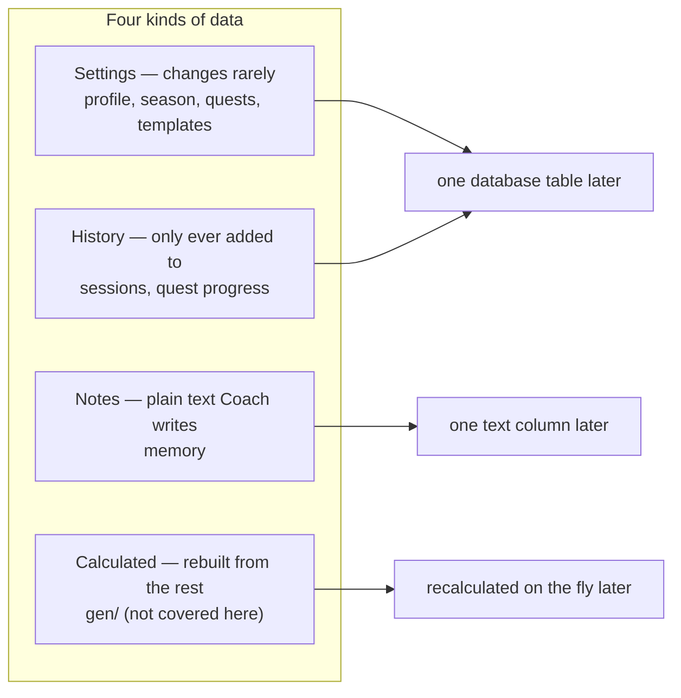
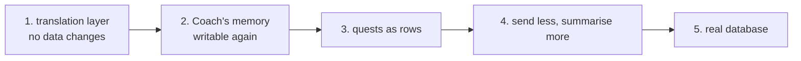

# Coach data redesign — group files by how often they change

> Status: Current · Owner: Tech Lead · Verified: 2026-08-16 · Author: Akash · Issue: [#378](https://github.com/sibling-shipyard/coach-hq/issues/378) · Exact file contents: [`coach-schema-redesign-lld.md`](coach-schema-redesign-lld.md)
>
> **Replaces when it ships:** [`ledger-split-plan.md`](ledger-split-plan.md) — its five open questions are answered in the LLD.
> **Note:** PR #374 lands first. The `rolling_state.json` it adds gets folded in during step 2, on purpose.

## The problem

Coach's memory file, `state.md`, is read every single turn — and nothing ever writes to it.

The closing question to the model was cut back to just `coach_note` to make it more reliable
(`ui/api/coach-chat.ts:16`; `validUpdates` starts as an empty list at :257). So Coach's "living
memory" has been stuck since the app took over. What continuity we do have is scattered across
three files that all do the same job, each keeping a different amount of history:

- `coach_notes.md` — everything Coach ever wrote, but never read back
- `rolling_state.json` — the last 3 sessions (added by PR #374)
- `state.md`'s "Recent Session Notes" — also the last 3, but nothing can write to it

The reason this keeps happening: **the files Coach reads and the files we store are the same
files.** So we can't change how something is stored without changing what the model sees, which
means changing SOUL too. Every fix so far has dodged that by adding another file.

This covers Coach's own files only — `user_data/coach/`, `user_data/ledger/`, and
`user_data/activities/workout_plans/`. Not covered: `activities/hist/`, `gen/`, and sleep (being
removed separately).

## The idea

Sort every file by **how often it changes and who changes it**, not by what it's about. Four kinds:

Sorting this way means that when we move to a real database, each file already matches one table.
No second redesign.

Three rules make it work:

1. **What we store is not what Coach reads.** Add a small translation layer in between. Coach keeps
   reading the same thing it always has; underneath, we're free to change files without touching
   SOUL or the prompt. This is what lets us do the move in steps instead of all at once — it's
   step 1, and it changes no data at all.
2. **Keep Coach's writing as plain text; just put it in labelled boxes.** `memory.json` holds things
   like Learned Patterns as ordinary paragraphs, each under its own label. The server can then
   replace one labelled box instead of trying to find-and-replace exact text inside a 14KB file —
   which is what keeps failing. We are **not** turning Coach's observations into rigid fields;
   that free text is where "Coach knows me" actually lives.
3. **Stamp every write with who did it and when.** Each file or row records `updated_at`,
   `updated_by`, and the existing `trace_id` from the logs. Right now the only record of who
   changed what is git history — and we lose that entirely when we move to a database. Adding it
   now is easy; adding it later is impossible for anything already written.

### Where everything ends up

`state.md` goes away. It splits into three files plus the translation layer that rebuilds the view
Coach reads. `coach_notes.md`, `rolling_state.json`, and the two `archive/*.md` files all become
one running log — they were always the same list, just kept for different lengths of time.

| Kind | New file | Takes over from |
|---|---|---|
| Settings | `coach/profile.json` | `state.md` Athlete Profile + Equipment, `coach_since` |
| Notes | `coach/memory.json` | `state.md` Fitness Baseline, RPE, Priorities, Learned Patterns, Injury Flags |
| History | `coach/sessions.json` | `coach_notes.md`, `rolling_state.json`, `state.md` Recent Session Notes, `archive/*.md` |
| Settings | `ledger/season.json` | `challenge_v2.json` season + phase |
| Settings | `ledger/quests.json` | `challenge_v2.json` main_quest, quests, weekly_targets, graduated |
| History | `ledger/progress.json` | `completed_dates`, `missed_dates`, `excused_dates`, `main_quest.sessions` |
| Settings | `ledger/progressions.json` | `challenge_v2.json` milestones |

Left alone for now: `chat_history.json` (works fine, ADR 0012), `current_week.json` and
`workout_plans/*` (already have proper ids — they just get the who/when stamp), `plugins.json`.

### How Coach saves things

Coach says what happened. The server does all the file writing. Each thing Coach can report has one
matching action, and **repeating the same report twice must leave everything unchanged** — so a
retry can't double-count. That's also exactly how a database transaction wants to behave.

| Coach reports | Looks like | Server does | Repeat-safe because | Step |
|---|---|---|---|---|
| `coach_note` | text | adds a row to `sessions.json` | same `trace_id` | 1 (already live) |
| `memory_update` | `{label, text}` | replaces one labelled box in `memory.json` | same label + `trace_id` | 2 |
| `quest_event` | `{quest_id, date, status}` | updates that day's row in `progress.json` | same quest + same date | 3 |
| `profile_update` | `{field, value}` | sets one field in `profile.json` | same field + `trace_id` | 3 |

**Add one new thing for Coach to report per step — never several at once.** PR #374 is the proof:
`title` was dropped because the model started rambling, `session_note` caused the same rambling and
made it forget to close the session, and reusing the already-working `coach_note` was fine. Every
extra field we ask for makes the model less reliable, so we spend them one at a time, behind tests.

### What Coach reads, and what it costs

The reply side is already handled — the model's reply limit is 2048 tokens (`coachPrompt.ts:50`),
lowered once it stopped having to type `state.md` back out. (`backend-decision.md` still says 32768;
that's out of date.) SOUL is basically free too: it's identical for everyone and stored once in a
shared Gemini cache (`soulCache.ts`).

**So everything we actually pay for, every turn, is the athlete's own material — the full 14KB
`state.md` plus `quest_log.md`, sent in full each time.** That's precisely what this redesign
controls, and splitting it into JSON is what makes it possible to send only the parts we need.
Markdown was all-or-nothing.

| Send | When | What's in it |
|---|---|---|
| Always | every turn | who they are, current season and phase, injuries, last 3 sessions, today's plan, quest status in one line |
| At the end | closing turn | learned patterns, priorities, fitness baseline, RPE anchors |
| Only if asked | later (step 4) | full quest log, training history summary, full workout details |

Each of those gets a size limit written into the translation layer, so prompt size becomes a number
we choose rather than however much Coach happened to write last month.

There's a second win here: settings and notes barely change, while history changes every session.
Once they're separate files, the barely-changing half can be cached per athlete the same way SOUL is
cached for everyone. That's a step-4 bonus, not something step 2 has to deliver.

## The steps

One PR each, one migration script each, applied to the skeleton and to `coach-akash`. No
supporting-both-formats code — with two athletes, a single conversion script is cheaper.

| Step | What ships | How we know it worked |
|---|---|---|
| **1** | translation layer both ways — one that builds what Coach reads, one that applies what Coach reports (PR #374 starts this); `trace_id` carried into writes | the prompt comes out character-for-character identical to today; `npm run eval:coach-chat` unchanged |
| **2** | `profile.json` + `memory.json` + `sessions.json`; `state.md` deleted; `memory_update` added | rebuilt view is character-for-character identical to today's `state.md`; one real session saves a memory note |
| **3** | the four ledger files; `quest_event` + `profile_update` added; `generate_quest_history.py` stops replaying day by day | `generate_quest_log.py` prints exactly the same text before and after |
| **4** | size limits, load-on-demand, training history summary (`coach-memory.md`) | measured drop in `[coach-chat] Gemini usage:` |
| **5** | move to a database — every file is already a table | not covered here; `backend-decision.md` owns it |

## Done when

- `state.md`, `coach_notes.md`, `rolling_state.json`, `archive/*.md` and `challenge_v2.json` don't
  exist in a new or converted repo, and nothing looks for them.
- One real session saves both a memory note and a session entry in a single commit — checked by
  actually looking in the repo, not by believing what Coach said.
- Ticking a quest works from Coach's report alone, and reporting the same tick twice changes nothing.
- Every write records who made it and when, and can be matched to its line in the logs.
- `validate-data.yml` checks the new shapes; `challenge_v2.json` is gone.
- `npm run test` and `npm run eval:coach-chat` pass at the end of *every* step, not just the last.

## Not doing yet

- **A file for body measurements** (weight, resting heart rate, and whatever replaces sleep). Named
  here so we leave room for it — not built until something needs it.
- **Letting Coach edit `current_week.json` directly.** Too much judgement involved; needs its own
  design, as `coach-intent-schema.md` already said.
- **Letting Coach fetch extra detail on demand** instead of us sending it every time. Needs its own
  ADR; steps 2 and 3 are what make it possible.
- **Saving the athlete's exact words** alongside Coach's summaries of them (`coach-memory.md`).
- **ADR updates.** ADR 0018 puts `coach_since` in `challenge_v2.json` and step 2 moves it; ADR 0006
  is replaced by step 3. Each gets its replacement ADR in the step that moves it, not before.
