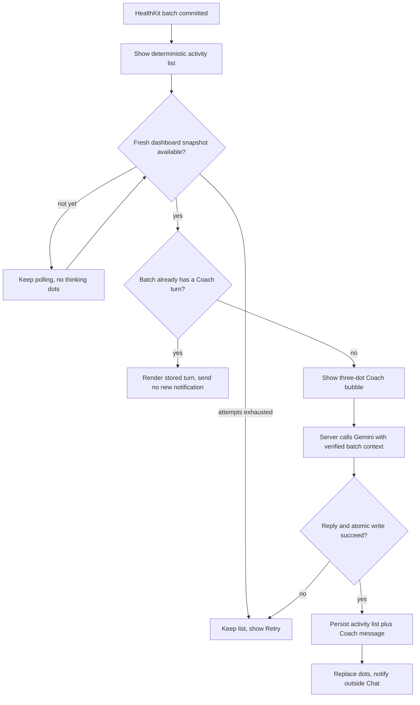
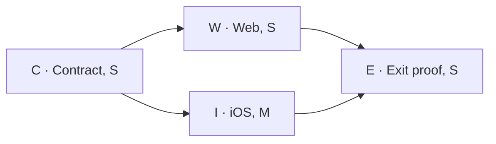

# Activity sync → Coach message trial

> Status: Current · Owner: Tech Lead · Verified: 2026-08-23

## Context

iOS says “Coach is on it” after a HealthKit sync, but no Coach turn follows. This trial completes
that promise: show the exact synced batch in Chat, show the existing thinking bubble while a real
Gemini request runs, then replace it with Coach's grounded message. Model-selected widgets, Home
redesign, and other proactive triggers are out of scope for this trial.

## Current state

- `HealthKitSyncManager.swift` knows the exact sync batch and `WidgetSnapshotStore.swift` already
  waits until the workflow has rebuilt fresh dashboard data.
- Web and iOS already render a three-dot thinking state in `CoachChatWidgets.tsx` and
  `CoachChatWarmUI.swift`; neither chat message contract carries activity attachments.
- `/api/coach-chat` can read athlete context, call Gemini, and atomically write chat history, but
  it has no activity-sync turn or retry key.

## Decision

The activity list is system-owned evidence. iOS sends source-qualified IDs from the completed sync;
the server rereads those activities from the athlete repo and builds every displayed value. Gemini
writes words only. One sorted set of activity IDs produces one stable `batch_id`, so retries return
the existing turn instead of generating another.

## Contract and behavior

- Add `attachments?: ChatAttachment[]` to Coach messages. Trial kind:
  `synced_activity_list { batch_id, activities[] }`; rows contain stable ID, title, sport, start,
  duration, and load when available. Tap opens Activity Detail.
- While the request is pending, clients render the list followed by their existing thinking bubble.
  On success that pending state becomes one durable Coach turn carrying the same attachment.
- Thinking dots appear only while `/api/coach-chat` is awaiting Gemini. Snapshot polling is a sync
  state, not Coach “thinking.”
- A failed Coach turn cannot fail sync or erase the list. Dots stop, Retry appears, and no Coach
  notification is sent. When the reply lands outside Chat, its real first sentence replaces the
  current “Coach is on it” copy.
- The prompt sees the verified batch, fresh `gen/athlete_insights.json`, current live week when
  available, injuries, and recent continuity. The reply must stand alone, mention no invented cause,
  and ask a question only when the answer could change the coaching.

## Build slices

| id | files | deps | owner |
|---|---|---|---|
| C · turn contract | `ui/api/coach-chat/**` | — | UI Expert |
| W · web list | `ui/client/src/components/coach-chat/**` | C | UI Expert |
| I · iOS trigger + list | `ios/CoachHQ/CoachHQ/Services/{HealthKitSyncManager,WidgetSnapshotStore,CoachChatAPIClient}.swift`, `ios/CoachHQ/CoachHQ/Views/{CoachChatView,CoachChatWarmUI,WarmInstrumentHomeView}.swift` | C | iOS Builder |
| E · exit proof | `ui/api/coach-chat/_tests/**`, web/iOS fixtures, this plan | C, W, I | Tech Lead |

W and I may run together after C because their file sets do not overlap. The critical path is
C → I → E. User-visible rollout waits for both clients so a persisted thread never breaks when
opened on the other platform.

## Done when

1. A one-activity or multi-activity sync shows one list, then real thinking dots, then one Coach reply.
2. Duplicate callbacks, refreshes, and Retry cannot create a second turn for the same `batch_id`.
3. Every card value comes from reread repo data; Gemini controls no IDs or measurements.
4. Failure leaves sync successful, the activity list visible, dots stopped, and Retry available.
5. The persisted turn renders and deep-links correctly on both web and iOS.

## Deferred

- Coach-requested widgets, comparisons, plan cards, and any attachment chosen by Gemini.
- The Home-first Coach card and inline widget previews outside Chat.
- Delivery after iOS has been terminated, quiet hours, and notification privacy controls.
- Proactive messages driven by plan drift, recovery, milestones, or time rather than an activity sync.

## Progress

- **C · turn contract:** done
- Files: `ui/api/coach-chat.ts`, `ui/api/coach-chat/_lib/{activitySync,activitySyncTurn,chatThreads,coachChatFiles,coachTurn,coachReplySchema,coachPromptText}.ts`, `ui/api/coach-chat/_tests/activitySyncTurn.test.ts`, `docs/eng-docs/coach-chat-daily.md`, `docs/eng-docs/coach-data-schema.md`
- Checks: `npm test -- --run` (29 files / 362 tests) and `npm run check` (`tsc --noEmit`) from `ui/`
