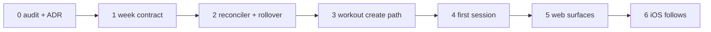

# Current Week and Workouts: pick an approach

> Status: Options · Owner: Tech Lead · Created: 2026-09-11 · Issue: #727
>
> Evidence and the full file inventory live in
> [`current-week-workouts-redesign-lld.md`](current-week-workouts-redesign-lld.md).
> This doc records the choices. It does not pick one.

## Context

Current Week asks the language model to own week identity, a lifecycle state machine, timezone
freshness, reconciliation, plan edits and coaching prose. It spreads that across three action
fields that silently drop each other. Workouts freeze at signup because there is no create path,
so onboarding dumps 4-6 guessed templates on every new athlete.

`workouts-season-model.md` already covers the workouts half. It is architecturally right, entirely
unexecuted, and it explicitly refuses to slim `current_week.json`.

## The axis

Each step moves work from the model to code. W3 is where W1 leads, so choosing W1 does not spend
the option.

## Current Week

| # | Approach | What changes | Cost |
|---|---|---|---|
| **W1** | **Code owns the frame, Coach owns intent and exceptions** (REC) | One sparse `week_update` replaces three actions and carries a date, so a move stops being a full rewrite. `discipline` becomes a closed enum. Reconciliation and weekly rollover move to code. Dead fields dropped after a consumer audit | Medium |
| W2 | Shrink the model's surface only | Same action collapse and rollover, no stored field changes | Low |
| W3 | The week is compiled, not authored | Code builds the seven-day frame from season intent and stored availability. Coach sets focus and exceptions only | High |

W1's risk is the field drops. Nobody has read every consumer yet, so that audit is step zero.
W2 leaves the dead fields, the free-text discipline and two drifted schema authorities in place.
W3 depends on blocks landing in `seasons.json`, which is gated Stack B work.

## Workouts

| # | Approach | What changes |
|---|---|---|
| **K1** | **Keep the architecture, re-cut the stacks** (REC) | Adopt §2, §5, §6 and §7 as written. Pull the deterministic reconciler and the non-chat week roll out of gated Stack B. Promote the First Session benchmark. Amend §4 to permit the week slimming. Land the ADR early, not at B6 |
| K2 | Execute the plan exactly as written | Current Week is fixed afterwards. The dark week and the template dump survive until then |
| K3 | Skip the hotfix, go straight to the season compiler | Designs on the open churn question the plan itself refuses to design on |

K1 moves two items out of Stack B because neither depends on the question that gates it, and the
week roll is the fix for a live bug.

## A new athlete's first week is compilable

Sports, injuries, the goal and its shape, and the tagged workout library are all captured already.
The one missing input is how many days a week and which days. First Session asks it, but the answer
lands as prose in the `fitness_baseline` note. Add `memory.json.availability` and a compiler can
place anchor sessions on real days. So "benchmark plus a first week" is reachable, not just
"benchmark only".

## Sequencing, for one landing, web first

Milestone 0 gates everything. No field is dropped before its consumers are read. The PR stack table
lands once an approach is chosen, per `kdb/doc-style.md`.

## Done when

- An approach is chosen for each half, and this doc records it.
- Milestone 0's audit names every consumer of every field proposed for removal.
- `workouts-season-model.md` and its LLD are amended for the defects listed in the LLD.

## Deferred

- Blocks and periodization stay gated, as `workouts-season-model.md` §12 says.
- The fate of #732, #733 and #734. Two conflict with `main` and all three predate the new contract.
- The widget in #727's done-when, which both stacks cut. That issue cannot close as written.
