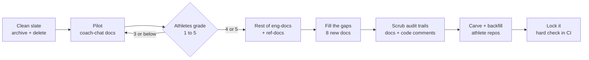

# Doc overhaul: HLD

> Status: Plan · Owner: Tech Lead · Verified: 2026-09-19

Drill-down (per-PR files, per-doc verdicts, check specs): `docs/plans/doc-overhaul-lld.md`.

## Context

Opening an eng-doc means reading all of it to learn what the system does. Docs were written by agents
for agents and read like change logs. The audit (63 docs against the code) found:

- 24 accurate, 11 stale, 3 with dead paths, 12 hard to skim, 7 historical, 4 shipped plans.
- The switch to OpenRouter (ADR 0046) never reached six docs. Four docs explain the same LLM seam.
- 799 audit-trail lines (issue numbers, dates, "no longer", "previously") in docs and code comments.
- No current end-to-end picture, no glossary, and no doc for CI, cron, deploys, the web client,
  widgets, the derived-data pipeline or the athlete-repo lifecycle.

## What this plan does

1. **New doc shape.** Every eng-doc has two sections, `## Human` then `## Agent`.
	`## Human` says what it is, how it works, and what it does and does not do.
	It uses plain language and a diagram wherever there are moving parts, with no length cap.
	`## Agent` holds paths, symbols and contracts in today's style, and runs as long as it needs to.
2. **No audit trails, anywhere.** Rule in `AGENTS.md`. Git is the archive.
3. **Historical docs** move to `docs/hist/`, untouched. Shipped plans are deleted.
4. **Gaps get real docs**, starting with one system overview and a glossary.
5. **A hard check** in CI keeps all of it from decaying.

## Decisions

Made by the athlete:
1. Historical docs go to `docs/hist/`, no deletes for them.
2. Scrub audit trails everywhere, code comments included.
3. A touched eng-doc without both sections is a hard error.
4. Human sections have no line cap. High-level working matters more than brevity.
5. Agent sections may run long. Length is fine for an agent. The Human section is the required part.
6. Diagrams: mermaid by default. Where an architecture view is too dense for mermaid, a hand-drawn SVG
	pair (light and dark) is checked in beside the doc.

Settled by checking the code (Akash's draft plan assumed otherwise):
- **No missing ADR.** ADR 0046 records the OpenRouter switch. `llm-provider-current.md` only needs to stop
	contradicting it.
- **The provider "future" doc is already folded** into `llm-provider-current.md`. Nothing to fold.
- **`STEERING.md` already has a reading order.** It only lacks `ROADMAP.md`.
- **`ops-agent-setup.md` is deleted.** Its issues are closed and the delete-on-ship rule applies.
- **`backend-decision.md` goes to `docs/hist/`.** It is research with no decision filed.

Taken from Akash's draft: pilot on coach-chat first with a grading gate, the four diagrams (LLM seam,
request lifecycle, entity map, two-repo topology), rewrite `coach-data-schema.md` around its entity map,
collapse `scaling-plan.md` to current status, keep `coach-chat-test-scenarios.md` as a catalog.

The three closed docs PRs are not thrown away. Their rewritten drafts and four diagram pairs are the
starting point for PRs 3, 4, 5 and 8 (LLD, "Reuse from the closed PRs").

Not taken: the one-sentence "stay within budget" rule (the hard check replaces it), leaving ref-docs
alone (three of them ship to athletes and need the same scrub), and doing no code scrub.

## Stack

One linear stack, merged bottom-up. The plan PR merges to `main` first. Then the stack branches off
`main`. `Refs: #N` on PRs 1 to 12, `Fixes: #N` on PR 13, which also deletes both plan files.
Branch names `core/doc-overhaul-<nn>-<brief>`. Six milestones, at most three PRs each.

| PR | milestone | outcome | owner | result |
|---|---|---|---|---|
| 1 | M1 Rules and clean slate | New doc shape and no-audit-trail rule written | Tech Lead | Style, rule and reading order live |
| 2 | M1 | Historical docs archived, shipped plans deleted | Tech Lead | `docs/hist/` exists, citations repointed |
| 3 | M2 Pilot: coach-chat | LLM cluster rewritten, ADR 0046 true everywhere | Tech Lead | One seam doc, one call-path doc |
| 4 | M2 | Coach-chat docs in the new shape | Tech Lead | Front door doc plus lifecycle diagram. Grading gate |
| 5 | M3 Rest of eng-docs | Data, soul, platform, ops docs migrated | Tech Lead | Entity map, trimmed scaling plan |
| 6 | M3 | iOS docs migrated | Tech Lead | Strava and Netlify framing gone |
| 7 | M3 | Ref-docs scrubbed, front matter standardized | Tech Lead | Athlete-facing docs clean |
| 8 | M4 Fill the gaps | Overview, glossary, topology, CI map | Tech Lead | One doc explains the whole system |
| 9 | M4 | Deploy, web client, widgets | Tech Lead | Front end and hosting documented |
| 10 | M4 | Week rollover, derived pipeline, athlete-repo lifecycle | Tech Lead | Data path documented end to end |
| 11 | M5 Scrub comments | Code comments scrubbed, app code | Bob the Builder | No tell lines in `ui/` and `engine/` |
| 12 | M5 | Platform, role docs, soul, kept plans scrubbed | Tech Lead | No tell lines outside named exceptions |
| 13 | M6 Lock | Hard check live, plans deleted | Tech Lead | CI enforces shape and rule |

After PR 12 merges and before PR 13: carve `coach-skeleton` and backfill the athlete repos, only if a
propagated doc changed (LLD section "Carve and backfill").

## Risks

- **Hard check blocks unrelated PRs.** It lands last, after every Current eng-doc is migrated.
- **Carve.** The style block is carved to other repos, so PR 1 bumps the agent-kit version.
- **Moving docs breaks citations.** PR 2 repoints each one in the same PR.
- **Code scrub is about 400 lines in Bob's area.** Comments only, CI green on the pushed SHA.
- **Human sections written from memory drift.** Each is checked against source before merge.

## Done when

1. `python3 kdb/scripts/validate_kdb.py` reports zero errors and fewer warnings than today.
2. Every Current eng-doc has `## Human` then `## Agent`. Every backticked path in an Agent section exists.
3. Grep for the tell words finds nothing outside the named exceptions.
4. A scratch branch that breaks either rule fails CI.
5. Every PR is green on its pushed SHA. Athletes rate the pilot and the overview 4 or higher.
