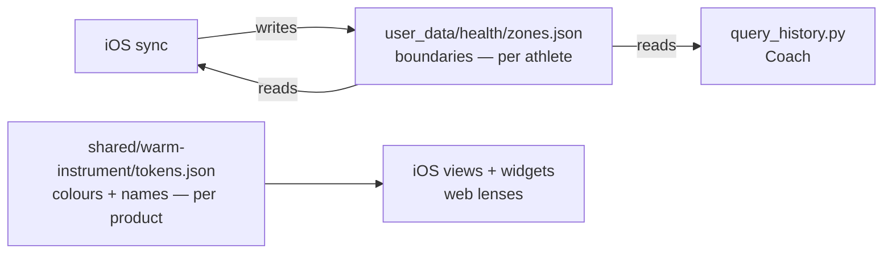

# HR zones — one source of truth for boundaries and colours

> Status: Current · Owner: Tech Lead · Verified: 2026-08-23 · ADR: 0028 (new) · Issues: [#495](https://github.com/sibling-shipyard/coach-hq/issues/495) · Blocked half: [#501](https://github.com/sibling-shipyard/coach-hq/issues/501)

Wave 1 only. Wave 2 (the derived default) is gated on #501 and is scoped at the bottom, not built.

## Context

One concept, "heart rate zone", is duplicated across the repo twice over — once as **boundaries**, once
as **colour**.

**Boundaries** `131/145/158/172` — five copies, not the three #495 names:

| Copy | Who can correct it |
|---|---|
| `ios/CoachHQ/CoachHQ/Models/Activity.swift:143` — `HRZoneConfig`, `UserDefaults` | athlete, device-local |
| `engine/core/query_history.py:40` — `HR_ZONES` | nobody — this is Coach's view of history |
| `ui/client/src/lib/activities.ts:282` — `HR_ZONE_LABELS` | nobody — and it has **zero consumers** |
| `shared/golden-dataset/generate-repo-data.mjs:85` | nobody — HQ's UI fixture |
| `ui/api/auth/_lib/generate-widget-snapshots-...bundle.js:761` | nobody — checked-in bundle |

Edit the steppers and only iOS changes — Coach keeps labelling against 131. And `UserDefaults` is
device-local, so a reinstall silently reverts an athlete's correction with no marker in the data.

**Colours** — four palettes, two conflicting name sets:

| Copy | Ramp |
|---|---|
| `ios/.../Views/ActivityDetailView.swift:12` `detailZoneColors` | earthy, `#c3d1c8 → #7f3728` |
| `ui/.../sport-analytics/runningLensModel.ts:23` + `badmintonLensModel.ts:554` | earthy, same ladder **shifted one rung**, `#adc2b7 → #4a241a` |
| `ios/.../Views/Theme.swift:59` `hrZoneColors` | tailwind blue→red; predates Warm Instrument |
| `ui/client/src/lib/activities.ts:282` colours | tailwind blue→red, and Z1 differs from Theme's |

Names: `ActivityDetailView.swift:7` says `Recovery/Base/Aerobic/Threshold/VO₂ Max`; `query_history.py:41`
comments say `Recovery/Aerobic base/Aerobic/Threshold/Max effort`; web ships no names.

**What the web does *not* do.** It renders zone *proportions*, never boundaries — `grep` for `.low`/`.high`
across `ui/client/src` returns nothing, and the lens models emit only `label: "Z${n}"` plus a percent
(`runningLensModel.ts:513-517`). So the web needs colours from this work, not numbers. `HR_ZONE_LABELS`
is the only web code holding range strings, and nothing imports it.

`#495` says the default should be Karvonen from `resting_hr`. **`resting_hr` does not exist** — one
HealthKit *authorization* request at `HealthKitSyncManager.swift:68`, no query, no field, no reader. It
lands in #501. The derivation is blocked; the plumbing is not. Wave 1 ships boundaries **stored
verbatim**, so no zone number moves.

Reuse, don't reinvent: `HRZoneEntry` (`Activity.swift:122`) already persists `low`/`high` per activity,
and `RibbonBuilder.storedConfig(from:)` (`Services/RibbonBuilder.swift:87`) already recovers historical
boundaries from it.

## Decision



**Two sources, because they answer to different owners.** Boundaries are athlete physiology and vary per
person, so they live in the athlete repo. Colours and names are product design, identical for everyone, so
they live in the Warm Instrument token pipeline, which already feeds four consumers and already has
`.github/workflows/validate-tokens.yml` failing CI on drift. Nobody had wired zones into it.

**Boundaries file** — `user_data/health/zones.json`, the health band ADR 0027 defines, where #501's
`resting_hr` will land. Not `platform/soul/C_athlete.md`: a 19-line pointer file, identical for every
athlete, whose schema block was already deleted once for describing a shape nothing on disk used
(`docs/eng-docs/soul-C-schema.md:7`). Not `user_data/coach/profile.json`: coach-chat-only, unread by
Python, iOS and the dashboard, and LLM-written via `turnWrites/`.

Plumbing precedent: **`user_data/ledger/plugins.json`** — the one existing athlete config file read by both
Python (`engine/lib/plugins.py`) and Node. Copy its shape: a tiny loader per language, a default when
absent, an `is_hq_monorepo` guard.

```json
{
  "version": 1,
  "_meta": { "updated_at": "2026-08-23T09:12:00Z", "updated_by": "ios-sync" },
  "source": "derived",
  "method": "stored_v1",
  "inputs": { "max_hr": null, "resting_hr": null },
  "boundaries": [131, 145, 158, 172]
}
```

Four inclusive uppers, Z5 implicit — same contract as `HRZoneConfig` today. `source` is `"derived"` or
`"override"`; an override wins and is never recomputed until cleared. Wave 2 fills `method` and `inputs`.

**Absent file = today's numbers, everywhere.** All three readers fall back to `[131,145,158,172]`. This is
load-bearing: it is why repos carved before this change keep working, why no phase depends on another
having shipped, and why **the file is deliberately not added to the carve template** — a fresh repo has no
`zones.json` until iOS writes one, which keeps the default in exactly one place per language.

**When iOS writes it.** Two triggers, both in phase 2:
1. **Seed on first sync when absent.** Written from the device's current `UserDefaults`. If those differ
	from `.default`, the athlete had already customised on this device, so the seed records
	`source: "override"` — that migrates an existing correction into the repo instead of losing it.
	Otherwise `source: "derived"`.
2. **On override.** Flipping the Settings toggle rewrites the file.

**How iOS reads it.** `HRZoneStore` fetches `zones.json` during sync alongside the other repo reads and
mirrors it into `UserDefaults`. `HRZoneConfig.current` reads that mirror, so zone integration stays
synchronous and offline-safe. Precedence: **mirror → legacy `UserDefaults` keys → `.default`.**

**Canonical ramp**, replacing all four palettes:

| | hex | name | note |
|---|---|---|---|
| Z1 | `#c3d1c8` | Recovery | |
| Z2 | `#6f9080` | Base | **moved down** — was `#adc2b7` |
| Z3 | `#315a4a` | Aerobic | |
| Z4 | `#a8702c` | Threshold | `= sports.cycling.hex` |
| Z5 | `#7f3728` | VO₂ Max | `= palette.accent` |

Today's `ActivityDetailView` ramp, with one fix. It was bunched at the light end: `Z1→Z2` sat at
**1.19:1** — two pale sages reading as one colour on the ribbon, where most badminton time lands — while
`Z2→Z3` had a 4.15:1 gap going spare. Moving Z2 into that gap splits it evenly at 2.22 / 2.22 and lifts the
ramp's weakest step to 1.86:1. Ends unchanged.

**Override is cold, not absent.** Garmin, Strava and watchOS 11 all derive by default and bury the manual
edit. Match that: the four steppers move behind a `Custom zones` toggle, **off by default**. An override
does not fail ADR 0023 — that rule is about signals needing to stay *current*, and an override is
write-once. The always-visible stepper is what fails 0023.

**One set of boundaries, not per-sport.** Considered and dropped. Max HR and resting HR are one number per
person; Garmin's per-sport sets exist because *achievable* max differs by modality, which matters when
training to zone prescriptions across several endurance sports. This athlete is badminton-primary, where HR
lags effort enough that zone time means something different regardless. And with no per-sport data to
derive from, the numbers would be hand-typed — the exact ADR 0023 habit this issue removes.

## Phases

| id | files | deps | owner |
|---|---|---|---|
| 1 | `kdb/decisions/0028-*.md`, `kdb/decisions/README.md`, `docs/eng-docs/hr-zones.md`, `docs/plans/hr-zones-single-source.md`, `engine/lib/hr_zones.py`, `engine/lib/hrZones.mjs`, `engine/lib/repo_layout.py`, `engine/lib/repo-layout.mjs`, `shared/golden-dataset/generate-repo-data.mjs` | — | Tech Lead |
| 2 | `ios/CoachHQ/CoachHQ/Services/HRZoneStore.swift`, `Models/Activity.swift`, `Views/SettingsView.swift`, `Services/HealthKitSyncManager.swift`, `CoachHQTests/HRZoneStoreTests.swift` | 1 | iOS Builder |
| 3 | `engine/core/query_history.py` | 1 | Bob |
| 4 | `shared/warm-instrument/tokens.json`, `shared/warm-instrument/generate.mjs`, `ui/client/src/lib/wiTokens.ts`, `ui/client/src/components/home-warm/wi-tokens.generated.css`, `ios/CoachHQ/CoachHQ/Views/WarmInstrumentTokens.generated.swift`, `ios/CoachHQ/CoachHQ/Models/HRZone.swift`, `Views/ActivityDetailView.swift`, `Views/Theme.swift`, `Views/ActivityFeedVariants.swift`, `Views/CoachingInsightsView.swift`, `ui/client/src/components/sport-analytics/runningLensModel.ts`, `ui/client/src/components/sport-analytics/badmintonLensModel.ts`, `ui/client/src/lib/activities.ts`, `ui/api/auth/_lib/generate-widget-snapshots-from-dashboard-snapshot.bundle.js`, `engine/core/query_history.py`, `docs/plans/hr-zones-single-source.md` *(deleted)* | 3 | UI Expert |

Phases 2 and 3 have disjoint `files` and both sit on 1 — either order. **Phase 4 is last** because it
re-touches `query_history.py` (phase 3); per CONVENTIONS, cross-cutting edits go at the top of a stack,
never the bottom. Phase 4 also **deletes this plan file** (AGENTS.md § Doc upkeep), which is why the file
appears in its row.

**Phase notes:**

1. Two loaders, one contract: `load_hr_zones(repo) -> list[int]` and `loadHrZones(repoRoot)`. Each returns
	the default on a missing, malformed, or non-strictly-increasing file, and each guards HQ with
	`is_hq_monorepo` the way `engine/lib/plugins.py:1` does — HQ has no `user_data/`. Add `health_dir()` /
	`healthDir()` to both `repo_layout` modules. `generate-repo-data.mjs:85` **imports the default from
	`hrZones.mjs`** instead of its own literals; its 25/35/25/10/5% proportions are unrelated and stay.
	No carve template and no golden fixture — absent means default, and adding either would re-introduce a
	literal copy.
2. `HRZoneStore` owns fetch/mirror/write per the read and write rules above. Do **not** add a second commit
	path — `HealthKitSyncManager.swift:172-176` already has an `extraFiles` hook with no caller. Reject
	non-strictly-increasing boundaries at the Settings UI: today `SettingsView.swift:131` gives the four
	steppers overlapping ranges (`100...160`, `120...170`, …), so Z1 upper 160 with Z2 upper 120 is
	reachable.
3. `HR_ZONES` becomes a call to `load_hr_zones()`. `format_zone_label` (`query_history.py:99`) already takes
	`(name, low, high)` — feed it, don't rewrite it. Seconds still come from each activity's stored
	`hr_zones`; only labels and ordering change.
4. `tokens.json` gets a `zones` key as a **JSON array**, not an object — zones are ordered Z1→Z5 and
	`sports`/`workouts` are unordered maps, so copying their shape loses the ordering. Each entry is
	`{hex, label, name}`. Four consumers, all updated together:
	a. `generate.mjs` emits `--wi-zone-1 … --wi-zone-5` to CSS and `WITokens.Zones.ramp: [Color]` to Swift.
	b. **`ui/client/src/lib/wiTokens.ts` imports `tokens.json` directly** via the `@warm-instrument` alias
		(`ui/vite.config.ts:12`, `ui/tsconfig.json:23`). Add a `zoneRamp()` accessor beside the existing
		`sportHex`/`sportMixHex`. **Not codegen** — the lens models need hex strings in JS, not CSS vars.
	c. The serverless bundle **inlines** `tokens.json` (see its line 1). Re-run
		`ui/scripts/bundle-widget-snapshots-api.mjs`.
	d. The **widget extension compiles the generated Swift** (`CoachHQ.xcodeproj/project.pbxproj:70-80`), so
		widgets pick the ramp up for free — build `CoachHQWidgetExtension`, not just `CoachHQ`.

	Then delete all four palettes and both name sets. New `Models/HRZone.swift` holds the `"Zone 1"…"Zone 5"`
	keys and names re-declared at `ActivityDetailView:6`, `ActivityFeedVariants:49,90` and
	`CoachingInsightsView:216`. **Delete `HR_ZONE_LABELS` outright** — dead code, and the web renders no
	boundaries. Two intended visual changes to call out in the PR: `Theme.heartRateColor` aliases
	`hrZoneColors[4]`, so the Settings heart icon becomes `#7f3728` instead of tailwind red; and old
	activities keep their stored boundaries but render in the new ramp, which is correct.

## Done when

**Boundaries**

1. The only zone-boundary literals left in the repo are the two loader defaults (`hr_zones.py`,
	`hrZones.mjs`) and iOS's `HRZoneConfig.default`. `grep -rn "131" ` proves it.
2. With no `zones.json` present, `query_history.py --detail <id>` and the iOS legend print exactly the
	labels they print today.
3. With `{"boundaries":[120,140,155,170]}` committed, both change to match — no code edit.
4. Re-integrating a known HR stream with `zones.json` absent yields zone seconds identical to today's
	output. *(This is the real no-numbers-moved check — existing `hist/*.json` are never rewritten by this
	work, so comparing them proves nothing.)*
5. A device with customised steppers and no `zones.json` produces one on next sync with
	`source: "override"` and the athlete's numbers.
6. Setting a custom zone, deleting the app, reinstalling and re-syncing restores that custom zone.
7. A non-strictly-increasing array is rejected at the Settings UI and ignored by all three readers —
	Python, Node, iOS.

**Colours**

8. No zone hex literal outside `tokens.json` and its generated/bundled outputs.
	`node shared/warm-instrument/generate.mjs` then `git diff --exit-code` is clean — what
	`validate-tokens.yml` runs.
9. iOS ActivityDetail ribbon, iOS widgets and the web lens bars render the same five colours for the same
	activity.
10. `HR_ZONE_LABELS` no longer exists and nothing referenced it.

## Wave 2 — after #501, do NOT build now

Karvonen (%HRR) from `resting_hr` (day-grain, #501) and a **95th-percentile** max over recent activities
rather than raw all-time max — one 210 bpm strap glitch must not set the ceiling permanently. Writes
`source: "derived"`, `method: "karvonen_p95_v1"`, re-derived on sync. That is what makes the default
self-maintaining per ADR 0023; wave 1 only makes it possible.

## Deferred

- P2 — recomputing historical `hr_zones` under new boundaries. History keeps its own `low`/`high`.
- P2 — `gen/dashboard_snapshot.json` could carry `hr_zone_boundaries` for the web. Not built: nothing reads
	it, and the key would collide in review with the per-activity `hr_zones` seconds. Add it with its first
	consumer, and name it `hr_zone_boundaries`.
- P2 — zone *names* now exist as tokens but the web still renders `Z1…Z5`. Left as-is; changing web labels
	is a design call, not plumbing.
