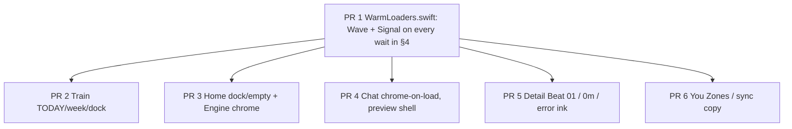

# iOS craft pass — LLD

> Status: Plan · Owner: iOS Builder · Created: 2026-09-16 · Issue: #1159

Drill-down for [`ios-craft-pass.md`](ios-craft-pass.md). The plan is the PR stack. This file is the audit: screens, waits, file lines, and what not to copy. Delete both files on the last PR of #1159.

Until this file existed, the research lived only in a Cursor thread plus a one-page plan.

---

## 1. Bar

The athlete rated **Activity Ledger** 5/5. That score is **care**, not a look.

What the ledger actually did: closed weeks (`+N MORE` + two paper edges), riffle that still lets a flick scroll, tap-after-riffle ignore, TODAY marking, a load sheet, a haptic per gesture. Every awkward state was designed.

**Do not** clone paper stacks, `‹ HQ` headers, or riffle onto other tabs. Each screen keeps its own language. Sit with every state the way the ledger did.

Warm Instrument tokens stay. Terracotta is load and primary action only (ADR 0041). Never a spinner colour, error colour, or decoration.

---

## 2. Evidence

| Source | What we saw |
|---|---|
| Sim iPhone 17 Pro, Coach HQ logged in | Train library + TODAY none (no THIS WEEK). Home cold skeleton (white field, leftover bars). Home loaded. Chat spinner then D-183 landing. |
| TestFlight (15:13, 16 Sep) | Train with THIS WEEK from **logged activities**, not a live coach plan. TODAY none above a paper chip on Wed. Dock eats Kickstart. |
| Athlete shots | Engine push (tab bar eats coach card). Detail WT #163 / Ride #115 / Badminton #58. Workout overview Diesel Engine (Start pill covers exercise 5). |
| [Amicro loaders](https://amicro.vercel.app/loaders) | Wave Physics: ball bouncing on 15 bars. Page wait. |
| [Generative Loaders](https://generativeloaders.com/) | Inline `signal` at 24pt: three tiny bars beside copy. |

Sim cannot tap tabs from this agent (Mac Accessibility off, no UITest target). `simctl io booted screenshot` works. Chat was forced via `pendingChatNavigation`. You tab was never shot.

`WorkoutsPageSelector.swift:54–58`: when `current_week` is not live, TODAY is `.none` and THIS WEEK is `weekRowsFromActivities`. That is why TestFlight shows "No live plan" above WeightTraining #163.

---

## 3. Wait language (port)

Two components, ink on desk, never terracotta. Reduce Motion freezes both.

### 3a. Page — `WarmWaveLoader`

Port of Amicro `WavePhysicsLoader`. Constants from the athlete's snippet:

| Name | Value |
|---|---|
| bars | 15 |
| bar width / gap | 12 / 8 pt |
| frames | 201 |
| bounces along the row (`B`) | 4 |
| max bounce height | 60 pt |
| base bar / wave peak | 16 / 48 pt |
| loop | 4s linear, reverse after halfway |

Ball travels left → right → left. Bars rise with cosine falloff (`dist < 3`). Bars indent under the ball (`dist < 1.5`). Ball squashes on contact. Recolour zinc-200/800 → `WarmInstrument.inkFaint` → `ink`. Dark mode flips that.

Use on **empty first paint** only. Not on pull-to-refresh.

### 3b. Inline — `WarmSignalLoader`

Port of generative-loaders `InlineLoader variant="signal"` at **24 pt**. Three short bars, equalizer pulse. Sits **next to copy** (Save, Load more, Syncing, Import, Sign in). `currentColor` / ink. Optional `label` when it stands alone.

Docs: signal is for buttons, status rows, and the short wait before a reply. That is our inline job.

### 3c. Chat reply — keep the bubble

`CoachChatThinkingBubble` (`CoachChatWarmUI.swift:363`) already has cycling copy (`CoachChatThinkingStage.labels`) and a coach-shaped card. **Do not** put Wave in the thread. Swap the three dots for Signal. Keep the words.

### 3d. Leave alone

| Wait | Why |
|---|---|
| `.refreshable` | System refresh, not our mark |
| WidgetKit `.redacted` | Home-screen placeholders |
| Onboarding `RevealStepView` `.skeleton()` | Reveal of real numbers, not a wait (`OnboardingRevealFlow.swift:411`) |
| Home pull with `showSpinner: false` | Already silent |

---

## 4. Wait inventory (today)

Replace in **PR 1**. Paths under `ios/CoachHQ/CoachHQ/Views/` unless noted.

**Page**

| Site | File | Today |
|---|---|---|
| Home | `WarmInstrumentHomeView.swift:67–68`, `HomeSkeletonView:715–748` | Empty pulsing rects; sim 01-launch was near-white with leftover left bars |
| Chat | `CoachChatView.swift:142`, `loadingView:351–360` | Centred `ProgressView` + "Loading Coach…". No header, no composer |
| Train | `WorkoutListView.swift:88–89` | Overlay `ProgressView` when templates empty |
| Ledger | `AllActivitiesListView.swift:35–36`, `loadingState:137–146` | Spinner in a WarmCard |
| Health Data | `HealthSettingsView.swift:132–143` | "Reading Apple Health…" + `ProgressView` |

**Inline**

| Site | File | Today |
|---|---|---|
| Detail header | `ActivityDetailView.swift:139–140` | Small `ProgressView` |
| Detail Save | `ActivityDetailView.swift:861` | Overlay spinner on terracotta CTA |
| Ledger load-more | `AllActivitiesListView.swift:106–107` | Spinner replaces "Load 20 more" |
| You Sync | `SettingsView.swift:231`, `759–764` | SF Symbol rotation, not ProgressView |
| You Reset test | `SettingsView.swift:476` | Spinner in rust button |
| Health Import | `HealthSettingsView.swift:279` | Small spinner on Import |
| Login GitHub | `LoginView.swift:104–105` | Spinner in Sign in |
| Login retry | `LoginView.swift:76` | "Checking…" |
| Setup check | `SetupView.swift:95`, `115` | Small ProgressView |
| Setup install | `SetupView.swift:186` | Spinner in primary button |

**Chat reply**

| Site | File | Today |
|---|---|---|
| Thinking bubble | `CoachChatWarmUI.swift:363–401` | Three bouncing dots + stage copy |
| Composer | `CoachChatView.swift:341` | Placeholder `""` unless replying; "Coach is replying…" while sending |

---

## 5. Home

**Already has care.** `HQ` + BUILD badge (`InstrumentHeaderView.swift` / `CompactInstrumentHeader`). Coach teaser serif italic (`CoachMessageCard.swift`). Engine count-up + sparkline (`EngineCard.swift`). Commitment quartet. Dashed empty week slots (`WeeklyPlanCard.swift:93–100`). Staggered reveals. Sync toast.

**Drops.**

1. Launch (`01-launch.png`): near-white field, ghost HQ, leftover bars. `HomeSkeletonView` is blank muted rects (`:715–747`), not the real column. `Theme.skeleton` exists and is unused here. Widgets start at opacity 0 (`StaggerRevealModifier`) so the handoff collapses left.
2. Empty / no-repo (`:307–338`): SF Symbol + 12pt caption, 100pt pad. Fetch fail is toast only (`:112–116`).
3. Loaded (`04-home-loaded.png`): calories/quest sit under the floating dock. `mainTabScrollBottomClearance` ~84pt (`Theme.swift:843–851`) is not enough for the pair (`minHeight` 148).
4. Compact `SessionRow` is not a button (`RecentSessionsCard.swift:42–43`). `onOpen` is swipe-to-edit on the non-compact path only.
5. Engine Home tap uses `.plain` (`WarmInstrumentHomeView.swift:176–182`), not `CardPressButtonStyle`. First-visit overlay hardcodes `.white` (`:354–357`).
6. Compact quest skips `.numericText()` (`QuestCard.swift:28–35`).

**PR 3 first slice.** Dock clearance. Recent rows tappable. Empty/error in Home type (mono kicker, serif body). Engine press style. Overlay adaptive colours. Wave already replaced the skeleton in PR 1.

**Not this pass.** Fold `SessionRow` onto `ActivityLedgerCard` (sport keyspace, DESIGN.md out of scope).

---

## 6. Chat

**Already has care.** Loaded landing (`03-chat-loaded.png`): `D-183`, hamburger, `TODAY`, serif italic bubble, gold `— PHELPS`, paper composer, thread pinned to the bottom (`CoachChatView.swift:248–254`). Own tokens `WarmInstrument.Chat`. Keyboard hides the tab bar. Thinking bubble is coach-shaped, not a second spinner (`CoachChatWarmUI.swift:363`).

**Drops.**

1. `threadsLoading` swaps the **whole screen** for the spinner (`CoachChatView.swift:141–146`, `:351–360`). Hard cut to the instrument.
2. Empty live list → `usingPreviewShell` (`:84–86`). History then shows fake threads (`:101–104`, `CoachChatPreviewData.swift`). Welcome intro only on that lie (`:292–293`). Real `greetNow` plants a message, so athletes never see `CoachChatWelcomeIntro`.
3. Wireup checklist still in the file header (`:5–9`): drop preview fallback, chips still `chipsByMessageId` (`:412–413`), signature rule vs last bubble, 7-day window.
4. Idle composer placeholder is `""` (`:341`). Default "Message Coach…" never ships.
5. **Zero** `Haptics` in Chat. History, hamburger, pick-up, send, New conversation, Retry are silent. DESIGN.md: never silent for meaningful events.
6. Header can flash `D-0` until `loadHeaderContext` (`:55–60`).

**PR 4 first slice.** Keep header + composer while Wave runs. Delete preview history from the live path. Idle placeholder. `.light` on send/history/pick-up. Signal inside the thinking bubble (PR 1 may already swap the dots).

---

## 7. Train (list + overview)

**Already has care.** `WarmWorkoutListCard` (`WorkoutListView.swift:342–450`): paper, 3pt type stripe, badge, figures, tags, `CardPressButtonStyle`. `TodayWorkoutHero` (`:500–581`) when a session is runnable. Timer path is already Warm (`WorkoutTimerWarm`, `WorkoutTimerView`, `WorkoutCompleteView`).

**Drops.**

1. TODAY `.none` (`:267–270`): `No live plan right now.` is a 15pt grey sentence. Rest (`:263–266`) and mention (`:252–262`) are the same: no paper.
2. TestFlight: TODAY none **and** THIS WEEK from logged hist. Wednesday is a paper chip (`WeekRowView:277–317`) while TODAY denies a plan. Two bands, two voices. Logic is correct (`WorkoutsPageSelector.swift:54–58`). The **voice** is not.
3. Week rows: 8pt dot + `EEE d` + `42M`. Settings-row next to library cards. Empty days are faint dots and em dashes.
4. Empty/error (`:161–197`): dumbbell / triangle SF Symbol over the designed list.
5. Dock clip: last library card (sim) and Kickstart (TestFlight); overview Start pill covers exercise 5 (`WorkoutOverviewView` + `WarmMainDockLayout`).
6. Hero uses `chevron.right` (`:537`); library uses `→` (`:380`). Overview leftover `chevron.left` (`WorkoutOverviewView.swift:47–54`). Overview background `Theme.mutedBackground` (`:23`) — same hex as desk, but not named desk.

**PR 2 first slice.** TODAY rest/mention/none as a quiet **paper card** in list grammar (not a ledger week). Week rows as compact day cards. Bump scroll clearance until the TestFlight clip is gone, including overview Start. One arrow dialect (`→`).

---

## 8. Activity Detail

**Already has care.** Four beats: hero duration → HR ribbon → vs-usual → notes/scores (`ActivityDetailView.swift:4`, `:152`, `:225`, `:319`, `:365`). Match vs note gated on sport (`:46`). Empty notes/scores have a dashed prompt (`:484`). Vs-usual ticks animate. Stream ribbon uses **stored** zone bounds (`:247`). Badminton #58 (7–2, zone legend, vs-usual) is in the ledger's family.

**Drops.** Athlete shots of WT #163 and Ride #115 vs Badminton #58.

1. Header: default chevron + 17pt name vs 52pt duration (`:120–149` vs `:160`). Leftover chrome, not "make a ledger back".
2. Loading: spinner in the header (`:139`). Skeleton only on the kcal/HR row (`:216`). Duration paints from `entry` immediately (`:160`). Cached open skips count-up (`:654–658`).
3. No-HR / thin stats: ribbon vanishes (`:228`). After load, missing kcal/HR/km leave an empty HStack (`:177–213`).
4. Legend prints `BASE 0m` / `AEROBIC 0m` (WT #163, Ride #115). `zoneTimeString` (`:313`) rounds sub-minute to `0m`. Filter should drop zones that round to nothing.
5. Ribbon is a still. No fill-from-zero. No measured-vs-estimate tell (`:255–268`).
6. PRE is saved, never shown (`:771`). DESIGN.md Phase 2 chip is fiction.
7. Errors use `WarmInstrument.accent` (`:82`, `:850`) — terracotta as status. Vs-usual fill is terracotta (`UsualComparisonRow` ~`:1151`). ADR 0041.
8. Empty notes: dashed card, pencil vs `>` chevron (`:467`, `:505`). Match has `EDIT`. Uneven verbs.

**PR 5 first slice.** Quiet header. Beat 01 honest (load + no-HR). Hide `0m` legend rows. Alarm ink for errors. Save already gets Signal in PR 1.

**Later (deferred).** PRE chip. Ribbon entrance. Shared-element from pulled ledger card (`matchedTransitionSource` is forbidden on stacked cards — DESIGN.md).

---

## 9. Engine

**Already has care.** Home tile: terracotta load, usual band, mix hours, coach-voice verdict (`EngineCard.swift`). Tap haptic (`WarmInstrumentHomeView.swift:176–178`). First-visit overlay copy (`:344–372`). Detail has three beats in the comment (`:492–507`): load hero, dose list, `CoachReadCard`.

**Drops.** Athlete Engine shot.

1. System-ish circular back. `.navigationBarBackButtonHidden(false)` (`:514`). Tab bar still showing. Coach card (`LOG · WED 16 SEPT`) is eaten by the Home pill.
2. Full-bleed **paper** (`:513`) vs Home **desk** (`:151`).
3. Dose is a bare list (`:588–636`), load numbers in **sport colour** (+18 green, +45 orange). Ledger card load is ink. Week load is terracotta. Sport-coloured +load is the old language.
4. No 6-week trend on the push, though Home M draws one (`EngineCard.swift:43–46`). Signal chip is badminton green (`:527–536`). Hero 54pt is not mono (`:548–551`); Home M is 46pt mono.
5. Empty `doseRows` still shows the kicker (`:588–593`). Always opens size `.M` (`:90–92`). Overlay hardcoded `.white`.

**PR 3 (with Home).** Hide system Back. Own back + edge-swipe + **hide tab bar**. Desk behind; terracotta only on the load hero. Dose as one WarmCard; +load in ink (terracotta only for week-load if shown).

---

## 10. You

**Already has care.** Profile WarmCard (`SettingsView.swift:716–786`): avatar, name, repo, sync chip. Desk, `MonoLabel` sections. Sync toasts. Sign-out `WarmDialog` (`:84–95`). Health sheet treats failed read as failed, not empty (`HealthSettingsView.swift:17–19`). Dark Mode icon swaps (`:315–320`).

**Drops.** No You screenshot. Audit from code.

1. Rows under the header are Settings.app: 22pt SF Symbol + 14pt + chevron (`:278–307`, `:859–875`). Zone row `.plain` (`:107–134`).
2. HR expander (`:105–201`): stock `Stepper`, no zone-colour preview. Auto-save on toggle **and** a Save button. Validation text uses terracotta (`:159–163`). Section title **"Training"** forces a workout metaphor.
3. Header says **"Open Sync for details"** (`:679`) while you are already on You. Sync error is a 12pt caption (`:245–249`).
4. Empty preferred name → **"You"** (`:711–713`). Sign-out: "access your training data" (`:88`). Few haptics.
5. Health sheet title **"Health Settings"** vs row **"Health Data"** (`HealthSettingsView.swift:50` vs `SettingsView.swift:289`). Rage: stock `TextEditor` + `DisclosureGroup` (`RageReportView.swift:108–177`).

**PR 6 first slice.** Landing only: Zones rename + five-colour strip + one save path. Sync copy matches the chip. Sign-out talks GitHub access. No terracotta-as-error.

**Later.** Health / Rage sheet craft.

---

## 11. Shared vs per-page

PR 1 owns the wait map. After it merges, 2–6 do not overlap files and may build in parallel. Rebase to 2→3→4→5→6 for review.

New file: `ios/CoachHQ/CoachHQ/Views/WarmLoaders.swift`. Call sites listed in the plan's PR 1 `files` column. Add the Xcode target membership in that PR.

---

## 12. Validate

iPhone 17 Pro / iOS 26.5 sim (`ios-build.yml` pin) plus TestFlight when a slice needs live week data.

1. Cold launch: Home, Chat, Train, Ledger, Health Data show Wave, never `ProgressView`. Reduce Motion: frozen wave.
2. Inline: Detail save, Load 20 more, Sync, Import, Sign in show Signal beside the label.
3. Chat: send → thinking bubble with Signal + copy, not Wave, not dots.
4. Train TestFlight frame: TODAY none + activity week + library read as one page; last card and Start sit above the pill.
5. Engine: no system Back, desk, tab bar hidden, coach card fully visible.
6. Dark mode once per slice.

Redirect `xcodebuild test` and grep. Never pipe the log into context.

---

## 13. Deferred (do not build in #1159)

- Fold `SessionRow` onto ledger cards (sport keyspace spans three lookups, DESIGN.md).
- Shared-element Detail open (`matchedTransitionSource` on stacked cards merges the next slip).
- You Health / Rage sheets.
- Detail PRE chip; ribbon entrance motion.
- generative-loaders **TextLoader** for streamed Coach tokens (iOS chat does not stream tokens today).
- Restyle pull-to-refresh or WidgetKit placeholders.
- Clone ledger paper / `‹ HQ` / riffle onto other tabs.
