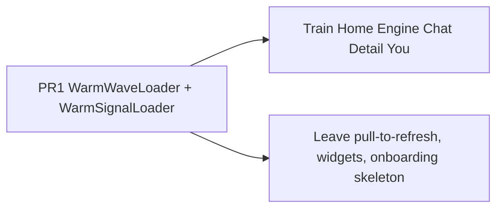

# Plan: iOS craft pass

> Status: Plan · Owner: iOS Builder · Created: 2026-09-16

## Context

Activity Ledger is 5/5 for care, not a look to copy. Other live screens are uneven: designed happy paths, leftover spinners, one-line empty states. Inspiration: [Amicro Wave Physics](https://amicro.vercel.app/loaders) (page wait) and [generative-loaders Signal](https://generativeloaders.com/) (inline). Issue #1159. Screen-by-screen audit: [`ios-craft-pass-lld.md`](ios-craft-pass-lld.md).

## Goal

One Warm Instrument app. Shared waits first, then each screen in its own language.

Bar: sit with every state, as the ledger did. Do not clone paper stacks, `‹ HQ`, or riffle.

## Wait map (today → PR 1)

| Site | Today | Kind |
|---|---|---|
| Home | pulsing empty cards | page |
| Chat `loadingView` | `ProgressView` + "Loading Coach…" | page |
| Train empty overlay | `ProgressView` | page |
| Ledger `loadingState` | `ProgressView` in a card | page |
| Health Data `loadingState` | "Reading Apple Health…" | page |
| Detail header / Save | small `ProgressView` | inline |
| Ledger "Load 20 more" | `ProgressView` | inline |
| You Sync / Reset test | spinning icon / `ProgressView` | inline |
| Health Import | `ProgressView` | inline |
| Login / Setup buttons | `ProgressView` | inline |
| Chat `CoachChatThinkingBubble` | three bouncing dots | chat reply |

## PR stack

| PR | milestone | outcome | final base | files | owner | parallel with | result |
|---|---|---|---|---|---|---|---|
| 1 | 1 Shared wait | Wave + Signal replace the wait map. Ink on desk. Reduce Motion freezes. | `main` | `ios/CoachHQ/CoachHQ/Views/WarmLoaders.swift`, `WarmInstrumentAtoms.swift`, `WarmInstrumentHomeView.swift`, `CoachChatView.swift`, `CoachChatWarmUI.swift`, `WorkoutListView.swift`, `AllActivitiesListView.swift`, `ActivityDetailView.swift`, `SettingsView.swift`, `HealthSettingsView.swift`, `LoginView.swift`, `SetupView.swift`, `ios/DESIGN.md`, `docs/plans/ios-craft-pass.md`, `docs/plans/ios-craft-pass-lld.md` | iOS Builder | — | |
| 2 | 2 Train | TODAY none/rest/mention as a quiet paper card. Activity-week rows even with library. Dock clears last card and Start pill. | PR 1 | `ios/CoachHQ/CoachHQ/Views/WorkoutListView.swift`, `WorkoutOverviewView.swift` | iOS Builder | 3,4,5,6 | |
| 3 | 3 Home + Engine | Home: layout-true wait already from PR 1; dock clears calories/quest; recent rows tappable; empty/error in Home type. Engine: hide system Back, desk, hide tab bar, dose as a card. | PR 1 | `ios/CoachHQ/CoachHQ/Views/WarmInstrumentHomeView.swift`, `Views/Widgets/RecentSessionsCard.swift` | iOS Builder | 2,4,5,6 | |
| 4 | 4 Chat | Keep header + composer while Wave runs. Drop preview history on the live path. Placeholder + haptics. | PR 1 | `ios/CoachHQ/CoachHQ/Views/CoachChatView.swift`, `CoachChatWarmUI.swift`, `CoachChatPreviewData.swift` | iOS Builder | 2,3,5,6 | |
| 5 | 4 Detail | Quiet header. Beat 01 honest for load and no-HR. Hide `0m` zone legend. Errors use alarm ink, not terracotta. | PR 1 | `ios/CoachHQ/CoachHQ/Views/ActivityDetailView.swift` | iOS Builder | 2,3,4,6 | |
| 6 | 4 You | Zones preview + one save path. Sync copy matches the header chip. Sign-out talks GitHub, not "training data". | PR 1 | `ios/CoachHQ/CoachHQ/Views/SettingsView.swift` | iOS Builder | 2,3,4,5 | |

File overlap is PR 1 vs everyone. After PR 1 merges, 2–6 are disjoint and may build in parallel, then rebase into 2→3→4→5→6 for review.

## Done when

1. No live wait in the map still uses `ProgressView` or `HomeSkeletonView`.
2. Train TestFlight frame (TODAY none + activity week + library) reads as one page; dock clips nothing.
3. Engine push shows desk and no system Back; tab bar does not eat the coach card.
4. Chat never shows a chrome-less spinner; history has no preview threads.
5. Detail empty-note sessions do not print `BASE 0m`; no-HR leaves no blank stat shelf.

## Deferred

- Fold `SessionRow` onto ledger cards (sport keyspace, `ios/DESIGN.md` out of scope).
- Shared-element open from pulled card into Detail.
- You Health / Rage sheets; Detail PRE chip; TextLoader for streamed Coach tokens.
- Restyling pull-to-refresh or WidgetKit placeholders.
- Shared Warm chip / empty kit — #1161, after this stack.
