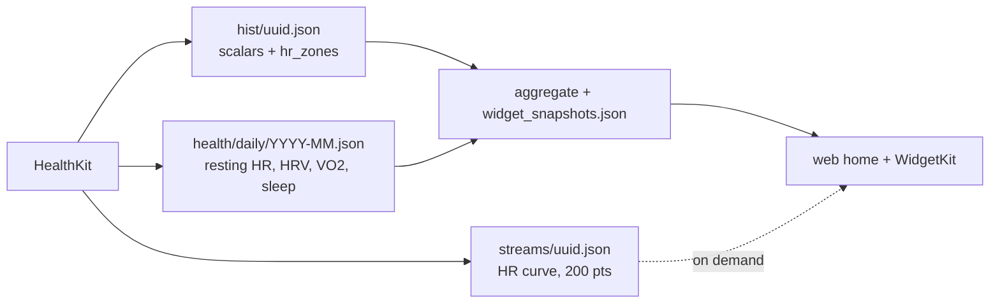

# HealthKit signals — rollout

> Status: Current · Owner: Tech Lead · Verified: 2026-08-23 · Issues: [#156](https://github.com/sibling-shipyard/coach-hq/issues/156) · Supersedes: PR #162 (as-shaped), PR #427

## Context

We ask every athlete for eight HealthKit permissions at onboarding and read three. Heart rate we
read badly — timestamps discarded, zone seconds guessed as `duration ÷ count`. Architecture is
settled in `docs/eng-docs/healthkit-richer-signals.md` + its LLD; this is the build order.

## Goal

Read seven of the eight, and put each signal at its own grain. Recovery metrics are day-grain:
hang them off an activity and a two-session Saturday stores them twice while a rest day stores
them not at all.

Widget maths lives once, in TypeScript (ADR 0005). No phase writes it twice — `Vo2Widget.swift`
already reads `home.vo2` and is handed `"unavailable"` every time. Phase 2 is a data change that
lights it up on both platforms with zero Swift.

## Two tracks

The HR curve and the recovery ledger both start at HealthKit and share nothing else. Track A is
iOS-only with one owner; Track B restructures the sync's control flow and spans three role docs.
They were bundled only because of a dependency error in an earlier draft of this table — phase 4
backfills `streams/` and never touches `hist/` or the ledger, so it depends on phase 1, not 2a.

**Track A — continuous HR per activity.** Self-contained and shippable on its own: accurate zone
seconds, an HR curve on the activity screen, and history behind it.

| id | files | deps | owner |
|---|---|---|---|
| 0 | `kdb/decisions/0027-healthkit-signal-grains.md`, `kdb/decisions/README.md`, `docs/eng-docs/healthkit-richer-signals.md`, `docs/eng-docs/healthkit-richer-signals-lld.md` | — | Tech Lead |
| 1 | `ios/CoachHQ/CoachHQ/Models/HRStream.swift`, `ios/CoachHQ/CoachHQ/Services/HRAnalysis.swift`, `ios/CoachHQ/CoachHQ/Services/ActivityMapper.swift`, `ios/CoachHQ/CoachHQ/Services/HealthKitSyncManager.swift`, `ios/CoachHQ/CoachHQTests/**` | 0 | iOS Builder |
| 3 | `ios/CoachHQ/CoachHQ/Views/ActivityDetailView.swift` | 1 | iOS Builder |
| 4 | `ios/CoachHQ/CoachHQ/Services/HealthKitBackfill.swift`, `ios/CoachHQ/CoachHQ/Views/HealthSettingsView.swift` | 1 | iOS Builder |

**Track B — day-grain recovery ledger.** Resting HR, HRV, VO₂ Max, sleep. Deferred: scope it on
its own merits, not as a tail of Track A.

| id | files | deps | owner |
|---|---|---|---|
| 2a | `ios/CoachHQ/CoachHQ/Services/HealthKitSyncManager.swift`, `ios/CoachHQ/CoachHQ/Services/DailyHealthWriter.swift` | 1 | iOS Builder |
| 2b | `engine/scripts/build-dashboard-snapshot.mjs`, `engine/lib/repo-layout.mjs`, `ui/client/src/components/home-warm/warmHomeSnapshots.ts`, `ui/client/src/components/home-warm/snapshots.ts` | 2a schema | Bob + UI Expert |

Two open questions block Track B, both found while scoping 2a and neither answered by the LLD:

1. **A rest day currently commits nothing.** `HealthKitSyncManager.swift:221` returns early when
	no new workouts are found, so the ledger cannot hang off the workout loop — the sync's control
	flow has to change. That guard also carries the first-sync "commit profile with no workouts"
	case, which makes it the riskiest edit in the rollout.
2. **First-sync cost.** A naive per-day implementation fires ~1,460 HealthKit queries across a
	365-day window. `HKStatisticsCollectionQuery` with a daily interval returns per-day buckets
	from one query per signal — four total regardless of range — but that is a different design
	from the one the LLD describes, and the backfill window is a policy call.

**Overlap:** 2a and 1 both touch `HealthKitSyncManager.swift` and cannot run at once. Everything
in Track A after phase 1 is disjoint — 3 and 4 can run in parallel.

## Done when

1. `Σ zone_seconds + uncovered_seconds == elapsed_time` (±1s) — asserted in a unit test against a
	synthetic mid-session dropout, not just a full-coverage workout. Phase 1 creates the repo's
	first XCTest target; there is none today (`ios-build.yml` compiles only).
2. Global max and min HR survive downsampling to 200 points — an interval session keeps its spikes.
3. An activity JSON written before this change still decodes — every new field optional, nil default.
4. A sidecar with a >60s dropout renders as a visible gap, not an interpolated line.
5. Backfill run twice at the same `generator` version produces zero commits on the second pass.
6. `gen/aggregate.json` stays under 1MB with sidecars present (ADR 0020's bound holds).

Track B, when it is scoped:

7. A rest day with no workout still produces a `health/daily/` row.
8. Re-syncing a day whose row has `sleep_hours` but not `vo2_max` leaves `sleep_hours` intact.
9. `buildVo2Snapshot()` returns `status: "available"` with ≥2 trend points from real HealthKit data.

## Deferred

- **P2** — `stepCount` stays authorized and unread. It is the only signal a phone-only athlete
	produces, so the call belongs to #487 (no-watch scenario), not to this plan.
- **P2** — `user_data/coach/sleep_log.json` is the manual sleep file ADR 0023 removed. Phase 2a
	supersedes it; deleting it and its `repo-layout.mjs` / snapshot-builder plumbing is part of #454.
- **P1** — Track B is unscheduled. The VO₂ widget stays stubbed until it lands.
- **P1** — Zone *boundaries* are defined three times over and only the iOS copy is athlete-fixable
	(#495). Exact integration against wrong thresholds is confidently wrong. Sequenced after phase 2a
	so heart-rate-reserve zones can derive from real `resting_hr` — which means it waits on Track B.
- **P2** — Phase 3 overlaps #331 (per-activity screens). Check whether they merge before briefing.
- **P3** — Day-grain backfill (phase 4 writes sidecars only), HR zone semantics, Coach reading the
	daily ledger in prompt context.
