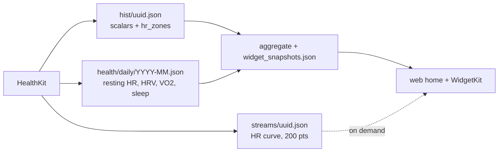

# HealthKit signals — rollout

> Status: Current · Owner: Tech Lead · Verified: 2026-08-23 · Issues: [#156](https://github.com/sibling-shipyard/coach-hq/issues/156) · Supersedes: PR #162 (as-shaped), PR #427

## Context

We ask every athlete for eight HealthKit permissions at onboarding and read three. Heart rate we
read badly — timestamps discarded, zone seconds guessed as `duration ÷ count`. Architecture is
settled in `docs/eng-docs/healthkit-richer-signals.md` + its LLD; this is the build order.

## Goal

Read seven of the eight, and put each signal at its own grain. Recovery metrics are day-grain:
hang them off an activity and a two-session Saturday stores them twice while a rest day stores
them not at all.

Widget maths lives once, in TypeScript (ADR 0005). No phase writes it twice — `Vo2Widget.swift`
already reads `home.vo2` and is handed `"unavailable"` every time. Phase 2 is a data change that
lights it up on both platforms with zero Swift.

## Phases

| id | files | deps | owner |
|---|---|---|---|
| 0 | `kdb/decisions/0027-healthkit-signal-grains.md`, `kdb/decisions/README.md`, `docs/eng-docs/healthkit-richer-signals.md`, `docs/eng-docs/healthkit-richer-signals-lld.md` | — | Tech Lead |
| 1 | `ios/CoachHQ/CoachHQ/Models/Activity.swift`, `ios/CoachHQ/CoachHQ/Services/ActivityMapper.swift`, `ios/CoachHQ/CoachHQ/Services/HealthKitSyncManager.swift`, `ios/CoachHQ/CoachHQTests/**` | 0 | iOS Builder |
| 2a | `ios/CoachHQ/CoachHQ/Services/HealthKitSyncManager.swift`, `ios/CoachHQ/CoachHQ/Services/DailyHealthWriter.swift` | 1 | iOS Builder |
| 2b | `engine/scripts/build-dashboard-snapshot.mjs`, `engine/lib/repo-layout.mjs`, `ui/client/src/components/home-warm/warmHomeSnapshots.ts`, `ui/client/src/components/home-warm/snapshots.ts` | 0 | Bob + UI Expert |
| 3 | `ios/CoachHQ/CoachHQ/Views/ActivityDetailView.swift` | 1 | iOS Builder |
| 4 | `ios/CoachHQ/CoachHQ/Services/HealthKitBackfill.swift`, `ios/CoachHQ/CoachHQ/Views/HealthSettingsView.swift` | 2a | iOS Builder |

**2a and 1 overlap on `HealthKitSyncManager.swift` — they cannot run at once.** 2b's files are
disjoint from 2a's, so both run in parallel once the ADR locks the schema; 2b's checks only pass
after 2a has written a real file.

## Done when

1. `Σ zone_seconds + uncovered_seconds == elapsed_time` (±1s) — asserted in a unit test against a
	synthetic mid-session dropout, not just a full-coverage workout. Phase 1 creates the repo's
	first XCTest target; there is none today (`ios-build.yml` compiles only).
2. Global max and min HR survive downsampling to 200 points — an interval session keeps its spikes.
3. A rest day with no workout still produces a `health/daily/` row.
4. Re-syncing a day whose row has `sleep_hours` but not `vo2_max` leaves `sleep_hours` intact.
5. `buildVo2Snapshot()` returns `status: "available"` with ≥2 trend points from real HealthKit data.
6. An activity JSON written before this change still decodes — every new field optional, nil default.
7. Backfill run twice at the same `generator` version produces zero commits on the second pass.
8. `gen/aggregate.json` stays under 1MB with sidecars present (ADR 0020's bound holds).

## Deferred

- **P2** — `stepCount` stays authorized and unread. It is the only signal a phone-only athlete
	produces, so the call belongs to #487 (no-watch scenario), not to this plan.
- **P2** — `user_data/coach/sleep_log.json` is the manual sleep file ADR 0023 removed. Phase 2a
	supersedes it; deleting it and its `repo-layout.mjs` / snapshot-builder plumbing is part of #454.
- **P1** — Zone *boundaries* are defined three times over and only the iOS copy is athlete-fixable
	(#495). Exact integration against wrong thresholds is confidently wrong. Sequenced after phase 2a
	so heart-rate-reserve zones can derive from real `resting_hr`.
- **P2** — Phase 3 overlaps #331 (per-activity screens). Check whether they merge before briefing.
- **P3** — Day-grain backfill (phase 4 writes sidecars only), HR zone semantics, Coach reading the
	daily ledger in prompt context.
