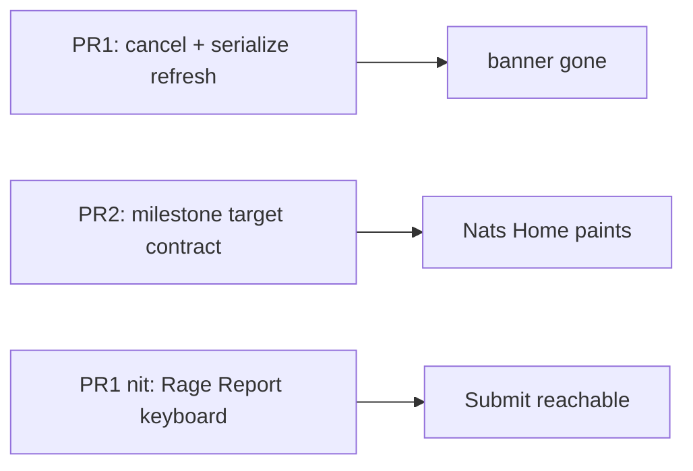

# iOS Home banner + empty widgets — root cause and fix

> Status: Current · Owner: Tech Lead · Verified: 2026-08-30

## Context

Two confirmed Home failures (Rage Report / Sentry), plus one Rage Report UX nit.

1. **Akash banner** — COACH-HQ-IOS-3. Cancelled duplicate Home fetch → sticky
   "Couldn't load Home". Not auth.
2. **Nats empty Home** — COACH-HQ-IOS-4 (`date2022`). Decode miss on milestone
   `target`. Deeper: stage-ladder progressions (no `current`/`target`). Crash guard
   **#700**; contract cleanup **#701**.
3. **Rage Report keyboard** — TextEditor never dismisses; Submit sits behind the
   keyboard. No Done toolbar / scroll-dismiss.

Loading polish (skeleton → content feel) stays deferred until (1) ships.

## Decision

| PR | outcome | files | owner | done when |
|---|---|---|---|---|
| 1 | Ignore cancel; serialize refresh; keyboard dismiss on Rage Report | `WidgetSnapshotStore.swift`; `RageReportView.swift` (+ tiny Theme/toolbar if needed) | iOS Builder | 5 cold + 5 fg/bg no false banner; revoke still banners; Rage Report Done / scroll-dismiss reaches Submit |
| 2 | Crash guard: always emit string `target` | `warmHomeSnapshots.ts` + bundle + test | UI Expert | **Done #700** — decode only; render/contract → #701 |
| 3 (later) | Smooth Home loading | `WarmInstrumentHomeView` / `HomeSkeletonView` | iOS Builder | Cache-first; soft crossfade; no full skeleton on warm cache |

## Done when

- Banner gone for valid sessions; revoke still banners.
- Nats Home shows widgets when hist has this week’s workouts.
- Rage Report Submit reachable with keyboard up.
- #308 closed or split.

## Deferred

- Full loading animation redesign (PR3).
- Settings `lastErrorDetail` — Rage Report covers evidence.
- Auto-dismiss policy for all error toasts.

## Progress

- **PR1 (branch `fix/ios-home-cancel-banner`):** implemented — cancel ignore +
  `isRefreshing` + Rage Report keyboard. Awaiting review/merge + athlete device verify.
- **PR2:** merged #700 (crash guard). Deeper progression contract → #701.
