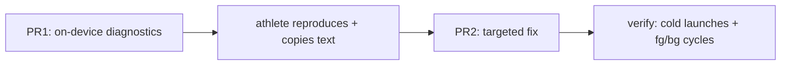

# iOS "Couldn't load Home" banner — root cause and fix

> Status: Current · Owner: Tech Lead · Verified: 2026-08-29

## Context

The Home error toast ("Couldn't load Home") fires on effectively every app open, even for an
existing athlete with good cached data already showing behind it (`WidgetSnapshotStore.swift`
L103-138, toast wired in `MainTabView.swift` L103-108). It doesn't auto-dismiss because
`Toast.autoDismisses` is `false` for `.error` (`Theme.swift:619`) — by design, but that's what
makes a transient race feel like a hard failure.

Prior attempts: **#549/#550** added a retry-once on `.notAuthenticated` and gated the workout
observer on session-ready. **#551/#552** hardened token storage against two suspected causes
(keychain-before-first-unlock, orphaned single-use refresh token) — neither confirmed. **#308**
is the still-open athlete report, filed 2026-08-22, mistagged `ui-expert` (this is `ios/CoachHQ`
code, iOS Builder's scope). A fresh build after both fixes still reproduces it every time, which
argues against a rare race and for something more structural in the auth/token path.

**Sentry is deliberately out of scope for this plan** — coverage doesn't reach this path in a
build the athlete can use today, and diagnosing it doesn't need to wait on that.

## Decision

Two PRs. First one gets us real evidence from the athlete's own device without another guess;
second one fixes whatever that evidence shows.

| PR | outcome | files | owner | done when |
|---|---|---|---|---|
| 1 | Capture the real error, not just the friendly string | `WidgetSnapshotStore.swift` (new `lastErrorDetail`), `SettingsView.swift` (new HOME diag group + into `diagnosticsText`) | iOS Builder | Settings → Diagnostics → Copy includes the concrete error type/HTTP status for the last Home fetch failure |
| 2 | Fix the confirmed cause | wherever PR1's evidence points (likely `GitHubAuthManager.swift` token/keychain path or `WidgetSnapshotStore.refresh()`) | iOS Builder | Banner does not fire across 5 cold launches + 5 fg/bg cycles on a real device |

Alternative to PR1 for whoever's building: if you're already sitting at Xcode with the device
attached, a throwaway `print()` in the same three catch sites plus the console is faster than
shipping a build for it — skip PR1 and go straight to PR2 once you have the real error. Either
path is fine; the athlete doesn't need Xcode for the Settings-panel path, does for the print path.

## Done when

- The banner does not appear on a normal cold launch or foreground resume for a signed-in athlete
  with a valid session.
- A deliberate revoke-token test (sign out server-side, relaunch) still shows the banner — proves
  the fix didn't silently swallow a real auth failure.
- #308 closed, #551 either confirmed or superseded by what PR1/PR2 actually found.

## Deferred

- Sentry coverage for this path — revisit only if it recurs after PR2 ships.
- Any UI change to how error toasts auto-dismiss — not touching that unless the root cause turns
  out to require it.
