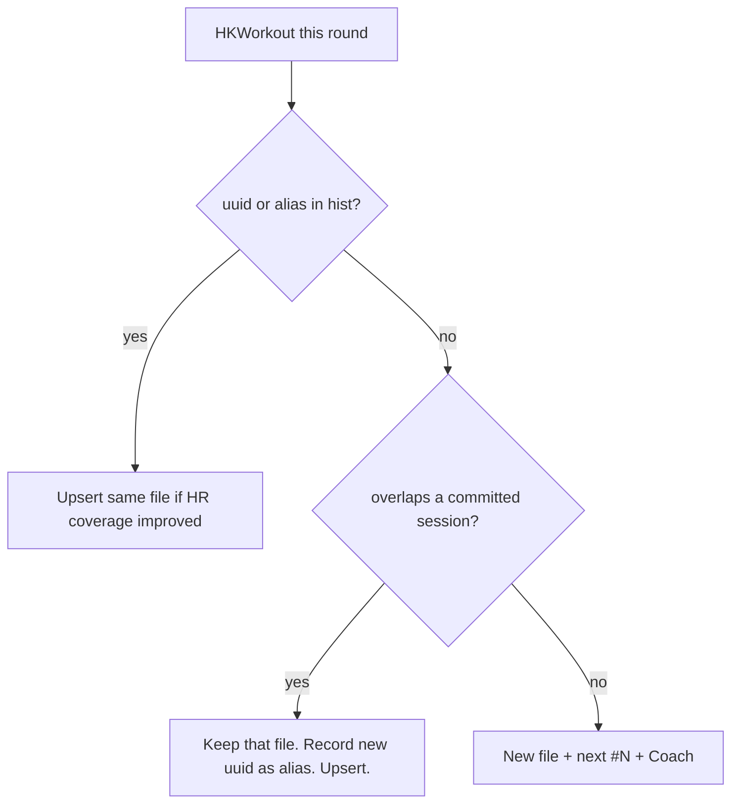

# iOS: one file per real session (Garmin rewrite + HR upsert)

> Status: Current · Owner: Tech Lead · Verified: 2026-08-31 · Issues: [#739](https://github.com/sibling-shipyard/coach-hq/issues/739), [#740](https://github.com/sibling-shipyard/coach-hq/issues/740)

Garmin Connect deletes and re-saves HealthKit workouts about every two weeks. New UUID, same
session. We insert again, burn the next `#N`, and skip the HR fetch because “the file exists.”

**Counters:** `ActivityNamer.assignName` only runs on insert. Date’s one gym is `#3`, `#4`, `#6`.
Upsert keeps the first name. New sessions still take the next free number. Existing gaps stay
until the cleanup PR; we do not renumber live history in the iOS round.

## Contract

- **Session** = this athlete, this time window. **Recording** = one app’s `HKWorkout`.
- ADR 0014 still owns the file key (`hk_<date>_<uuid>.json`). UUID is not the session key.
- Identity stays on the first file. Payload may improve (more `covered_seconds`, or first HR).
- Insert only when nothing in `hist/` is that session. No new `#N`.
- **Coach fires only on insert.** Upsert (rewrite, alias, HR fill-in) stays out of
  `syncedForCache` / the coach-message POST. That is a filter on today's list, not a new path.

**Match, in order:** (1) exact uuid (2) alias list on the committed file (3) same activity group +
≥50% of the shorter window (4) start within 2 minutes + ≥50% of shorter, even if sport differs
(Skanda’s Garmin `Run` vs Strava `Walk` at the same second). Greedy, not transitive.

**HR refresh:** the query is already a time window, not the workout object. Re-fetch for
incomplete sessions in the 14-day lookback even when the filename exists. Today we `continue`
before that fetch.

Committed hist in the window must be read (filename date on `hk_*`). List-only uuid parse is
what missed Garmin. Manual import uses the same match, or Import creates the duplicate again.

## Stack

| PR | Result | Files | Owner |
|---|---|---|---|
| 0 | Lock the contract | this plan; `kdb/decisions/0035-one-file-per-session.md` | Tech Lead |
| 1 | Forward-looking upsert. Rewrites stop inserting. Counters stop drifting. Coach stays insert-only. | `WorkoutDeduplicator.swift`; `HealthKitSyncManager.swift`; `Activity.swift` (`aliases`); `verify_workout_dedup.swift`; `docs/eng-docs/ios-sync.md` | iOS Builder · [#739](https://github.com/sibling-shipyard/coach-hq/issues/739) |
| 2 | Collapse files already duplicated in athlete repos | `engine/scripts/` hist cluster (dry-run default); run on `coach-date2022` + `coach-skanda-2003` | Bob · [#740](https://github.com/sibling-shipyard/coach-hq/issues/740) |

PR 1 does not delete Date’s three gym files. PR 2 keeps the earliest file, copies the best HR
body into it, writes aliases, deletes loser hist+stream. No Coach. No live `#N` rewrite.

**Done when (PR 1):** a new Garmin uuid that overlaps a committed session writes zero new files
and does not bump the sport counter; a known uuid with more HR rewrites hist+stream; two gyms
the same day with different starts both insert; `swiftc … verify_workout_dedup.swift` covers
those three; Health Settings does not offer Import for a rewrite of a synced session.

**Done when (PR 2):** Date `hist/` is 6 HK sessions not 9; Skanda’s 11 duplicated HK clusters
are 1 file each; dry-run prints the deletes before any write.

## Deferred

- Garmin metadata id as a fifth match key — extra, overlap has to work without it.
- A `sessions.json` index to avoid N hist reads — P2 if the window fetch is slow.
- Coach ping when HR first appears — not a new activity; out of scope.

**Rejected:** uuid-only upsert (misses Garmin). Delete-and-reinsert under the new uuid (breaks
streams and Coach ids). iOS deleting 42 Skanda files on next sync (that is PR 2, dry-run first).
