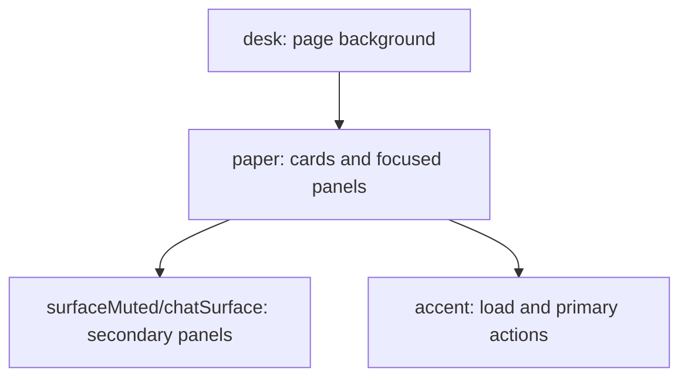

# iOS visual consistency and dark mode

> Status: Proposal · Owner: iOS Builder · Created: 2026-09-12

The iOS app already has the right Warm Instrument base, but dark mode and a few Train surfaces
do not yet feel designed as one system.

## Goal

Make every live iOS screen follow the same surface hierarchy in light and dark mode.

## Improvements in this pass

1. Give `WarmInstrument.Chat` real dark values instead of light colors reused in dark branches.
2. Make Train use shared Warm Instrument tokens unless a workout-specific role is truly needed.
3. Bring `WorkoutCompleteView` back into the desk/paper/accent system.
4. Make page backgrounds explicit: main tabs use `WarmInstrument.desk`, cards use `paper`.
5. Audit terracotta against ADR 0041: load and primary actions only.
6. Add a quick visual checklist for light and dark screenshots across the main tabs.

## Milestones

| # | Result |
|---|---|
| M1 | Dark mode tokens are readable and warm across Home, Coach, Activity, Train, and You. |
| M2 | Train and Workout Complete backgrounds match the app's surface hierarchy. |
| M3 | One visual QA pass documents remaining P2 polish without widening this stack. |

## PR stack

| PR | milestone | outcome | final base | files | owner | parallel with | result |
|---|---|---|---|---|---|---|---|
| V1 | M1 | Add real dark variants for shared Warm Instrument and Chat tokens. | `main` | `CoachHQ/Views/Theme.swift` | iOS Builder | none | Main screens no longer use light chat fills or muddy text in dark mode. |
| V2 | M2 | Align Train backgrounds, timer support colors, and completion surfaces. | V1 | `CoachHQ/Views/WorkoutTimerWarm.swift`, `CoachHQ/Views/WorkoutTimerView.swift`, `CoachHQ/Views/WorkoutCompleteView.swift`, `CoachHQ/Views/WorkoutListView.swift` | iOS Builder | none | Train feels intentionally focused, not visually separate from the app. |
| V3 | M3 | Capture light/dark visual QA and fix only small token or spacing misses. | V2 | `CoachHQ/Views/**`, `ios/DESIGN.md` if rules change | iOS Builder | none | Screenshots pass, and any deferred design calls are named. |

## Done when

Dark mode is checked on Home, Coach Chat, Activity Ledger, Activity Detail, Workouts, Timer,
Workout Complete, Settings, Login, and Setup.

No live page uses a new raw color literal when an existing Warm Instrument token fits.

`BuildProject` passes, and any changed Swift file has clean Xcode diagnostics.

## Deferred

- A broader card-density redesign for Settings is P2 unless the QA pass shows overlap or contrast bugs.
- A canonical sport keyspace is already deferred in `ios/DESIGN.md`; do not fold it into this pass.
- New generated token tooling is P2; hand-picked iOS dark values are enough for this stack.
