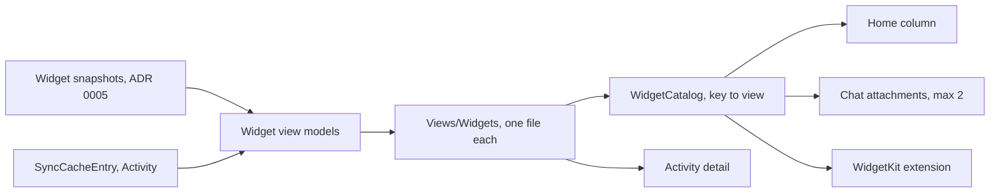

# iOS widget modules

> Status: Draft · Owner: iOS Builder · Verified: 2026-09-08
>
> Tracking: #928. Milestone and epic placement is a Tech Lead call — filed under `Later` to stay
> clear of the M3/M4 epic-parent gate.

## Context

Two goals: one look across every surface, and one place to change it. Today iOS has neither,
and the evidence is in the code rather than in taste.

`WarmInstrumentAtoms.swift:142` defines `SportChip` and says *"shared by the weekly plan slots and
the training heatmap legend. Never redesign this per surface."* Both redrew it inline
(`WarmInstrumentHomeView.swift:1060` day slots, `:1144` legend) and the atom is now referenced
nowhere. The rule was written down and it still lost, because nothing enforced it.

The same drift is in the widgets. `CoachHQWidget/EngineWidget.swift:104` says *"mirror the in-app
Engine widget's math 1:1"* — `bandStrip`, `trendSparkline`, `mixBar` are hand-copied from
`WarmInstrumentHomeView.swift:620`. Engine is drawn three times, counting `EngineDetailView`'s own
gauge (`:1737`). Coach's read is drawn twice, and the original (`CoachReadWidget`, `:1290`) is dead.

It is not all drift. `CoachHQWidget/CommitmentWidget.swift:45` reuses `SportCube` across targets and
it works. `ActivityDetailView`'s ribbon keeps its arithmetic in `RibbonBuilder` and is unit-tested.
**Both patterns already exist here. The plan is to make the good one the default.**

## Goal

One widget, one file, one place to improve it. Surfaces choose density, not styling.

`Theme.swift` and `WarmInstrumentAtoms.swift` already compile into both targets via the
`project.pbxproj:69-80` membership list. This extends that band; it does not invent it.

**PR 617 is the pattern.** `ActivityRowViewModel` + adapters + one dumb `ActivityLedgerRow`, which it
already puts in both the ledger and Chat. Every step below copies that shape.

## What the full read found

| finding | evidence |
|---|---|
| 984 lines of unreachable view files, plus dead types | `CoachingInsightsView.swift` (508, marked DEPRECATED, holds 4 `*Widget`s), `TrainingHeatmapView.swift` (230, only caller is that dead file), `ActivityListView.swift` (209, superseded by `AllActivitiesListView`), `WorkoutPlaceholderView.swift` (37); then `CompactZoneBar`, `StatItem`, `WarmSecondaryCTA`, and — once those files go — `ThemedCard`/`BrandHeader`/`SectionHeader` |
| 44 hardcoded colours outside the two token files | `CoachChatWarmUI` 19, `WorkoutTimerWarm` 10, `WorkoutOverviewView` 6, `WarmInstrumentHomeView` 3, `ActivityDetailView` 3, `WorkoutListView` 2, `OnboardingRevealFlow` 1 |
| "int if whole, else 1dp" written 5 times | `numberString` (`:764`), `questNumber` (`:913`), `loadLabel` (`:1732`), `number` in `SportStripCell` and in `SportCube` |
| sport → icon/colour mapped 4 ways | `Theme.sportIcon`+`sportBadge` (HK strings), `WarmInstrument.sfSymbol`+`sportColor` (`WarmSportId`), `OnboardingRevealFlow.sportDisplayInfo` (HK strings), `TrainingActivityWidget.legend` (hardcoded list) |
| terracotta's stated rule is broken | `WarmInstrument.accent` — *"reserved for LOAD only. Never a generic accent, CTA, or brand colour"* — is aliased as `WorkoutTimerWarm.rust` and used for every timer CTA, Settings' Sync Now, and Reset Test Branch |
| two card shells | `WarmCard` (live) vs `ThemedCard`/`BrandHeader`/`SectionHeader` (legacy; only the dead files still use them) |
| two atoms are dead **because** live code bypassed them | `SportChip` (`WarmInstrumentAtoms.swift:142`) redrawn at `WarmInstrumentHomeView.swift:1060` and `:1144`; `CoachReadWidget` (`:1290`) redrawn as `EngineDetailView.coachReadCard` (`:1719`). These get adopted, not deleted — deleting them would ratify the bypass |
| one stat cell written 4 times | `SupportingStatCell` (`ActivityDetailView.swift:1327`), `WeekStatCell` (`ActivityFeedVariants.swift:195`), `BigStat` (`OnboardingRevealFlow.swift:507`), `stat(_:_:)` (`WarmInstrumentHomeView.swift:1247`) — all bypassing the legacy `StatItem` |

## PR stack

| PR | milestone | outcome | final base | files | owner | parallel with | result |
|---|---|---|---|---|---|---|---|
| W0 | Seed | Land the open PR 617 — rebase, test, merge | `main` | `Views/ActivityFeedVariants.swift`, `Views/CoachChatView.swift`, `Views/CoachChatWarmUI.swift` | iOS Builder | — | One activity row serves the ledger and Chat |
| W1 | Clear the ground | Delete the four unreachable files and the genuinely-dead types; **keep `SportChip` and `CoachReadWidget`** — they are dead only because live code bypassed them, and W3b adopts them. Fix `ios/DESIGN.md`, which still lists the deleted Insights file as "Phase 5 next priority" | W0 | `Views/CoachingInsightsView.swift`, `Views/TrainingHeatmapView.swift`, `Views/ActivityListView.swift`, `Views/WorkoutPlaceholderView.swift`, `Views/ActivityFeedVariants.swift`, `Views/Theme.swift`, `ios/DESIGN.md` | iOS Builder | — | Nothing gets carried into `Views/Widgets/` that no screen renders |
| W2 | Shared band | Move the 6 forked widgets (Engine, Quest, BuildPhase, Vo2, TrainingActivity, Commitment) to `Views/Widgets/`, rename `…Widget`→`…Card`, add to extension membership | W1 | `Views/WarmInstrumentHomeView.swift`, `Views/Widgets/` (new), `CoachHQ.xcodeproj/project.pbxproj` | iOS Builder | — | Both targets compile one copy; zero visual change |
| W3 | Shared band | Delete the WidgetKit fork; fold `EngineDetailView`'s third Engine rendering onto the same sub-views | W2 | `CoachHQWidget/`, `Views/Widgets/Engine*.swift` | iOS Builder | W3b | `bandStrip`/`trendSparkline`/`mixBar` defined once |
| W3b | Shared band | Move the remaining 5 (RecentSessions, WeeklyPlan, Calories, CoachMessage, plan/heatmap slots); the plan slot and heatmap legend adopt `SportChip`, and `EngineDetailView` adopts `CoachReadCard`, instead of redrawing them | W2 | `Views/WarmInstrumentHomeView.swift`, `Views/Widgets/`, `project.pbxproj` | iOS Builder | W3 | `WarmInstrumentHomeView.swift` is layout + chrome only |
| W4 | One vocabulary | One number/duration formatter, one sport lookup, one stat cell in `Views/Widgets/Format.swift`; `SessionRow` folded onto `ActivityRowViewModel`; the 44 stray colours moved onto tokens | W3b | `Views/Widgets/`, `Views/WarmInstrumentAtoms.swift`, `Views/CoachChatWarmUI.swift`, `Views/WorkoutTimerWarm.swift`, `Views/WorkoutOverviewView.swift`, `Views/WorkoutListView.swift`, `Views/OnboardingRevealFlow.swift` | iOS Builder | — | One row, one formatter, one sport table; a colour change lands everywhere at once |
| W5 | Detail widgets | Extract `heroCard`, `ribbonCard`+`zoneLegend`, `usualCard`, `richScoreCard` behind view models; move `cachedUsualRows`/`median` into a `RibbonBuilder`-style type and test it | W4 | `Views/ActivityDetailView.swift`, `Views/Widgets/`, `CoachHQTests/`, `project.pbxproj` | iOS Builder | — | Detail cards are reusable; the vs-usual maths has tests |
| W6 | Catalog | `WidgetCatalogKey` + factory; Home column becomes stored `[WidgetCatalogKey]` instead of a hardcoded body | W5 | `Views/Widgets/WidgetCatalog.swift` (new), `Views/WarmInstrumentHomeView.swift`, `CoachHQTests/` | iOS Builder | — | Home order is data; an unknown key renders nothing, never crashes |

**Gated, not in this stack.** W7 is chat inline widgets: new `ChatAttachment` kinds rendering catalog
widgets, capped at two. It needs the server catalog from `coach-conversation-widgets-roadmap.md` M3.
That milestone's locked decision is that Coach picks only opaque keys the server built, so building
this earlier means guessing those key names. `ChatAttachment` (`CoachChatModels.swift:50`) is already versioned
with an `.unknown` fallback, so the day those keys exist this is new kinds, not new plumbing.

**Two naming rules W2 locks in.** `EngineWidget` exists twice today — Home's `private struct` and the
extension's `Widget` conformer — and they only coexist because they are in separate targets. Sharing
the file collides them, so in-app views become `…Card` and `…Widget` is reserved for WidgetKit entry
points. Catalog keys are the server's strings, never iOS-invented ones.

## Done when

- `grep -rn "func bandStrip\|func trendSparkline\|func mixBar" CoachHQWidget/` returns nothing.
- `Views/WarmInstrumentHomeView.swift` is under 800 lines (1,855 today), and the only `private struct …Widget` left in it is `EditableWidget`, the edit-mode chrome.
- `grep -l "Color(red:" Views/*.swift` lists only `Theme.swift` and `WarmInstrumentTokens.generated.swift`.
- One definition each of the number formatter, the duration formatter, the sport lookup, and the stat cell.
- `Views/ActivityDetailView.swift` holds no `median(` or row-building maths.
- `xcodebuild test` green locally, then the `iOS Build` check green on the pushed SHA.
- Screenshots before/after W2 and W3 match — those PRs change no pixels.

## Deferred

- **P1 — a check, not a norm.** Every finding above is a rule someone already wrote down and the
  codebase then broke. After W4, add a CI grep for stray `Color(red:` outside the token files. Without
  it this plan decays the way `SportChip`'s comment did.
- **P2 — server-driven Home order per athlete.** Needs an order field in the snapshot contract; that is
  `ui/` plus pipeline, not `ios/`. W6 ships local-only and reads a server field later.
- **P2 — one View across all three surfaces is not the target.** WidgetKit has no animation, its own
  type ramp, `containerBackground` and `.redacted`. Shared view models, maths and sub-views; a thin
  per-surface wrapper. Chasing literal view sharing costs more than the fork did.
- **P2 — terracotta's load-only rule.** Either the timer and Settings stop using it as a CTA colour, or
  the rule in `Theme.swift:202` gets rewritten to match what shipped. Athlete's call which.
- **P2 — `SettingsView`, timer views, onboarding untouched** beyond W4's colour and formatter pass.
  Large, but single-surface: no second renderer, no fork, no payoff.
- **Needs an ADR** (Area: ios) in W2: widgets are modules keyed by the conversation-widget catalog.
  Enforces: no new widget is defined `private` inside a screen file.
