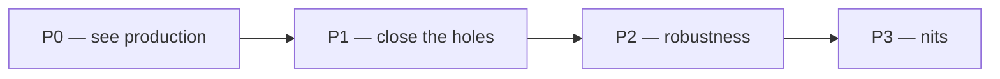

# Monitoring — what we do, in what order

> Status: Current · Owner: Tech Lead · Verified: 2026-08-29 · ADR: [0032](../../kdb/decisions/0032-sentry-data-rules.md)

## Context

The Sentry stack (#633, #634, #636, #640) merged on 2026-08-29. The data now exists; nothing
displays it, iOS has nowhere to send, and only Gemini failures reach Sentry at all. This is the
running order for the rest — Sentry setup, the iOS Rage Report, and iOS testing in one list.

**Size** is the house Low / Medium / High from `ROADMAP.md`, sized for one worker, one PR.
**Status** is one of **Done**, **In progress**, **Blocked** (on what), or **Not started**. Shipped
items move to the Done section at the bottom; the priority tables only hold outstanding work.

## Order

## P0 — we cannot see production today

| # | Work | Size | Status | Done when |
|---|---|---|---|---|
| 2 | Answer why no `gen_ai` span has ever carried `outcome:ok` | Low to diagnose; a fix is unsized until we know which it is | **Blocked** — needs one coach turn on production | We know whether Gemini is failing or our success path never emits |
| 3 | Point `Secrets.swift` at the `coach-hq-ios` DSN | Low | **In progress** — project created; DSN not yet pasted in | One real iOS event lands in it |

Item 3 is why Phase 5 is not as done as `sentry-lld.md` claims: `DiagnosticsManager.swift:240`
skips init when the DSN is still the placeholder, so until the DSN is in place the iOS app sends
nothing at all.

## P1 — the view has holes

| # | Work | Size | Status | Done when |
|---|---|---|---|---|
| 4 | [#646](https://github.com/sibling-shipyard/coach-hq/issues/646) — bring the six uncovered API routes under `withContinuedTrace` | Medium — two PRs: `auth/[...action].ts` alone, then the other five | **In progress** | A thrown error in `auth`, `repo-file`, `widget-snapshots`, `coach-chat-context`, `coach-chat-profile-status` or `waitlist` appears in Sentry |
| 5 | [#603](https://github.com/sibling-shipyard/coach-hq/pull/603) — unblock the Rage Report test-host crash | Medium, could be High — root cause unknown until sanitizer output names it | Not started | `ios-build.yml` green on that branch |
| 6 | Ship the Rage Report | Low — the PR is already written, 43 files; only 5 blocks it | **Blocked** on item 5 | An athlete submits a note plus selected timeline events; Cancel sends nothing |
| 7 | The three alert rules from `sentry-runbook.md` | Low | Not started | A new production error pages us within 15 minutes |
| 8 | [#638](https://github.com/sibling-shipyard/coach-hq/issues/638) — send the Gemini key as `x-goog-api-key` | Low — three call sites | Not started | Key absent from every URL; outbound spans can be turned back on |

Item 4 is **six** routes, not five: `auth/[...action].ts`, `coach-chat-context.ts`,
`coach-chat-profile-status.ts`, `repo-file.ts`, `waitlist.ts`, `widget-snapshots.ts`. The issue and
this doc both said five and both missed `coach-chat-profile-status.ts`. `auth` ships as its own PR:
it is a catch-all covering every auth endpoint, and identity is established *inside* it, so
`setAthleteScope` cannot sit where it sits in the other five.

**5 is the iOS testing item.** `RageReportTests.testCancelSendsNothing` crashes the test host with
`malloc: pointer being freed was not allocated`, at the same address on all three restart attempts —
deterministic, not flaky. The test body is pure (fake submitter, two hand-built events), and it is
the first test in the suite alphabetically, so suspect first-touch of a shared static rather than
the Rage Report code. CI also logs Keychain `-34018` because the runner builds
`CODE_SIGNING_ALLOWED=NO`, which is why it passes on a signed local build.

## P2 — robustness, not blocking

| # | Work | Size | Status | Done when |
|---|---|---|---|---|
| 9 | [#643](https://github.com/sibling-shipyard/coach-hq/issues/643) — flush via `waitUntil` | Medium — new dependency, and it inverts the span suite's premise | Not started | A coach turn no longer waits on Sentry ingest |
| 10 | Range-check the traces sample rate in `ui/api/_lib/sentry.ts` and `ui/client/src/lib/observability.ts` | Low | Not started | `SENTRY_TRACES_SAMPLE_RATE=100` warns instead of silently disabling tracing |
| 11 | Runbook corrections, one PR: make the web/API side set `operation` like iOS does, add the `sentry.origin:manual` filter to the health widget, fix the prove-step that needs Phase 6, bump the stale `Verified:` date on `docs/eng-docs/github-auth.md` | Low — docs plus one tag | Not started | Every query in `sentry-runbook.md` returns rows against real data |
| 12 | [#343](https://github.com/sibling-shipyard/coach-hq/issues/343) — iOS UI tests | High — the issue is a whole test framework, not one suite | Not started | A UI test runs in `ios-build.yml` |
| 13 | Stop emitting two `http.server` spans per request | Low | Not started | One span per request, carrying `outcome` |
| 17 | One shared route wrapper, then retrofit `coach-chat.ts` and `coach-message.ts` onto it | Low | Not started | Every wrapped route calls one helper; the ~15-line block exists once |

`operation` is set by **iOS only** — `DiagnosticsManager.swift:319` and `:333`. Web and API never
set it, so the runbook's error grouping is half-empty rather than dead: iOS events carry it, web and
API events do not. Either the two web projects start setting it or the runbook stops promising it;
picking one is the work in item 11.

Item 13, found while building the dashboard: every request produces our manual `http.server` span
**and** the auto-instrumented one. Grouping live spans by `sentry.origin` gives 9 `manual` (carrying
`outcome`) and 9 `auto.http.otel.http` (carrying none) for the same 9 requests. Until it is fixed,
any query over `span.op:http.server` must filter `sentry.origin:manual` or it counts every request
twice — the "Coach HQ health" dashboard already does. #633 kept the auto span deliberately and a
test pins `spans`/`disableIncomingRequestSpans` unset, so read that test before changing the init.

Item 17 is a design call the athlete raised, deliberately deferred until item 4 lands. Each wrapped
route hand-rolls the same ~15 lines; after item 4 there will be eight copies. A shared helper is the
better shape. But the six routes differ in where identity becomes known: `waitlist` has no auth at
all, and `auth` establishes it. Until all eight call sites exist, the helper is guesswork.
Retrofitting the two existing routes rewrites code that carries every coach conversation, for no
athlete-visible change, so it waits for the same PR as the helper.

## P3 — nits

None outstanding. The stale `Verified:` date on `docs/eng-docs/github-auth.md` is folded into
item 11, which touches docs anyway.

## Done

| # | Work | Shipped |
|---|---|---|
| 1 | The Sentry dashboard — "Coach HQ health", three widgets, each verified against live rows | 2026-08-29, dashboard `5873386` |
| 14 | Capture non-Gemini server errors on the two wrapped routes | 2026-08-29, [#647](https://github.com/sibling-shipyard/coach-hq/pull/647), closing #639 |
| 15 | Unblock iOS distribution — link `Sentry-Dynamic` instead of `Sentry` | 2026-08-29, `a965e23` |
| 16 | The web project's `environment` and `release` tags, wired from Vercel at build time | 2026-08-30, [#659](https://github.com/sibling-shipyard/coach-hq/pull/659), closing #641 |

Item 15 is worth remembering. Apple rejected the archive because the embedded `Sentry.framework`
had no debug-symbol file. The plain `Sentry` package ships none; `Sentry-Dynamic` ships a real one
per platform slice. Verified on the passing archive: it carries `Sentry.framework.dSYM` at UUID
`76FF1075-E44C-35F8-B628-06DBF903DEF3`, the same id as the shipped binary. Do not swap back.

Item 16 shipped wider than #641 read. The issue said the `release` fallback worked; that was
measured on an API event. On the browser it never had — all 581 `coach-hq-web` spans carried
release `development`. Sentry matches source maps to a release, so Phase 6 could not have worked
until this landed. **Not yet proved in Sentry:** the preview deploy sits behind Vercel's auth wall,
so the tags are verified in the built bundle but not on a real event.

## Parked, by decision

- **Phase 6 — upload symbols to Sentry.** **Medium.** Distribution is no longer blocked (item 15),
  but nothing uploads web source maps or iOS dSYMs *to Sentry*, so a production stack trace is
  still unreadable there. Wants a release workflow, which does not exist. Revisit at TestFlight.

## Deferred

- Alert routing beyond email and the Sentry mobile app.
- Anything in `sentry-lld.md` §4.
