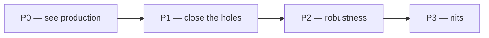

# Monitoring — what we do, in what order

> Status: Current · Owner: Tech Lead · Verified: 2026-08-30 · ADR: [0032](../../kdb/decisions/0032-sentry-data-rules.md)

## Context

The Sentry stack (#633, #634, #636, #640) merged on 2026-08-29. The data now exists; nothing
displays it, iOS has nowhere to send, and only Gemini failures reach Sentry at all. This is the
running order for the rest — Sentry setup, the iOS Rage Report, and iOS testing in one list.

**Size** is the house Low / Medium / High from `ROADMAP.md`, sized for one worker, one PR.
**Status** is one of **Done**, **In progress**, **Blocked** (on what), or **Not started**. Shipped
items move to the Done section at the bottom; the priority tables only hold outstanding work.

## Order

## P0 — we cannot see production today

| # | Work | Size | Status | Done when |
|---|---|---|---|---|

Item 3 is why Phase 5 is not as done as `sentry-lld.md` claims: `DiagnosticsManager.swift:240`
skips init when the DSN is still the placeholder, so until the DSN is in place the iOS app sends
nothing at all.

## P1 — the view has holes

| # | Work | Size | Status | Done when |
|---|---|---|---|---|
| 5 | [#603](https://github.com/sibling-shipyard/coach-hq/pull/603) — unblock the Rage Report test-host crash | Medium, could be High — root cause unknown until sanitizer output names it | Not started | `ios-build.yml` green on that branch |
| 6 | Ship the Rage Report | Low — the PR is already written, 43 files; only 5 blocks it | **Blocked** on item 5 | An athlete submits a note plus selected timeline events; Cancel sends nothing |
| 7 | The three alert rules from `sentry-runbook.md` | Low — two rules now, the third needs the Rage Report | **Deferred**, athlete's call — watching the dashboard by hand until item 5 lands | A new production error pages us within 15 minutes |
| 8 | [#638](https://github.com/sibling-shipyard/coach-hq/issues/638) — send the Gemini key as `x-goog-api-key` | Low — three call sites | Not started | Key absent from every URL; outbound spans can be turned back on |

**5 is the iOS testing item.** `RageReportTests.testCancelSendsNothing` crashes the test host with
`malloc: pointer being freed was not allocated`, at the same address on all three restart attempts —
deterministic, not flaky. The test body is pure (fake submitter, two hand-built events), and it is
the first test in the suite alphabetically, so suspect first-touch of a shared static rather than
the Rage Report code. CI also logs Keychain `-34018` because the runner builds
`CODE_SIGNING_ALLOWED=NO`, which is why it passes on a signed local build.

## P2 — robustness, not blocking

| # | Work | Size | Status | Done when |
|---|---|---|---|---|
| 12 | [#343](https://github.com/sibling-shipyard/coach-hq/issues/343) — iOS UI tests | High — the issue is a whole test framework, not one suite | Not started | A UI test runs in `ios-build.yml` |

## P3 — nits

None outstanding. The stale `Verified:` date on `docs/eng-docs/github-auth.md` is folded into
item 11, which touches docs anyway.

## Done

| # | Work | Shipped |
|---|---|---|
| 1 | The Sentry dashboard — "Coach HQ health", three widgets, each verified against live rows | 2026-08-29, dashboard `5873386` |
| 14 | Capture non-Gemini server errors on the two wrapped routes | 2026-08-29, [#647](https://github.com/sibling-shipyard/coach-hq/pull/647), closing #639 |
| 15 | Unblock iOS distribution — link `Sentry-Dynamic` instead of `Sentry` | 2026-08-29, `a965e23` |
| 3 | `coach-hq-ios` is sending — one trace now runs iOS → API → Gemini | 2026-08-30, trace `76336904e9274a539d4931086f41c834` |
| 16 | The web project's `environment` and `release` tags, wired from Vercel at build time | 2026-08-30, [#659](https://github.com/sibling-shipyard/coach-hq/pull/659), closing #641 |
| 2 | Answered, no fix needed: the success path emits `outcome:ok` normally | 2026-08-30, measured on production |
| 4 | Every API route under `withContinuedTrace`, capturing what its own catch swallows | 2026-08-30, [#660](https://github.com/sibling-shipyard/coach-hq/pull/660) + [#661](https://github.com/sibling-shipyard/coach-hq/pull/661), closing #646 |
| 19 | Sentry's file-I/O auto-instrumentation off on iOS | 2026-08-30, [#664](https://github.com/sibling-shipyard/coach-hq/pull/664) |
| 17 | One shared route wrapper, all eight call sites on it | 2026-08-30, [#665](https://github.com/sibling-shipyard/coach-hq/pull/665) |
| 18 | The remaining capture gaps closed — every silent conversion now captures | 2026-08-30, [#665](https://github.com/sibling-shipyard/coach-hq/pull/665) |
| 10 | Sample rate range-checked on both sides, not just parsed | 2026-08-30, [#666](https://github.com/sibling-shipyard/coach-hq/pull/666) |
| 13 | One `http.server` span per request — the SDK duplicate is off | 2026-08-30, [#666](https://github.com/sibling-shipyard/coach-hq/pull/666) |
| 11 | `operation` set by web and API, every runbook query corrected | 2026-08-30, [#667](https://github.com/sibling-shipyard/coach-hq/pull/667) |
| 9 | Route span flush runs under Vercel `waitUntil`, off the coach-reply path | 2026-08-30, [#680](https://github.com/sibling-shipyard/coach-hq/pull/680), closing #643 |

Item 15 is worth remembering. Apple rejected the archive because the embedded `Sentry.framework`
had no debug-symbol file. The plain `Sentry` package ships none; `Sentry-Dynamic` ships a real one
per platform slice. Verified on the passing archive: it carries `Sentry.framework.dSYM` at UUID
`76FF1075-E44C-35F8-B628-06DBF903DEF3`, the same id as the shipped binary. Do not swap back.

Item 16 shipped wider than #641 read. The issue said the `release` fallback worked; that was
measured on an API event. On the browser it never had — all 581 `coach-hq-web` spans carried
release `development`. Sentry matches source maps to a release, so Phase 6 could not have worked
until this landed. **Not yet proved in Sentry:** the preview deploy sits behind Vercel's auth wall,
so the tags are verified in the built bundle but not on a real event.

Item 3 closed on a real coach turn from the simulator. One trace carried the tap, the phone's
`http.client` POST, the API's `http.server` span and the Gemini call, both API spans `outcome:ok`.
That is the first end-to-end proof that the three projects share a trace rather than producing
three unrelated event streams.

Item 19 was found in that same trace: 15 of its 19 spans were iOS reading its own keyboard files —
`Keyboard-en.plist`, `KBLayouts_iPhone.dat`, `SystemVersion.plist`. Sentry's file-I/O
auto-instrumentation produces them. They bury the four spans that matter and spend span quota on
nothing.

Item 2 closed by measurement, not by a fix. Production `gen_ai` spans ran 3 `ok` to 1 `error`; the
all-error picture that started it was 9 preview spans from PR verification. Those were our own
deliberate test failures, read as a production alarm. **Split by environment before drawing any
conclusion from span data.**

Item 13 is worth keeping straight. `spans: false` would have killed the outbound spans too;
`disableIncomingRequestSpans: true` removes only the SDK's duplicate incoming span, and the manual
one from `withContinuedTrace` survives because `startSpan` does not go through `httpIntegration`.
That is why the fix is one option and not a rewrite.

## Parked, by decision

- **Phase 6 — upload symbols to Sentry.** **Medium.** Distribution is no longer blocked (item 15),
  but nothing uploads web source maps or iOS dSYMs *to Sentry*, so a production stack trace is
  still unreadable there. Wants a release workflow, which does not exist. Revisit at TestFlight.

## Deferred

- Alert routing beyond email and the Sentry mobile app.
- Anything in `sentry-lld.md` §4.
