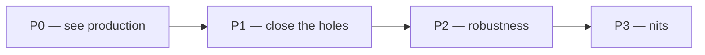

# Monitoring — what we do, in what order

> Status: Current · Owner: Tech Lead · Verified: 2026-08-29 · ADR: [0032](../../kdb/decisions/0032-sentry-data-rules.md)

## Context

The Sentry stack (#633, #634, #636, #640) merged on 2026-08-29. The data now exists; nothing
displays it, iOS has nowhere to send, and only Gemini failures reach Sentry at all. This is the
running order for the rest — Sentry setup, the iOS Rage Report, and iOS testing in one list.

**Size** is the house Low / Medium / High from `ROADMAP.md`, sized for one worker, one PR.

## Order

## P0 — we cannot see production today

| # | Work | Size | Done when |
|---|---|---|---|
| 1 | Build the Sentry dashboard: Gemini health, web/API health, production errors | Low | Three widgets return real rows, not empty panels |
| 2 | Answer why every `gen_ai` span is `outcome:error` with zero successes | Low to diagnose; a fix is unsized until we know which it is | We know whether Gemini is failing or our success path never emits |
| 3 | Create the `coach-hq-ios` project and point `Secrets.swift` at its DSN | Low | One real iOS event lands in it |

Item 3 is why Phase 5 is not as done as `sentry-lld.md` claims: `DiagnosticsManager.swift:240`
skips init when the DSN is still the placeholder, and the org has only `coach-hq-api` and
`coach-hq-web`.

## P1 — the view has holes

| # | Work | Size | Done when |
|---|---|---|---|
| 4 | [#646](https://github.com/sibling-shipyard/coach-hq/issues/646) — bring the five uncovered API routes under `withContinuedTrace` | Medium — five routes, each needs a wrapper and a test | A thrown error in `auth`, `repo-file`, `widget-snapshots`, `coach-chat-context` or `waitlist` appears in Sentry |
| 5 | [#603](https://github.com/sibling-shipyard/coach-hq/pull/603) — unblock the Rage Report test-host crash | Medium, could be High — root cause unknown until sanitizer output names it | `ios-build.yml` green on that branch |
| 6 | Ship the Rage Report | Low — the PR is already written, 43 files; only 5 blocks it | An athlete submits a note plus selected timeline events; Cancel sends nothing |
| 7 | The three alert rules from `sentry-runbook.md` | Low | A new production error pages us within 15 minutes |
| 8 | [#638](https://github.com/sibling-shipyard/coach-hq/issues/638) — send the Gemini key as `x-goog-api-key` | Low — three call sites | Key absent from every URL; outbound spans can be turned back on |

**5 is the iOS testing item.** `RageReportTests.testCancelSendsNothing` crashes the test host with
`malloc: pointer being freed was not allocated`, at the same address on all three restart attempts —
deterministic, not flaky. The test body is pure (fake submitter, two hand-built events), and it is
the first test in the suite alphabetically, so suspect first-touch of a shared static rather than
the Rage Report code. CI also logs Keychain `-34018` because the runner builds
`CODE_SIGNING_ALLOWED=NO`, which is why it passes on a signed local build.

## P2 — robustness, not blocking

| # | Work | Size | Done when |
|---|---|---|---|
| 9 | [#643](https://github.com/sibling-shipyard/coach-hq/issues/643) — flush via `waitUntil` | Medium — new dependency, and it inverts the span suite's premise | A coach turn no longer waits on Sentry ingest |
| 10 | Range-check the traces sample rate in `ui/api/_lib/sentry.ts` and `ui/client/src/lib/observability.ts` | Low | `SENTRY_TRACES_SAMPLE_RATE=100` warns instead of silently disabling tracing |
| 11 | Runbook corrections, one PR: drop the dead `operation` grouping and alert filter, fix the prove-step that needs Phase 6 | Low — docs only | Every query in `sentry-runbook.md` returns rows against real data |
| 12 | [#343](https://github.com/sibling-shipyard/coach-hq/issues/343) — iOS UI tests | High — the issue is a whole test framework, not one suite |
| 13 | Stop emitting two `http.server` spans per request | Low | One span per request, carrying `outcome` | A UI test runs in `ios-build.yml` |

Nothing sets an `operation` tag anywhere in `ui/` or `ios/`; it is left over from the `operation_id`
design that #633 replaced with native tracing.

Item 13, found while building the dashboard: every request produces our manual `http.server` span
**and** the auto-instrumented one. Grouping live spans by `sentry.origin` gives 9 `manual` (carrying
`outcome`) and 9 `auto.http.otel.http` (carrying none) for the same 9 requests. Until it is fixed,
any query over `span.op:http.server` must filter `sentry.origin:manual` or it counts every request
twice — the "Coach HQ health" dashboard already does. #633 kept the auto span deliberately and a
test pins `spans`/`disableIncomingRequestSpans` unset, so read that test before changing the init.

## P3 — nits

| # | Work | Size |
|---|---|---|
| 14 | Bump the stale `Verified:` date on `docs/eng-docs/github-auth.md` | Low |

## Parked, by decision

- **Phase 6 — source maps and dSYMs.** **High** — wants a release/archive workflow first, which
  does not exist. Revisit when TestFlight releases are set up. Until then every production stack trace,
  web and iOS, is unreadable.

## Deferred

- Alert routing beyond email and the Sentry mobile app.
- Anything in `sentry-lld.md` §4.
