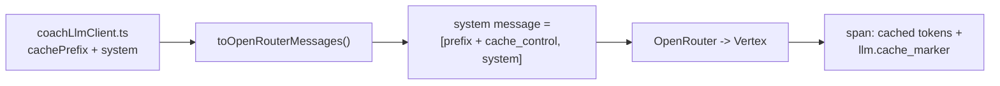

# Plan: prompt caching for coach-chat on OpenRouter

> Status: Plan · Owner: Tech Lead · Created: 2026-09-15 · Revised: 2026-09-18

## Context

Coach-chat resends a fixed prefix (persona, rules, few-shot examples) on every turn. Production
runs on OpenRouter (ADR 0046). The OpenRouter adapter joins that prefix and the per-turn block
into one plain string, so nothing tells the provider where the stable part ends. The Gemini
explicit cache (`geminiSoulCache.ts`) only runs on the direct-Gemini path, which production does
not use. I want to send OpenRouter's `cache_control` marker at that boundary, and prove with
Sentry that it does something.

## What I verified

- **The seam is ready.** `LlmRequest.cachePrefix` (stable) and `LlmRequest.system` (per turn) are
  separate fields (`ui/api/_lib/llmClient.ts:89`). Chat fills both (`coachLlmClient.ts:63`). The
  only place the boundary is lost is `toOpenRouterMessages()` in `openRouterAdapter.ts`.
- **Prefix size.** `staticSystemText(SOUL.chat.md)` is 24,309 characters, about 6k tokens
  (characters / 4, an estimate). Older docs say ~13k tokens; that describes the retired 49 KB SOUL.
- **Sentry already carries the result.** `gen_ai.usage.input_tokens.cached` and
  `gen_ai.usage.cost.usd` are set on the OpenRouter span (`sentry.ts:400`) and tested
  (`sentry-spans.test.ts:371`).
- **Evidence for the marker is thin.** `docs/eng-docs/chat-provider-bench.md` § Explicit cache
  marker measured 48% cached from call 1 with the marker, on the coach-message prompt, six calls
  back to back in one window. The doc says it cannot explain why call 1 already hit, and that
  marked and unmarked requests may key the cache differently. It never measured the chat prompt
  or a realistic gap between calls.
- **Other providers.** The bench says DeepSeek arms cached without a marker and ignored it.
  Anthropic and Alibaba need it (OpenRouter docs, not measured here).

## Decision

Send the marker on chat, always, no per-model branch. Ship it as "send and measure", not as a
promised saving. ADR 0052 records that, and states no savings figure until Sentry shows one.

## Build (Bob for code, me for ADR and docs)

1. `openRouterAdapter.ts`: when `cachePrefix` is set, the leading system message becomes two
   blocks. Block 1 is `cachePrefix` with `cache_control: {type: "ephemeral"}`. Block 2 is `system`,
   omitted when empty. No `cachePrefix` keeps today's plain string, byte for byte. Widen the
   return type to `content: string | block[]`.
2. Same file: pass `"llm.cache_marker": "true" | "false"` through `withLlmSpan`'s
   `extraAttributes`, so Sentry can split marked from unmarked calls.
3. Fix comments that become false: `openRouterAdapter.ts` `toOpenRouterMessages` doc,
   `llmClient.ts:82-85`, `openRouterAdapter.test.ts:138-141`.
4. `kdb/decisions/0052-openrouter-cache-control-marker.md` (0048 is taken; 0052 is next). Enforces:
   no per-model marker branch, and no Edge Config cache for the OpenRouter path.
5. Docs, `Verified:` bumped: `chat-llm-seam.md:45`, `llm-provider-current.md` Caching section
   (and its stale ~13K figure), `chat-provider-bench.md` recommendation, `sentry-runbook.md`
   Coverage boundary (new attribute, how to read hit rate, why there is no alert on zero cached).

## Tests

1. Unit: block shape, empty `system`, no `cachePrefix` stays a plain string, the attribute in both
   states, `cachedPromptTokens` still absent-vs-zero safe.
2. Failure path: a provider 400 on the content-array shape reaches Sentry through
   `captureLlmFailure`. I read `shouldCapture` first and add a test, not assume it.
3. `npm test` for `ui/api`, then `bash platform/scripts/check.sh --quiet` after committing.
4. Live, on `test/close-verification` of `coach-skanda-2003`: 3+ turns in one thread back to
   back, then a gap of a few minutes. Read cached tokens per turn from Sentry. Report zeros too.
5. Docs and ADR state only what those runs show.

## Done when

1. Marked chat spans carry `llm.cache_marker: true` and a cached-token count in Sentry.
2. The live run shows what turn 1, turn 2+ and the gapped turn actually report.
3. The pushed SHA is green on `ui-tests.yml` and `platform-tests.yml`.

## Deferred

- Coach-message caching, gated on step 2 above: `docs/plans/openrouter-caching-coach-message.md`.
- Weekly plan auto-generation caching: section in `docs/plans/weekly-plan-auto-generation-lld.md`.
- Deleting `geminiSoulCache.ts`: ADR 0046 calls OpenRouter interim, so it stays.
