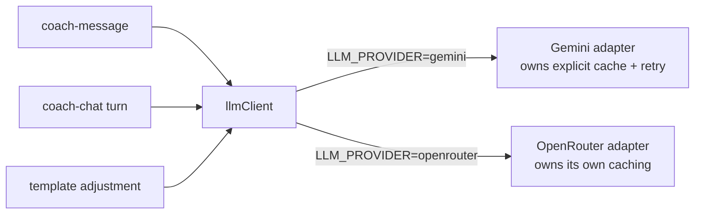

# OpenRouter M2 — coach-chat onto `llmClient` — LLD

> Status: Current · Owner: Tech Lead · Verified: 2026-09-08

Execution detail for milestone 2 in [`chat-openrouter-migration.md`](chat-openrouter-migration.md).
That plan carries M2 as a single PR. It is three. Chat does not send what the seam can express,
and one open provider question decides how much of chat's schema has to change. J2 moves every
chat file this touches, so every chat path cited below is the post-J2 one and is not on `main` yet.
Rather than wait for #821 to merge, all three PRs branch from `fix/808-quest-create-flaky` (#824,
the current tip of the 819→821→822→824 stack). That stack is rebased current with `main`; these
PRs rebase onto `main` once it lands.

## How the three callers reach the model today

`coach-message` already goes through the seam. Chat and template adjustment each open their own
socket, and neither looks like the other.

| | `coach-message` | coach-chat turn | template adjustment |
|---|---|---|---|
| Reaches the model via | `selectLlmAdapter` (`_lib/llmClient.ts:68`) | raw `fetch` (`coach-chat/_lib/gemini/geminiClient.ts:113`) | raw `fetch` (`coach-chat/_lib/decide/coachWorkoutFiles.ts:340`) |
| Auth | header, per adapter | `?key=` in the URL | `?key=` in the URL |
| Prompt shape | one flat string | `systemInstruction` + multi-turn `contents` + history | one `contents` block |
| Schema | 1 property, required | built per turn, ~19 optional actions, per-athlete enums | static, nested |
| `additionalProperties` | `false` | absent, 19 objects | absent |
| Explicit cache | none | `gemini/soulCache.ts`, Global Config, 4 env vars | none |
| Retry | none | 400 → drop cache, 503/504 → one backoff | none |
| Telemetry | tokens, cost, resolved provider | tokens only | tokens only |
| Timeout | 45s | 45s | 20s |

Two consequences worth stating plainly. Chat and templates today cannot switch provider at all —
there is no seam to switch. And chat is the only caller paying for an explicit cache, which is
also the only caller whose telemetry cannot report what a turn cost.

## Target

## The question that branches this design — probe before building

Chat's schema declares roughly 19 actions and requires exactly one of them: `required: ["reply"]`.
`generationConfigFor` (`gemini/coachReplySchema.ts:494`) does that on purpose, so an action a turn
must not take is absent from the schema rather than merely discouraged.

OpenAI-style `strict` JSON Schema takes the opposite position: every property must appear in
`required`, and optionality is expressed as a null union. `coach-message` cannot tell us which
rule OpenRouter applies to a Vertex-routed Gemini model, because its schema has one property and
that property is required.

So the first task is a probe, not a patch. Send the real post-#824 `coachReplySchema` through
`response_format: {type: "json_schema", strict: true}` on `google/gemini-3.8-flash` pinned to
`google-vertex`, with `required: ["reply"]` unchanged.

| Probe result | What M2 becomes |
|---|---|
| Accepted as-is | Mechanical. Add `additionalProperties: false` to 19 objects; the compiler finds every one, because `LlmJsonSchema` demands it |
| Rejected — every key must be required | Structural. Each action becomes required-and-nullable, which retires "forbidden actions are absent structurally" and re-opens #824's ordering fix. Stop and re-scope; this is no longer a plumbing change |

Run the probe before PR 1. It costs one request and it decides whether M2 is a week or a month.

**Run 2026-09-08:** accepted as-is. One live call, the real `RETURNING_ACTIONS` shape (15 action
fields + `reply`, `required: ["reply"]`, `strict: true`) against `google/gemini-3.8-flash` pinned
to `google-vertex`, returned HTTP 200 with `{"reply":"Hi"}` ($0.00268). OpenRouter does not enforce
OpenAI's "every property must be required" rule for this model/provider. **M2 is mechanical** —
proceed straight to PR 1.

## What the seam has to grow

`LlmRequest` is `{prompt, maxOutputTokens, responseSchema}`. Chat needs four more things, and each
one belongs in the adapter rather than the caller:

1. **Turns, not a string.** Chat sends history as real `contents` and a separate `systemInstruction`.
   `prompt: string` becomes `system: string` plus `messages: {role, text}[]`. Gemini maps these to
   `systemInstruction`/`contents`, OpenRouter to a leading system message.
2. **Caching becomes the adapter's business.** `soulCache.ts` moves behind the Gemini adapter.
   Callers pass the stable prefix and stop knowing whether it was cached. The OpenRouter adapter
   does nothing here, per the parent plan's locked decision.
3. **Retry moves too.** Chat's "400 means a stale cache, retry without it" is a Gemini fact.
   OpenRouter's equivalent is HTTP 200 carrying an `error` object, already handled in its adapter.
4. **Timeout per request.** 45s for a chat turn, 20s for template adjustment, today hardcoded per
   adapter.

Chat gets one thing back for free: `GeminiUsage` already carries `costUsd` and `resolvedProvider`,
and the adapters already populate them. Chat's own client does not. After this, a chat turn reports
what it cost.

## Execution

| PR | milestone | outcome | final base | files | owner | parallel with | result |
|---|---|---|---|---|---|---|---|
| 1 | 2 | Seam carries system + turns + per-request timeout; `coach-message` moves onto the new shape with no behaviour change | `fix/808-quest-create-flaky` (#824 stack tip) | `ui/api/_lib/llmClient.ts`, `ui/api/_lib/llmAdapters/`, `ui/api/_lib/_tests/`, `ui/api/coach-message/_lib/coachMessage.ts`, `ui/api/coach-message/_tests/` | Bob the Builder | — | [#917](https://github.com/sibling-shipyard/coach-hq/pull/917), open, checks green |
| 2 | 2 | Chat turn runs through `llmClient`; cache and retry move into the Gemini adapter; schema gains `additionalProperties` | PR 1 | `ui/api/coach-chat/_lib/gemini/`, `ui/api/_lib/llmAdapters/geminiAdapter.ts`, `ui/api/coach-chat/_tests/`, `ui/scripts/eval-coach-chat.ts` | Bob the Builder | — | [#920](https://github.com/sibling-shipyard/coach-hq/pull/920), open, checks green |
| 3 | 2 | Template adjustment stops opening its own socket | PR 2 | `ui/api/coach-chat/_lib/decide/coachWorkoutFiles.ts`, `ui/api/coach-chat/_tests/` | Bob the Builder | — | [#921](https://github.com/sibling-shipyard/coach-hq/pull/921), open, checks green |

Production stays on `LLM_PROVIDER=gemini` throughout. Nothing here flips a provider; M3 does that.

PR 1 and PR 2 both touch `geminiAdapter.ts`, so they cannot run in parallel.

## Tests

- PR 1: existing `coach-message` tests pass unchanged against the new request shape. Adapter tests
  cover system-plus-turns mapping on both sides.
- PR 2: the 23 eval transcripts in `coach-chat/_tests/coach-chat-eval/transcripts/` pass on direct
  Gemini through the seam. This is the same gate as #670 (PR 810) and reuses its baseline.
  **Blocked in practice** — both the local `GEMINI_API_KEY` and CI's own `secrets.GEMINI_API_KEY`
  return `RESOURCE_EXHAUSTED` on `gemini-3.1-pro` (account quota, not a code defect; likely #670's
  actual root cause, not the stale-rubric theory that issue was framed around). Ran the suite
  against OpenRouter instead, unblocked by the same key: 19/23 pass on `google/gemini-3.8-flash`.
  Structurally consistent with the direct-Gemini baseline (#807's transcript is clean on both;
  #808's own transcript hit a token-truncation before it could reproduce or clear). Two failures
  were new truncations at the shared 4096-token ceiling, not on direct Gemini — worth budget
  attention before an M3 cutover, not fixed here.
- PR 3: template adjustment keeps its own tests; the assertion moves from a `fetch` mock to an
  adapter stub.
- Every PR: `bash platform/scripts/check.sh --quiet`.

## Done when

1. All three callers reach the model through `selectLlmAdapter`, and no `generativelanguage.googleapis.com`
   URL is left outside `llmAdapters/`.
2. The explicit soul cache is reachable only through the Gemini adapter.
3. A chat turn's Sentry span reports `costUsd` and the resolved provider.
4. The eval transcripts pass through the seam. Direct Gemini is untestable under current account
   quota (see PR 2's Tests row); OpenRouter's 19/23 stands in as the live evidence for this PR
   stack until that quota gap is resolved.

## Deferred

- Flipping chat to `LLM_PROVIDER=openrouter` — that is M3, gated on #670's live baseline.
- Removing the direct Gemini adapter and `soulCache.ts` — M3.
- Whether OpenRouter's implicit caching pays for chat's ~13K static prefix. The bench already
  measured that Vertex discounts only an exact whole-prompt repeat, which chat never sends, so
  assume no discount until measured again.
- The `new_habits` crash found reviewing #824 (`decide/coachIntents.ts:561`) lands with that stack,
  not here.
