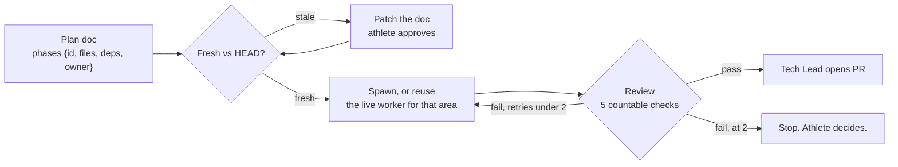
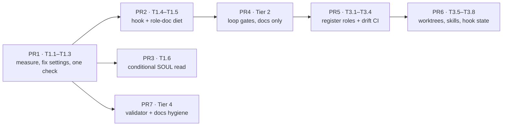

# Agent setup: one plan, stack-ranked

> Status: Current · Owner: Tech Lead · Verified: 2026-08-28 · Issues: [#395](https://github.com/sibling-shipyard/coach-hq/issues/395), [#328](https://github.com/sibling-shipyard/coach-hq/issues/328) · Supersedes: PR #396 `ops-agent-setup.md`, PR #397 `platform-agent-loop.md`

## Context

Two agents audited our dev-agent setup on the same day and filed separate plans: #396 (context
engineering, from Anthropic's *Effective context engineering for AI agents*) and #397 (loop
hardening, from the athlete's "Coach HQ Agent Framework Improvements" doc). They overlap on about a
third of their items and disagree on nothing important. This is the union, deduped, stack-ranked,
with the measurements re-run so the ordering rests on numbers rather than on either author's claim.

Over the one-page budget by explicit athlete exception. It is a checklist, not a page.

**The organising rule, from #396, and it survives the merge:** anything a hook or a script can
enforce is text we can delete. Every item below either shrinks what an agent loads, stops it
re-deriving something, or turns a rule we restate into a mechanism we run once.

**The counterweight, from #397, and it also survives:** the token complaint is mis-aimed. Workers
read `AGENTS.md` + their role doc + the ADR index — not SOUL, not `tech-lead.md`. Boot is under 10%
of a worker's run. The tokens go into re-reading *code*, which fewer spawns and one kept-alive
worker per area fix, not doc trimming. The one genuinely fat boot is Tech Lead's own.

## What I re-measured

Verified on `main` at `584b12c`, 2026-08-17. Both plans' factual claims hold.

| Claim | Verified |
|---|---|
| `ios-builder.md` is mostly Learnings | 6495B total, 4626B Learnings across 12 entries — **71%** |
| `tech-lead.md` likewise | 9170B total, 3169B across 13 entries — **35%**, and 13 against a ~15 cap |
| `ui-expert.md` | 3265B / 1328B / 6 entries — 41%. `bob-the-builder.md` is clean at 10% |
| Roles are not registered | `.claude/` holds exactly two files: `settings.json`, `hooks/session-start.sh`. No `agents/`, no `skills/` |
| Validator prints warnings nobody acts on | 4 dead-path warnings, unchanged, `validate-kdb OK (24 ADRs)` |
| Eng-docs are stale | 26 docs; 6 still at `Verified: 2026-07-29`, i.e. before the SOUL split, ADRs 0022–0025 and the coach data redesign |
| Checks are scattered | `ui/`: `npm run check` (tsc), `npm test` (vitest) · `platform/scripts/`: `compose-soul.mjs`, `validate-soul.mjs` · `kdb/scripts/validate_kdb.py` |

**One thing both plans missed.** `.claude/settings.json` allowlists `npm run check` and `npm run test`
— and there is no root `package.json`, so neither command exists at the repo root. Those two entries
have never matched anything. Combined with the `gh` entries the remote harness cannot use, roughly a
third of the allowlist is dead. That makes the allowlist fix (T1.2) worth more than either plan
scored it: it is not a tidy-up, it is a broken file.

## Status — what the #398–#405 stack shipped

**All eight PRs (#398–#405) reviewed and merged to `main`, 2026-08-18.** Updated after that review.

| Item | PR | State |
|---|---|---|
| T1.1 boot-cost script | #399 | ✅ shipped |
| T1.2 settings.json repair | #400 | ✅ shipped — 8 MCP names in the first pass did not exist on this server; corrected in review |
| T1.3 one check command | #399 | ✅ shipped as `platform/scripts/check.sh` |
| T1.4 `git add -A` hook | #400 | ✅ shipped — 15/15 on a payload matrix, and it blocked a real `git add .` during this review |
| T1.5 role-doc diet + byte cap | #401 | ✅ shipped — see the measurement below before calling it a win |
| T1.6 conditional SOUL read | #402 | ✅ shipped — the one large saving in the stack |
| T2.1–T2.7 loop gates | #403 | ✅ shipped, plus ADR 0026 recording the LangGraph rejection |
| T3.7 dynamic session-start state | #405 | ✅ shipped |
| T3.8 dedupe role-doc preamble | #401 | ✅ shipped |
| T4.1 fix the four dead paths | #404 | ✅ shipped |
| T4.2 two new validator rules | #404 | ✅ shipped — the staleness hard-fail was rescoped in review, see below |
| T4.5 PR template gate line | #404 | ✅ shipped |
| T3.1–T3.6 register roles, model tiers, worktrees, skills | — | ⏸ held, gated on the measurement below |
| T4.3 re-verify `scaling-plan.md` | — | ⏸ held, athlete's call |
| T4.4 delete the Historical eng-docs | — | ⏸ held, athlete's call |

### What the measurement actually says

`node platform/scripts/boot-cost.mjs`, `main` vs top of stack:

| Role | Before | After | Δ |
|---|---|---|---|
| Tech Lead (non-soul task) | ~14 760 tok | ~5 250 tok | **−64%** |
| iOS Builder | 8 884 tok | 8 636 tok | −2.8% |
| UI Expert | 3 722 tok | 3 772 tok | **+1.3%** |
| Bob the Builder | 3 415 tok | 3 464 tok | **+1.4%** |

One real win: Tech Lead's conditional SOUL read. Everything else roughly broke even, and two
roles got slightly *heavier*, because `AGENTS.md` grew 495B and the ADR index 65B — costs every
role pays — while the savings landed in role docs each read by one role. The iOS "71% smaller
role doc" moved 3072B of its 4626B straight into `ios-app-spec.md` and `ios/DESIGN.md`, which
iOS Builder also reads at boot. Promotion into an eng-doc is not a saving when the eng-doc is
itself a boot file (#414).

**This is the number T3.1–T3.6 were gated on.** It says the boot-doc problem is nearly all
Tech Lead's SOUL read, now fixed, plus iOS's two spec docs, which is #414 and not Tier 3. Tier 3
buys isolation and tool scoping — real, but not tokens. Score it that way before starting it.

### What is left

Nothing in the stack is outstanding. These are the deliberate holds and the follow-ups:

| | Item | Why it is still open |
|---|---|---|
| 1 | ~~Run `platform/scripts/check.sh` end to end~~ | **Done 2026-08-18.** All five legs run. Four pass; `validate-soul` fails on a finding that predates this stack and is now #424. Confirmed the script is not the cause — a pristine worktree of `main` fails identically. |
| 2 | **#414 — iOS boot (P1)** | The one P1 from review. Cheap now: #402 built the conditional-read mechanism, so applying it to `ios/DESIGN.md` and `docs/eng-docs/ios-app-spec.md` is a small PR. |
| 3 | **T3.1–T3.6 — register roles, model tiers, tool scoping, worktrees, skills** | Held, and the measurement above is the reason. It says the boot-token problem was almost entirely Tech Lead's SOUL read, now fixed. Tier 3 buys isolation and tool scoping, which are real but are not tokens. Score it that way before starting. |
| 4 | **T4.3 — re-verify or supersede `scaling-plan.md`** | Athlete's call: is our architecture doc still true? |
| 5 | **T4.4 — delete the five Historical eng-docs** | Athlete's call. |
| 6 | **#415, #416, #417 (P2)** | Validator gaps found in review. None blocking. |
| 7 | **#424 (P1) — `validate-soul` cannot fail CI** | Found by item 1 on its first real run. `continue-on-error: true` in `.github/workflows/validate-soul.yml` swallows the step's exit code, so the "fails on new findings" its comment promises has never once happened — and there is an unseen new finding on `main` today. Assigned to Skanda, under #297 in M2. |

**This plan is not delete-on-ship yet.** `docs/plans/` is deleted when the work ships; items 3–5
above are still open, so it stays. Delete it when they resolve, folding anything durable into
`docs/eng-docs/` first.

### Found in review, filed as issues

- #414 (P1) — iOS boot is the heaviest and the diet barely moved it
- #415 (P2) — the path checker silently skips paths after an odd backtick, so "zero warnings" is a floor
- #416 (P2) — staleness only polices docs that opted in via `Status: Current`
- #417 (P2) — widen path-checking to `.claude/hooks/`, where a dead path misdirects every session

## The loop, with the gates in it

## Tier 1 — do now

Cheap, pays every session, no dependency on anything else. `Src` marks where each item came from:
`396`, `397`, `both`, or `TL` for items I added.

| | Item | Src | Effort |
|---|---|---|---|
| T1.1 | **Measure boot cost before trimming it.** `platform/scripts/boot-cost.mjs` sums the byte/token cost of each role's declared boot set and prints a table. Both plans quote figures (2.9k Bob / 3.1k UI / 6.7k iOS / ~11k Tech Lead) that nothing reproduces. Without this, every later trim is an opinion and nobody can tell in a month whether it held | TL | L |
| T1.2 | **Repair `.claude/settings.json`.** Add the `mcp__github__` read tools (the remote harness has no `gh`, and every web session burns a turn discovering that); drop or fix the `npm run check` / `npm run test` entries that match nothing; add the checks that actually exist | both + TL | L |
| T1.3 | **One check command.** `platform/scripts/check.sh` runs tsc, eslint, vitest, `compose-soul --check`, `validate-soul`, `validate_kdb.py`. Makes review check 3 a single line. **Not** a root `package.json` — that shadows npm resolution for `ui/`, which is where Vercel roots | 397 + TL | L |
| T1.4 | **`PreToolUse` hook denying `git add -A` and `git add .`**, then delete the sentence from `tech-lead.md` and from every future brief. A rule in a hook costs zero tokens forever | both | L |
| T1.5 | **Role-doc diet.** Cap Learnings in **bytes** (~1.5KB), not entries — several entries run 60–80 words on one line and pass the count check. Move cross-role learnings to where the reader is: "never `git add -A`" was learned *from* a subagent and filed in `tech-lead.md`, which no subagent opens. Enforce the cap in `validate_kdb.py` | both | L |
| T1.6 | **SOUL becomes a conditional read.** Tech Lead boot step 2 reads all 365 lines of `platform/SOUL.claude.md` every session — ~63% of the boot, unused on UI, CI or infra work. Read it when the task touches soul layers, coach behaviour, or chat | both | L |

Order inside the tier: T1.1 first so T1.5 and T1.6 have a before/after. T1.3 before T1.2 so the
allowlist has something real to allow.

## Tier 2 — the loop gates

Docs only. This is what turns "delegate and hope" into something checkable. Nothing here needs the
harness work in Tier 3, which is why it ranks above it.

| | Item | Src | Effort |
|---|---|---|---|
| T2.1 | **Phases are typed.** An executable plan carries a `{id, files, deps, owner}` table (rule lands in `kdb/doc-style.md`). Briefs become sliceable, scope bleed becomes checkable (`worker diff ⊆ phase.files`), and **file overlap decides parallelism, not task logic**. `owner` is my addition: it records which worker is live for that area, so reuse-before-spawn has somewhere to look | both + TL | L |
| T2.2 | **Freshness gate.** Step 0 of the execution loop: diff the plan doc against HEAD; if the files it names have moved, propose a doc patch and wait — before any worker spawns | 397 | L |
| T2.3 | **Review is five countable checks**, not a verdict: named checks re-run by me and green · diff ⊆ phase files · explicit paths staged · PR file list verified against the branch, not against local `main` · doc upkeep done | 397 | L |
| T2.4 | **Fixed subagent report shape:** files touched, checks run *with output*, what was deliberately not done. Review still happens — this stops me re-deriving what happened | 396 | L |
| T2.5 | **Retry cap is 2.** Two worker fixes, then it stops and comes to the athlete | 397 | L |
| T2.6 | **Worker writes progress into its plan file as it goes**, so a respawn resumes instead of restarting | 396 | L |
| T2.7 | **Broad searches go to the `Explore` subagent** — it returns conclusions, not file dumps into the main context | 396 | L |

## Tier 3 — the harness

Real subagents. Highest ceiling, highest effort, and the tier most likely to be over-built — which
is why it sits below the free stuff. **Gate it on T1.1:** if the measured boot cost after Tier 1 is
already small, T3.1–T3.4 buy isolation and tool scoping, not tokens, and should be scored as such.

| | Item | Src | Effort |
|---|---|---|---|
| T3.1 | **Register the roles.** Generate `.claude/agents/*.md` from `.github/agents/` — the role doc becomes the worker's system prompt, loaded rather than read as a turn. `.github/agents/` stays the cross-agent source so Cursor keeps working. Verify `@`-import resolves inside a subagent file first; if not, frontmatter plus a pointer line | both | M |
| T3.2 | **Drift check on that generation.** If `.claude/agents/` is generated, CI fails on drift — exactly as `compose-soul --check` does for the two SOUL builds. Skipping this reproduces the silent-divergence bug class ADR 0022 exists to prevent | TL | L |
| T3.3 | **Model tier in frontmatter.** Cheap models for mechanical work, strong for soul and voice. The rule is already written in `tech-lead.md` and wired to nothing | both | L |
| T3.4 | **Per-role tool allowlist**, replacing one flat list in `.claude/settings.json` | 396 | L |
| T3.5 | **Worktree isolation per subagent** — deletes three sentences of branch-hygiene scar tissue from `tech-lead.md` | 396 | L |
| T3.6 | **Rituals become on-demand skills** in `.claude/skills/`: the soul ritual (edit layer → compose → both builds → `SOUL_HISTORY.md`, written out twice today), the pre-PR doc-upkeep checklist, and `platform/skills/pipeline-tools.md`, which is called a skill and is loaded as nothing. Boot prose everyone reads becomes a file the one agent doing that job opens | both | M |
| T3.7 | **Session-start hook emits dynamic boot state**: current branch, `git log --oneline -5`, dirty files. Boot steps 1 and 5 for free. Local git only — no network, or every session start pays for it | 397 | L |
| T3.8 | **Deduplicate the shared preamble** across the four role docs — the same tax paid four times, already drifting | 396 | L |

## Tier 4 — enforcement and docs hygiene

Real, ranked last because none of it changes a session tomorrow. **Ordering inside the tier is load-bearing:** T4.1 before T4.2 (clean the warnings before you tighten the check), and T4.3 before T4.4 (six docs sit at 2026-07-29; a 90-day hard fail lands on them first).

| | Item | Src | Effort |
|---|---|---|---|
| T4.1 | **Act on the four warnings the validator already prints**, then decide: a warning nobody reads is noise — either it fails the build or the check goes | 396 | L |
| T4.2 | **`validate_kdb.py` learns two rules nothing enforces:** a diff touching `platform/soul/*` must add a `SOUL_HISTORY.md` entry (`AGENTS.md` says outright that the grep cannot find this); and `Verified:` staleness — warn at 60 days, fail at 90 | both | L |
| T4.3 | **Re-verify or supersede `scaling-plan.md`** — "the must-read", last verified 2026-07-29, before the SOUL split, ADRs 0022–0025 and the coach data redesign | 396 | M |
| T4.4 | **Delete-on-ship for Historical eng-docs**, the rule `docs/plans/` already has. Candidates: `phelps-research-notes`, `website-unification-history`, `hq-port-plan`, `hq-restructure-plan`, `m1-plan` | 396 | L |
| T4.5 | **PR template carries the ADR 0024 gate line.** The ADR requires a PR to name its paid-check gate or say it was skipped and why; the template prompts for a test plan and not for that | 397 | L |

## Implementation order

Seven PRs. Every one is small, sequential off `main`, and reviewable in a sitting.

PR3 and PR7 are independent of the spine and can run in parallel with it — disjoint paths, which is
exactly the T2.1 rule applied to this plan itself.

**Stop and re-evaluate after PR4.** This is 26 items of process work sitting next to a P0 (#358,
carve ships no SOUL) and the M2 gate (#295, chat reliability). Tiers 1 and 2 are the ones that pay
back inside a week. Tier 3 is worth doing only if the PR1 measurement says the boot cost is real, or
if a scope-bleed incident makes isolation urgent. Do not run this plan to completion on momentum.

## Done when

1. `platform/scripts/check.sh` is one command, allowlisted, and green.
2. `git add -A` is refused by a hook, and the sentence describing it is gone from the repo.
3. No role doc's Learnings block exceeds 1.5KB, and `validate_kdb.py` fails the build if one does.
4. Tech Lead boots without reading SOUL on a UI or infra task, and PR1's script shows the drop.
5. Every plan chunk names its paths, and one pair has run in parallel *because* they were disjoint.
6. A worker loads its role from `.claude/agents/`, and CI fails if that file drifts from `.github/agents/`.
7. `validate_kdb.py` fails on a soul-layer diff with no `SOUL_HISTORY.md` entry, and on any `Status: Current` doc unverified for 90 days — and passes.
8. One M3 epic runs the loop end to end. Homescreen UX (#307) fits: several `ui/` tasks against **one** kept-alive UI Expert, reporting spawn count and boot cost against the PR1 baseline.

## Rejected

- **Rebuilding the loop in LangGraph** (`StateGraph`, `Send()`, `interrupt()`, a Postgres
	checkpointer), from the athlete's source doc. Our nodes are Claude Code sessions in a harness we
	do not control, so this means standing up a second agent runtime for a repo whose backend is
	Vercel serverless and JSON in git. The plan doc plus the issue thread is our checkpoint, and it
	survives a cold boot better than in-process state. **Record this as an ADR when Tier 2 ships** —
	`docs/plans/` is delete-on-ship, so otherwise the reasoning leaves with the file and the next
	agent re-litigates it.
- ~~**Stacked PRs.**~~ **Reversed 2026-08-18 — stacking is now the default.** The original
	objection was that PR B shows the wrong diff until A merges, review changes on A cascade
	upward, and CI runs against a stale base. Shipping #399–#405 as a seven-deep stack answered
	it: the cascade is one mechanical `rebase --onto` per level, GitHub tracks the bases, and one
	sitting reviewed the whole thing. The mechanics that make it work are now in
	`.github/CONVENTIONS.md` § Stacked PRs — not an ADR, because a shipping convention you can
	abandon at any time does not meet the bar in `kdb/decisions/README.md`.
- **Rewriting the 26 eng-docs.** Eats a week, produces 26 docs nobody reads. Delete about a third,
	date the rest, fix `scaling-plan.md` properly. `soul-path-to-v6.md` is the template.
- **Growing `AGENTS.md`, adding MCP servers, or building a memory system.** Simplest thing that works.
- **A root `package.json`** for the single check command. It shadows npm resolution for `ui/`, which
	is where Vercel roots the build. A shell script in `platform/scripts/` costs nothing and risks nothing.

## Deferred

- **P2 — cross-session perpetual worker team** (sibling sessions). Each gets its own container and
	checkout, and a long-lived transcript costs more per turn than the boot it saves. Revisit after
	the backend+DB decision (#325).
- **P2 — coach-chat context cost.** Every item here is about *our* agents at HQ, which cost our time.
	Coach now runs in the hosted app (ADR 0021), where the backend assembles context per turn and that
	cost is per user, per message, forever. Nobody has measured it. Separate issue, separate audit —
	but it is the token bill that actually scales, and this plan should not be mistaken for covering it.
- **P3 — parallel worker dispatch.** Nothing tells Tech Lead that Bob and UI Expert can run at once.
	Falls out of T2.1 for free; no separate work unless it does not.
- **P3 — issue template carries scope boundary, paths and validation**, making the subagent brief a
	paste rather than a write-up. Depends on T2.1 landing first.
