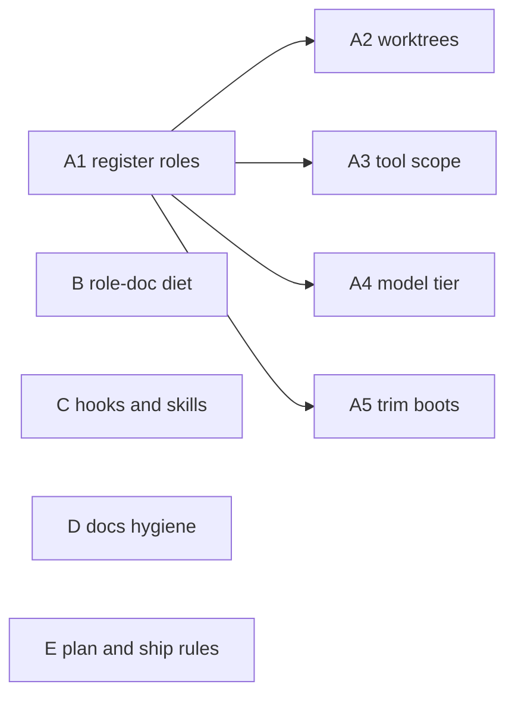

# Agent setup: context engineering pass

> Status: Current · Owner: Tech Lead · Verified: 2026-08-17

## Context

Our five dev agents (Tech Lead, Bob, UI Expert, iOS Builder, Coach) are configured by prose that
loads in full at every boot, and enforced by hope. Read against Anthropic's *Effective context
engineering for AI agents*, the bones are right — the routing hook points at the table instead of
restating it, the ADR index is an index — but four things leak: roles aren't real subagents, role
docs are filling with trivia, rules live as text instead of mechanisms, and docs never expire.

The guiding rule from the article, applied to us: **anything a hook or script can enforce is text
we can delete.** Every item below either shrinks what an agent loads or stops it re-deriving.

## The work

**A — Make the five roles real subagents.** They are read-by-convention today; Tech Lead
hand-writes a cold five-field brief per delegation and hopes the worker opens the right doc.

| | Item | Effort | Impact |
|---|---|---|---|
| A1 | Generate `.claude/agents/*.md` from `.github/agents/` — one source, Cursor still reads the originals | M | High |
| A2 | Worktree isolation per subagent — deletes three sentences of branch-hygiene scar tissue from `tech-lead.md` | L | High |
| A3 | Per-role tool allowlist, replacing one flat list in `.claude/settings.json` | L | Med |
| A4 | Model tier in frontmatter — cheap for mechanical work, strong for soul and voice. The rule exists in `tech-lead.md` and is wired to nothing | L | Med |
| A5 | Trim boot sequences: `AGENTS.md` + role doc + ADR index always; `SOUL.claude.md` (365 lines), `ios-app-spec.md`, `ios/DESIGN.md` read only when the task touches them | L | High |

**B — Role-doc diet.** `ios-builder.md` is 4.6KB of Learnings in a 6.5KB doc: 71% of what every
iOS session loads is accumulated trivia. `tech-lead.md` is 35%.

| | Item | Effort | Impact |
|---|---|---|---|
| B1 | Cap Learnings in **bytes** (~1.5KB), not entries — several run 60–80 words on one source line and pass the count check | L | High |
| B2 | Move cross-role learnings out of `tech-lead.md`. "Never `git add -A`" was learned *from a subagent* and filed where no subagent will ever read it | L | High |
| B3 | Deduplicate the shared preamble across the four role docs — same tax paid four times, already drifting | L | Low |
| B4 | Enforce the byte cap in `kdb/scripts/validate_kdb.py` | L | Med |

**C — Rules become mechanisms.** We already do this for the knowledge base (`kdb/scripts/pre-commit`,
four validate workflows) and never did it for agent behaviour.

| | Item | Effort | Impact |
|---|---|---|---|
| C1 | `PreToolUse` hook blocking `git add -A`, then delete the learning | L | High |
| C2 | `Stop` hook: checkout left on `main`, branch and commit convention checked | M | Med |
| C3 | Pre-PR doc-upkeep checklist (5 steps in `AGENTS.md`) → skill, loaded at PR time instead of turn one | M | Med |
| C4 | Soul ritual (edit layer → compose → commit both builds → `SOUL_HISTORY.md`) → skill; written out twice today, in `AGENTS.md` and `tech-lead.md` | M | Med |
| C5 | Fix the `gh` instruction — web sessions have no `gh` CLI and must use the GitHub MCP tools. Every web session burns a turn discovering this | L | High |

**D — Docs hygiene.** The instrumentation is good: 26 eng-docs, all carrying Status / Owner /
Verified, six correctly marked Historical. The problems are volume and expiry, not writing.

| | Item | Effort | Impact |
|---|---|---|---|
| D1 | Re-verify or supersede `scaling-plan.md` — "the must-read", last verified 2026-07-29, since then the SOUL split, ADRs 0022–0025 and the coach data redesign all shipped | M | High |
| D2 | Delete-on-ship for Historical eng-docs, the rule `docs/plans/` already has. Candidates: `phelps-research-notes`, `website-unification-history`, `hq-port-plan`, `hq-restructure-plan`, `m1-plan` | L | Med |
| D3 | `Verified:` staleness check in `validate_kdb.py` — warn at 60 days, fail at 90. The doc walker and path checker already exist, so this is an extension, not new machinery | L | High |
| D4 | Act on the four warnings `validate_kdb.py` already prints (dead paths in three `docs/plans/` files) and then decide: a warning nobody reads is noise — either it fails the build or the check goes | L | Med |

**E — How we plan and ship.**

| | Item | Effort | Impact |
|---|---|---|---|
| E1 | Every plan chunk declares the paths it touches; disjoint paths run in parallel. File overlap decides parallelism, not task logic — it is the same annotation the subagent brief already needs | L | High |
| E2 | Sequential small PRs off `main`. **Not stacked** — see Rejected | L | Med |
| E3 | Fixed subagent report shape: files touched, checks run *with output*, what was deliberately not done. Review still happens; it stops re-deriving what happened | L | High |
| E4 | Subagent writes progress to its plan file as it goes, so a respawn resumes instead of restarting from zero | L | Med |
| E5 | Broad searches go to the `Explore` subagent — it returns conclusions, not file dumps into the main context | L | Med |

## Sequencing

Four independent tracks. A is the only one with internal ordering.

Start with A + B: one PR each, B is nearly free and pays every session.

## Done when

1. A worker subagent boots from its own registered definition, in its own worktree, with a scoped
	tool list — and Tech Lead delegates by name, not by hand-written brief.
2. No role doc's Learnings block exceeds 1.5KB, and `validate_kdb.py` fails the build if one does.
3. `git add -A` is blocked by a hook, and the learning describing it is deleted.
4. `validate_kdb.py` fails on any `Status: Current` doc unverified for 90 days, and passes.
5. Every plan chunk names its paths, and at least one pair of chunks has run in parallel because
	they were disjoint.

## Rejected

- **Stacked PRs.** Small: yes, unreserved — the v5.8 soul trim ran five sequential PRs off `main`
	against one issue and worked well. Stacking costs us: PR B shows the wrong diff until A merges,
	review changes on A cascade upward, and CI runs against a stale base. The bottleneck is the
	athlete's review time, and stacking makes review harder exactly when A needs changes. Stack only
	when a chunk cannot be split and both are reviewed in one sitting.
- **Rewriting the 26 eng-docs.** Eats a week, produces 26 docs nobody reads. Delete about a third,
	date the rest, fix `scaling-plan.md` properly. `soul-path-to-v6.md` is the template.
- **Growing `AGENTS.md`, adding MCP servers, or a memory system.** Simplest thing that works.

## Deferred

- P3: parallel worker dispatch — nothing tells Tech Lead that Bob and UI Expert can run at once.
	Falls out of E1 for free; no separate work unless it doesn't.
- P3: issue template carries scope boundary + paths + validation, making the subagent brief a
	paste rather than a write-up. Depends on E1 landing first.
