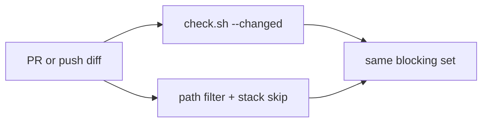

# Plan: make local and hosted gates agree

> Status: Plan · Owner: Tech Lead · Created: 2026-09-16 · Issue: #1125

## Context

Three gates disagree. `pre-push` runs all of `check.sh` (UI-heavy, no iOS). GitHub is path-filtered, and a stack rebase re-runs `macos-26` on every iOS PR. `Protect main` requires only `issue-link`, so you wait for iOS and can still merge it red.

## Goal

Cut the wait between local gate and merge. Expensive hosted jobs run once per stack for that path. The local gate runs only what the diff can fail. Hosted coverage matches `checks.conf`.

This repo **squash-merges**, so `main`'s SHA never ran on the PR. Keep `push` to `main`. Do not skip hosted UI because pre-push passed — that gap was #194. The wait we can cut is N-fold stack iOS, superseded branch runs, and path-unaware local.

## PR stack

| PR | milestone | outcome | final base | files | owner | parallel with | result |
|---|---|---|---|---|---|---|---|
| 1 | 1 | Skip iOS/Vercel when an upstack PR would also trigger that job; cancel in-progress on iOS; maps match ADR 0048 | `main` | `.github/workflows/ios-build.yml`, `ui/vercel.json`, `kdb/scripts/stack_ci_gate.py`, `platform/scripts/gen-codeowners.py`, `CODEOWNERS`, `.github/agents/cyclops.md`, `platform/scripts/boot-manifest.json`, `docs/eng-docs/ios-xcode-setup.md`, `docs/plans/ops-ci-gates.md` | Tech Lead | 2 | |
| 2 | 2 | `check.sh --changed` on pre-push; cancel in-progress on UI/platform workflows; engine script tests + `vite build` in `checks.conf` and matching workflow `paths:` (#1117); delete this plan | PR 1 | `platform/scripts/check.sh`, `platform/scripts/checks.conf`, `.githooks/pre-push`, `.github/workflows/platform-tests.yml`, `.github/workflows/ui-tests.yml`, `.github/CONVENTIONS.md`, `docs/plans/ops-ci-gates.md` | Tech Lead | 1 | |

Skip rule: skip workflow W on PR P iff some **transitive upstack** open PR also changes files matching W's paths. A docs PR on top of an iOS PR must not eat the iOS run. Fail open if GitHub is unreachable or Vercel has no `GITHUB_PAT`. `issue-link` always runs. `workflow_dispatch` stays for a middle-PR exception.

Vercel preview skip uses the same rule via `ignoreCommand`, calling GitHub with `GITHUB_PAT` (already on the Vercel project for waitlist). Missing token → build, never skip.

#1117 is this stack's second milestone, not a third PR. One new parent issue; #1117 becomes its child.

**Operating rule (no code):** resume the live worker for that area before a new spawn. Already in `.github/agents/tech-lead.md` Delegation. A fresh spawn to change three lines re-pays the code-read `ops-agent-setup.md` measured.

## Done when

1. Rebasing an all-iOS stack starts one `ios-build` run, on the highest iOS-touching PR, and cancels the superseded run on that branch.
2. An iOS-only `git push` does not run vitest; a `ui/` push still does.
3. `engine/scripts/*.test.mjs`, `engine/scripts/test_*.py`, and `npm run build` are blocking in `check.sh` and in the workflow whose `paths:` lists them.
4. `CODEOWNERS` lists `engine/lib/` and `engine/scripts/` as Bob; `platform/`, `.github/workflows/`, `shared/golden-dataset/`, and `shared/workout-library/` as Tech Lead; `shared/warm-instrument/` stays UI Expert.

## Athlete call — after PR 1

Required checks on `main`: (a) keep `issue-link` only, hosted iOS/UI informational, or (b) require the hosted checks that ran (skipped counts as success). REC: (b). Not a code PR; GitHub ruleset plus one ADR if we lock it.

## Deferred

- Eighth agent, Claude T3 harness, `eval:coach-chat` on PRs, Graphite.
- Stack-skip on `ui-tests.yml` / `platform-tests.yml` (cheap).
- `validate-soul` blocking CI until `platform/validate-soul-baseline.json` is zero.
- Leftover `ops-agent-setup.md` athlete-calls (T3, `scaling-plan.md`, Historical eng-docs).
- Skipping `push` to `main` — unsafe while squash-merge is the only merge method.
