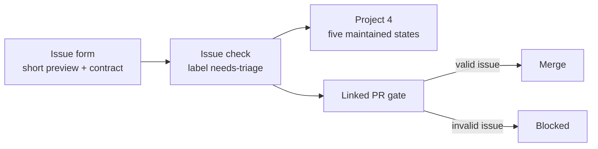
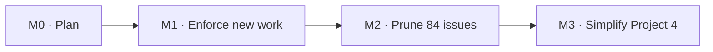

# Issue hygiene and Project 4

> Status: Current · Owner: Tech Lead · Verified: 2026-08-31 · Issue: [#747](https://github.com/sibling-shipyard/coach-hq/issues/747)

## Context

Issues are the record and [Project 4](https://github.com/orgs/sibling-shipyard/projects/4) is the
human view. Auto-add works: all 84 open issues reach the board. Intake quality and status do not:
22 bodies are empty, 66 use retired priority labels, 76 sit in Backlog, and one open issue is Done.
PR #748 also proved that `Refs: #N` does not trigger Project 4's built-in PR-link workflow.

## Decision / goal

- Title: `Area: plain-English problem or outcome`, at most 90 characters.
- Body starts with two short sentences: what changes, then why it matters. It then requires
  `## Done when` and `## Scope`.
- Exactly one `area:*` and one `type:*` label. M3 / M4 / Later is the horizon. Project `Effort`
  is Low / Medium / High. No second priority scale.
- Project status is Backlog → Ready → In progress → In review → Done. Ready is the human triage
  decision. Draft PRs set In progress; ready PRs set In review; closing the issue sets Done.
- Keep Project 4's built-in auto-add and close workflows. A narrow `PROJECT_TOKEN` updates status
  for the repo's `Refs` / `Fixes` convention, which the built-in PR-link workflow does not parse.
- GitHub cannot reject issue creation. A malformed issue gets `needs-triage`, stays out of Ready,
  and blocks any linked PR from merging. That is the enforcement boundary.

## Milestones

| ID | Size | Result |
|---|---:|---|
| M0 | S | Plan approved and #747 is the single tracking issue. |
| M1 | M | Forms and CI enforce the title, preview, headings, labels, and milestone contract. |
| M2 | M | Every open issue is closed, merged, or readable and categorized; #247 is no longer open-and-Done. |
| M3 | S | Project 4's five statuses follow issue and PR state; focused views replace unused fields. |

## PR stack

| PR | milestone | outcome | final base | files | owner | parallel with | result |
|---|---|---|---|---|---|---|---|
| P0 | M0 | executable plan | `main` | `docs/plans/ops-issue-hygiene.md` | Tech Lead | — | this PR |
| P1 | M1 | contract, forms, validator tests | `main` | `.github/ISSUE_TEMPLATE/**`, `.github/agents/issue-template.md`, `.github/workflows/sync-issue-metadata.yml`, `kdb/scripts/check_issue_contract.py`, `platform/tests/**` | Tech Lead | — | [#751](https://github.com/sibling-shipyard/coach-hq/pull/751) |
| P2 | M1 | issue-event check, PR gate, Project status sync | P1 | `.github/workflows/issue-hygiene.yml`, `.github/workflows/pr-issue-link.yml`, `kdb/scripts/check_pr_issue_link.py`, `platform/tests/**` | Tech Lead | — | in progress |
| P3 | M3 | record the final board contract, delete plan | P2 | `.github/CONVENTIONS.md`, `ROADMAP.md`, `docs/plans/ops-issue-hygiene.md` | Tech Lead | — | pending |

## Done when

1. A malformed fixture fails locally and in CI; a compliant fixture passes.
2. A linked PR cannot merge while its issue has `needs-triage` or fails the contract.
3. Draft, ready, and finishing PR events set In progress, In review, and Done as appropriate.
4. Project 4 has views for Needs triage, Now, Later, and By area; all open issues have valid status.
5. The final PR deletes this plan after durable rules move to `.github/agents/issue-template.md` and `.github/CONVENTIONS.md`.

## Deferred

- P2: cross-repository governance and automated product-priority decisions.
- Project field deletion waits for a dry-run mapping and athlete confirmation because 17 items carry Urgency today.
