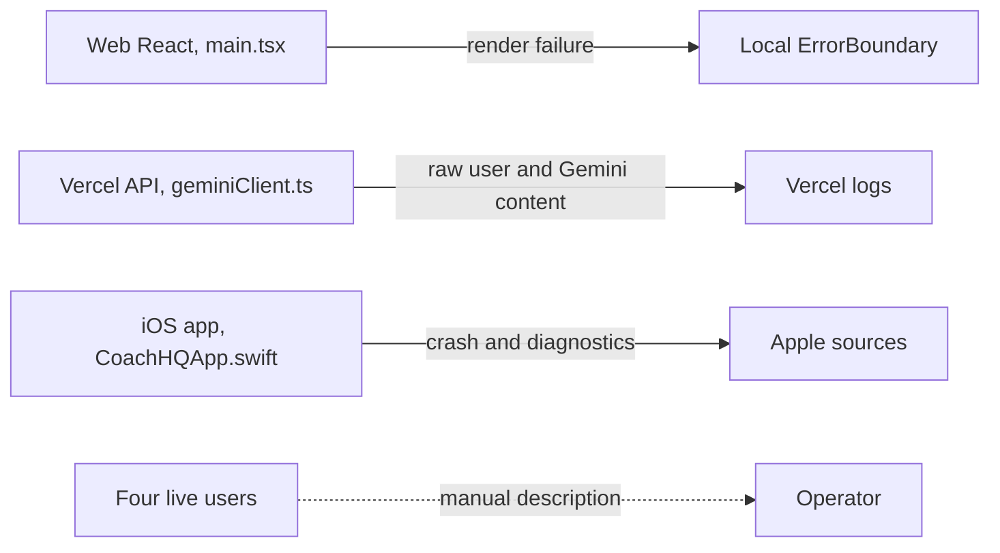
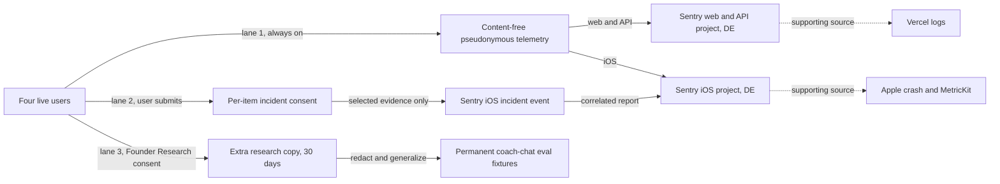

# Operations observability and consent-led rage reports

> Status: Current · Owner: Tech Lead · Verified: 2026-08-25 · Issue: [#585](https://github.com/sibling-shipyard/coach-hq/issues/585)

## Context and current state

`ui/client/src/main.tsx` and `ios/CoachHQ/CoachHQ/CoachHQApp.swift` have no monitoring hook,
while `ui/client/src/components/ErrorBoundary.tsx` only shows a local stack. Urgently,
`ui/api/coach-chat/_lib/geminiClient.ts:89` logs the raw athlete message and
`ui/api/coach-chat/_lib/geminiClient.ts:134` logs the parsed Gemini reply to Vercel. The recovery cache in
`ios/CoachHQ/CoachHQ/Services/CoachChatLocalCache.swift` is not upload consent.

## Goal state

Use Sentry Developer in DE with separate web/API and iOS projects. Vercel and Apple remain
supporting sources. Invite the four athletes separately into Founder Research. Never capture
credentials or tokens.

## Locked calls and load-bearing contracts

- **Lane 1:** allowlist normalized error code/type, operation status/duration, release/build,
  platform, and a rotated pseudonymous actor. Exclude replay, content, identity, activity payload,
  URL query, headers, bodies, credentials, and tokens at SDK and server scrubbers.
- **Lane 2:** conversation, screenshot, account/repo identity, and failing activity default off
  and each needs a toggle. The receipt holds report id, selections, purpose, policy version, and time.
- **Lane 3:** Founder Research is separate, unticked, voluntary, and revocable; declining never
  reduces service. Versioned scopes cover conversations, Gemini replies, health/activity data,
  screenshots, replays, and diagnostic events. Founding product team access only. Extra copies
  expire within 30 days; normal product data keeps its lifecycle. Leaving stops capture and allows
  deletion requests. Keep only anonymised metrics or redacted, generalized fixtures in
  `ui/api/coach-chat/_tests/coach-chat-eval/transcripts/`.
- **Consent source:** PR1 must lock the proposed user-owned
  `user_data/coach/research_consent.json`, carved by `platform/scripts/carve-skeleton.mjs`, or name
  its replacement in the ADR and short evidence LLD before PR5.
- **Correlation:** a random `operation_id` crosses client and API in `X-Operation-ID` request and
  response headers and Sentry tags. It encodes no user, repo, activity, or content.
- **iOS buffer and retention:** keep 200 content-free entries or 256 KiB, whichever comes first.
  Expire after 24 hours, clear on account exit, upload only with a report. Retain Sentry operations
  and incident attachments for at most 30 days; delete incident evidence earlier when a report closes.
- **Deferred:** replay/analytics outside Founder Research, automatic incident screenshots,
  backend replacement, and plan upgrades. Founder Research is locked.

## Six-PR execution stack

| id | files | deps | owner |
|---|---|---|---|
| PR1 · stop raw logs + lock policy | `ui/api/coach-chat/_lib/geminiClient.ts`, `kdb/decisions/`, `docs/eng-docs/`, `platform/scripts/carve-skeleton.mjs`, `ui/api/_lib/` | — | Tech Lead |
| PR2 · web + API monitoring | `ui/package.json`, `ui/client/src/main.tsx`, `ui/client/src/components/ErrorBoundary.tsx`, `ui/api/`, `ui/scripts/` | PR1 | UI Expert |
| PR3 · iOS monitoring + buffer | `ios/CoachHQ/CoachHQ.xcodeproj/project.pbxproj`, `ios/CoachHQ/CoachHQ/CoachHQApp.swift`, `ios/CoachHQ/CoachHQ/Services/`, `ios/CoachHQ/CoachHQTests/` | PR1 | iOS Builder |
| PR4 · rage report | `ios/CoachHQ/CoachHQ/Views/`, `ios/CoachHQ/CoachHQ/Services/`, `ios/CoachHQ/CoachHQTests/` | PR3 | iOS Builder |
| PR5 · Founder Research consent + rich evidence | `platform/scripts/carve-skeleton.mjs`, `ui/api/`, `ui/client/src/`, `ios/CoachHQ/CoachHQ/Services/`, `ios/CoachHQ/CoachHQ/Views/`, `ios/CoachHQ/CoachHQTests/` | PR2, PR4 | Tech Lead |
| PR6 · dashboards, alerts, runbook | `.github/workflows/`, `docs/eng-docs/`, `docs/plans/ops-observability-rage-reports.md` | PR5 | Tech Lead |

PR2 and PR3 may run in parallel after PR1. Critical path: **PR1 → PR3 → PR4 → PR5 → PR6**.

- **PR1 — M.** Exit: raw message/reply logs are gone; approved ADR/LLD and tests prove separate default-off consents, token rejection, and the carved source.
- **PR2 — M.** Exit: one web/API failure pair arrives content-free with one `operation_id`.
- **PR3 — M.** Exit: CI proves buffer limits, expiry, account clearing, redaction, and one test crash reaches Sentry.
- **PR4 — M.** Exit: the iOS Sentry SDK sends exactly the selected incident items, while cancel sends nothing.
- **PR5 — L.** Exit: an invitee can share approved evidence, revoke/delete without service loss, and a 30-day test removes extra copies.
- **PR6 — S.** Exit: alerts fire, the runbook proves deletion and source correlation, and this plan is deleted.

PRs 1–5 use `Refs: #585`; PR6 uses `Fixes: #585` and deletes this file after folding durable
privacy, retention, dashboard, and response rules into the ADR and runbook.

**Official sources:** Sentry lists the [Developer plan](https://sentry.io/pricing/), confirms it can
[use DE storage](https://sentry.io/changelog/data-storage-location-in-germany-is-generally-available/),
and documents that [attachments persist for 30 days](https://docs.sentry.io/platforms/javascript/enriching-events/attachments/).
