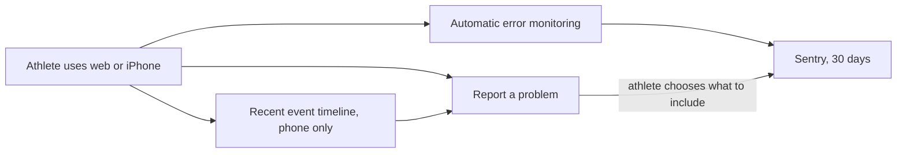
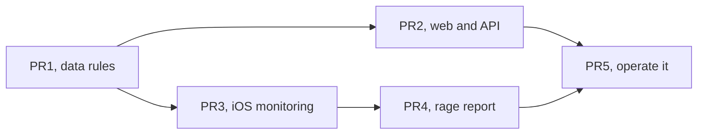

# Debugging Loop

> Status: Current · Owner: Tech Lead · Verified: 2026-08-25 · Issue: [#585](https://github.com/sibling-shipyard/coach-hq/issues/585)

## Why now

Four athletes use the product. Today, a broken experience leaves us asking what happened from
memory. The API currently writes full athlete messages and Gemini replies into Vercel logs —
a standalone hotfix ships that fix before this stack begins (`geminiClient.ts:89,134`).

We need a safe debugging trail that runs from the athlete's phone to the operator dashboard.

## What we are building

| block | what we collect | where it lives | user control |
|---|---|---|---|
| **1. Monitoring** | Crashes, error type, screen/operation, timing, app version, model and token counts. No chat or health content. | Sentry projects for web/API and iOS | Always on. |
| **2. Rage report** | The phone's recent event timeline plus any screenshot, conversation excerpt, or activity the athlete selects. | Timeline stays on the phone for 24 hours. A submitted report stays in Sentry for up to 30 days. | Nothing rich leaves the phone until the athlete taps Submit. |

Capture Gemini **token counts**. Never capture API keys, login tokens, or credentials.

## Decisions already made

1. Use Sentry Developer with data stored in Germany. Keep Vercel and Apple logs as backup sources.
2. Do not add a new data warehouse.
3. Keep at most 200 events or 256 KiB on the phone. Delete them after 24 hours or on sign-out.
4. Automatic screenshots and replay stay off.
5. PR1 defines the exact event fields and data rules before capture is enabled.

## PR stack

| id | shippable result | files | deps | owner |
|---|---|---|---|---|
| **PR1 · Small** | Lock the data rules. Define allowed event fields. | `kdb/decisions/`, `docs/eng-docs/` | — | Tech Lead |
| **PR2 · Medium** | Web and API failures appear in Sentry without message content. | `ui/client/src/`, `ui/api/`, `ui/scripts/`, `ui/package.json` | PR1 | UI Expert |
| **PR3 · Medium** | iOS crashes appear in Sentry and the phone keeps a short local timeline. | `ios/CoachHQ/CoachHQ/Services/`, `ios/CoachHQ/CoachHQ/CoachHQApp.swift`, `ios/CoachHQ/CoachHQTests/` | PR1 | iOS Builder |
| **PR4 · Medium** | "Report a problem" lets an athlete preview and submit selected evidence. | `ios/CoachHQ/CoachHQ/Views/`, `ios/CoachHQ/CoachHQ/Services/`, `ios/CoachHQ/CoachHQTests/` | PR3 | iOS Builder |
| **PR5 · Small** | Dashboards, alerts, and the operator runbook work end to end. | `.github/workflows/`, `docs/eng-docs/`, `docs/plans/ops-observability-rage-reports.md` | PR2, PR4 | Tech Lead |

PR2 and PR3 can run together. Critical path: **PR1 → PR3 → PR4 → PR5**.

## Done when

1. A web/API failure and an iOS crash show the release, operation, and timing without private content.
2. A submitted rage report joins that failure with only the evidence the athlete selected; Cancel sends nothing.
3. A new crash or repeated error triggers a Sentry alert that reaches the operator within 15 minutes, without anyone reporting it first.
4. The team can answer "what broke, for whom, and in which version?" from one dashboard and runbook.

PRs 1–4 use `Refs: #585`. PR5 uses `Fixes: #585`, moves durable rules into the ADR/runbook,
and deletes this plan.

**Sentry references:** [Developer plan](https://sentry.io/pricing/),
[German storage](https://sentry.io/changelog/data-storage-location-in-germany-is-generally-available/),
[30-day attachment retention](https://docs.sentry.io/platforms/javascript/enriching-events/attachments/).
