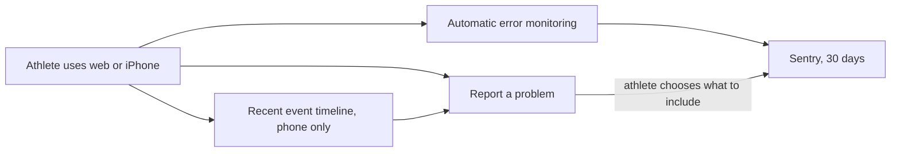
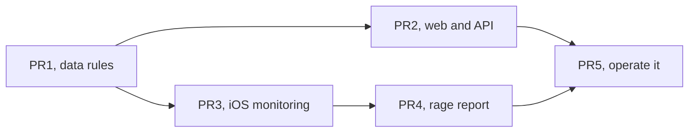

# Debugging Loop

> Status: Current · Owner: Tech Lead · Verified: 2026-08-26 · Issue: [#585](https://github.com/sibling-shipyard/coach-hq/issues/585)

## Why now

Four athletes use the product. Today, a broken experience leaves us asking what happened from
memory. Detailed request and response logs exist in Vercel, but only one operator can reach them
and they are hard to search or use from a phone. This plan makes Sentry the primary debugging trail
from the athlete's phone to the operator dashboard, with Vercel as fallback.

## What we are building

| block | what we collect | where it lives | user control |
|---|---|---|---|
| **1. Monitoring** | Crashes, error type, screen/operation, timing, app version, athlete message, Gemini reply, model and token counts. | Sentry projects for web/API and iOS, retained for up to 30 days | The four close-friends beta athletes are treated as opted in; formal controls come in #590. |
| **2. Rage report** | The phone's recent event timeline plus any screenshot, conversation excerpt, or activity the athlete selects. | Timeline stays on the phone for 24 hours. A submitted report stays in Sentry for up to 30 days. | No report attachment leaves the phone until the athlete taps Submit. |

Never capture API keys, login tokens, auth headers, or credentials in Sentry.

## Decisions already made

1. Use Sentry Developer with data stored in Germany. Keep Vercel and Apple logs as backup sources.
2. Treat the four current athletes as opted into detailed Sentry and Vercel request/response logs. [#592](https://github.com/sibling-shipyard/coach-hq/pull/592) is held until this loop works; it is not a prerequisite.
3. Sentry is the primary searchable debugging view. Vercel stays as fallback. Do not add a new data warehouse.
4. Keep at most 200 events or 256 KiB on the phone. Delete them after 24 hours or on sign-out.
5. Automatic screenshots and replay stay off. Formal Founder Research is separate [#590](https://github.com/sibling-shipyard/coach-hq/issues/590).
6. PR1 defines the exact Sentry fields and data rules before capture is enabled.

## PR stack

| PR | milestone | outcome | final base | files | owner | parallel with | done when |
|---|---|---|---|---|---|---|---|
| **PR1 · Small** | M1 · monitoring | Lock the detailed Sentry data rules and exact event fields. | `main` | `kdb/decisions/`, `docs/plans/` | Tech Lead | — | ADR and short LLD define rich fields, credential scrubbers, operation ID, retention, access, and the beta opt-in boundary. |
| **PR2 · Medium** | M1 · monitoring | Web and API failures appear in Sentry with searchable request/response context. | PR1 | `ui/package.json`, `ui/package-lock.json`, `ui/vite.config.ts`, `ui/client/src/`, `ui/api/`, `ui/scripts/`, `docs/eng-docs/env-vars.md` | UI Expert | PR3 | One web/API failure pair joins the athlete message and Gemini reply with one operation ID. |
| **PR3 · Medium** | M1 · monitoring | iOS crashes appear in Sentry and the phone keeps a short local timeline. | PR2 | `ios/CoachHQ/CoachHQ.xcodeproj/`, `ios/CoachHQ/CoachHQ/`, `ios/CoachHQ/CoachHQTests/` | iOS Builder | PR2 | CI proves buffer limits, expiry, sign-out clearing, and one test crash reaches Sentry. |
| **PR4 · Medium** | M2 · report and operate | "Report a problem" previews and submits selected evidence. | PR3 | `ios/CoachHQ/CoachHQ/Views/`, `ios/CoachHQ/CoachHQ/Services/`, `ios/CoachHQ/CoachHQTests/` | iOS Builder | — | Submit sends exactly the selected items; Cancel sends nothing. |
| **PR5 · Small** | M2 · report and operate | Dashboards, alerts, and the operator runbook work end to end. | PR4 | `.github/workflows/`, `docs/eng-docs/`, `docs/plans/` | Tech Lead | — | A production proof triggers the alert and the runbook joins the phone, API, and release evidence. |

PR2 and PR3 build together after PR1; rebase PR3 onto PR2 before review. Final merge order is
**PR1 → PR2 → PR3 → PR4 → PR5**.

## Done when

1. A web/API failure and an iOS crash show the release, operation, timing, and useful debugging context in Sentry.
2. A submitted rage report joins that failure with only the evidence the athlete selected; Cancel sends nothing.
3. A new crash or repeated error triggers a Sentry alert that reaches the operator within 15 minutes, without anyone reporting it first.
4. The team can answer "what broke, for whom, and in which version?" from one dashboard and runbook.

PRs 1–4 use `Refs: #585`. PR5 uses `Fixes: #585`, moves durable rules into the ADR/runbook,
and deletes this plan.

**Sentry references:** [Developer plan](https://sentry.io/pricing/),
[German storage](https://sentry.io/changelog/data-storage-location-in-germany-is-generally-available/),
[30-day attachment retention](https://docs.sentry.io/platforms/javascript/enriching-events/attachments/).
