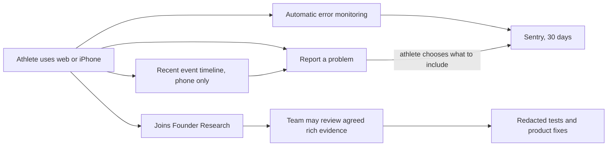
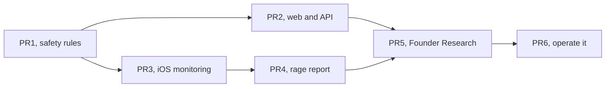

# Debugging and Founder Research

> Status: Current · Owner: Tech Lead · Verified: 2026-08-25 · Issue: [#585](https://github.com/sibling-shipyard/coach-hq/issues/585)

## Why now

Four athletes use the product. Today, a broken experience leaves us asking what happened from
memory. Worse, the API currently writes full athlete messages and Gemini replies into Vercel logs.
We need a safe debugging trail and a separate, explicit programme for richer product research.

## What we are building

| block | what we collect | where it lives | user control |
|---|---|---|---|
| **1. Monitoring** | Crashes, error type, screen/operation, timing, app version, model and token counts. No chat or health content. | Sentry projects for web/API and iOS | Always on; athlete identity is replaced by a rotating ID. |
| **2. Rage report** | The phone's recent event timeline plus any screenshot, conversation excerpt, or activity the athlete selects. | Timeline stays on the phone for 24 hours. A submitted report stays in Sentry for up to 30 days. | Nothing rich leaves the phone until the athlete taps Submit. |
| **3. Founder Research** | Agreed chat text, Gemini output, health/activity data, repo/account identity, screenshots, replay, and diagnostics. | Original chat and health files stay in the athlete repo. Submitted evidence goes to Sentry; temporary research exports expire within 30 days. | Invite-only, clearly listed, revocable, and no loss of service for saying no. |

Capture Gemini **token counts**. Never capture API keys, login tokens, or credentials.

## Decisions already made

1. Use Sentry Developer with data stored in Germany. Keep Vercel and Apple logs as backup sources.
2. Do not add a new data warehouse. Read Founder Research data from its existing athlete repo or a submitted report.
3. Keep at most 200 events or 256 KiB on the phone. Delete them after 24 hours or on sign-out.
4. Automatic screenshots and replay stay off unless that athlete joined Founder Research.
5. PR1 defines the exact event fields, consent record, deletion path, and access list before capture is enabled.

## PR stack

| id | shippable result | files | deps | owner |
|---|---|---|---|---|
| **PR1 · Medium** | Stop raw chat logging. Lock the data and consent rules. | `ui/api/coach-chat/_lib/`, `kdb/decisions/`, `docs/eng-docs/`, `platform/scripts/carve-skeleton.mjs` | — | Tech Lead |
| **PR2 · Medium** | Web and API failures appear in Sentry without message content. | `ui/client/src/`, `ui/api/`, `ui/scripts/`, `ui/package.json` | PR1 | UI Expert |
| **PR3 · Medium** | iOS crashes appear in Sentry and the phone keeps a short local timeline. | `ios/CoachHQ/CoachHQ/Services/`, `ios/CoachHQ/CoachHQ/CoachHQApp.swift`, `ios/CoachHQ/CoachHQTests/` | PR1 | iOS Builder |
| **PR4 · Medium** | “Report a problem” lets an athlete preview and submit selected evidence. | `ios/CoachHQ/CoachHQ/Views/`, `ios/CoachHQ/CoachHQ/Services/`, `ios/CoachHQ/CoachHQTests/` | PR3 | iOS Builder |
| **PR5 · Large** | Founder Research join, leave, access, and delete flows work. | `platform/scripts/carve-skeleton.mjs`, `ui/api/`, `ui/client/src/`, `ios/CoachHQ/CoachHQ/Views/`, `ios/CoachHQ/CoachHQ/Services/` | PR2, PR4 | Tech Lead |
| **PR6 · Small** | Dashboards, alerts, and the operator runbook work end to end. | `.github/workflows/`, `docs/eng-docs/`, `docs/plans/ops-observability-rage-reports.md` | PR5 | Tech Lead |

PR2 and PR3 can run together. Critical path: **PR1 → PR3 → PR4 → PR5 → PR6**.

## Done when

1. A web/API failure and an iOS crash show the release, operation, and timing without private content.
2. A submitted rage report joins that failure with only the evidence the athlete selected; Cancel sends nothing.
3. A Founder Research athlete can join, leave, and request deletion without affecting product access.
4. The team can answer “what broke, for whom, and in which version?” from one dashboard and runbook.

PRs 1–5 use `Refs: #585`. PR6 uses `Fixes: #585`, moves durable rules into the ADR/runbook,
and deletes this plan.

**Sentry references:** [Developer plan](https://sentry.io/pricing/),
[German storage](https://sentry.io/changelog/data-storage-location-in-germany-is-generally-available/),
[30-day attachment retention](https://docs.sentry.io/platforms/javascript/enriching-events/attachments/).
