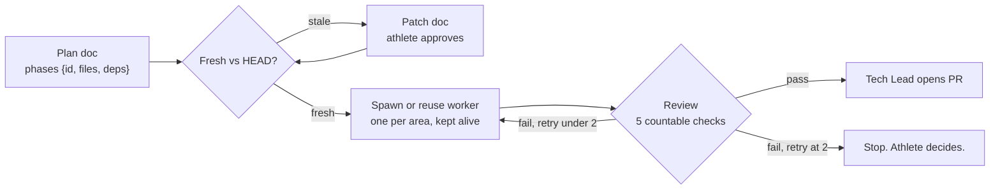

# Agent loop hardening — put the transitions in the docs, not in my head

> Status: Current · Owner: Tech Lead · Verified: 2026-08-17 · Issue: [#328](https://github.com/sibling-shipyard/coach-hq/issues/328) · Source: athlete doc "Coach HQ Agent Framework Improvements" (2026-08-17)

## The problem

The build loop works, but four of its rules live in whatever I remember that session: whether a
weeks-old plan doc still matches HEAD, what "review" actually checks, when retrying stops, and
whether a worker stayed inside its files.

The token complaint is real but mis-aimed. Measured: a Bob boot is ~2.9k tokens, UI Expert ~3.1k,
iOS Builder ~6.7k — workers read `AGENTS.md` + their role doc + the ADR index, **not** SOUL and not
`tech-lead.md`. Boot docs are under 10% of a worker's run; the tokens go into re-reading *code*,
saved by fewer spawns and one worker kept alive per area. The exception is my own boot: ~11k, of
which `platform/SOUL.claude.md` is 63% and usually unread.

## Phase 1 — the gates (docs only)

All four land in `.github/agents/tech-lead.md`, except 2.

1. **Freshness gate.** Step 0 of the execution loop: diff the plan doc against HEAD; if the files
	it names have moved, propose a doc patch and wait — before any worker spawns.
2. **Phases are typed.** An executable plan carries a `{id, files, deps}` table (`kdb/doc-style.md`),
	so briefs are sliceable and scope bleed is checkable: worker diff ⊆ `phase.files`.
3. **Review is five countable checks**, not a verdict: named checks re-run by me and green · diff ⊆
	phase files · explicit paths staged, no `git add -A` · PR file list verified against the branch ·
	doc upkeep done (eng-doc `Verified:` bumped, ADR if a locked decision moved, `SOUL_HISTORY.md` if
	a soul layer moved).
4. **Retry cap is 2.** Two worker fixes, then it stops and comes to the athlete.

## Phase 2 — the harness (config, not prose)

5. **Roles become real subagent definitions.** `.claude/agents/*.md` makes the role doc the worker's
	system prompt — loaded, not read as a turn — and frontmatter pins the model per role, so cheap
	models get used by config. `.github/agents/` stays the cross-agent source; the `.claude/` file
	imports it with `@`, as `CLAUDE.md` does with `AGENTS.md`. **Verify `@` resolves in a subagent
	file first**; if not, it carries frontmatter plus a pointer line.
6. **Repeated rules become hooks.** A `PreToolUse` hook denying `git add -A` and `git add .` ends
	that bug class and deletes a line from every brief. A rule in a hook costs zero tokens forever.
7. **Permission allowlist is stale for web.** `.claude/settings.json` allowlists `gh pr view`, `gh
	issue list`; the remote harness has no `gh` — add the `mcp__github__` read tools.
8. **One check command at the root.** Checks are scattered across `ui/` (`npm run check`, `npm
	test`), `compose-soul.mjs --check`, `validate-soul.mjs`, `kdb/scripts/validate_kdb.py`. A root
	`npm run check` makes review check 3 one command.
9. **Rituals become on-demand skills.** `platform/skills/pipeline-tools.md` isn't loaded as a skill
	— there is no `.claude/skills/`. Procedures like compose-soul → both builds → `SOUL_HISTORY.md`
	are boot-prose everyone reads when only the agent doing that job needs them. Subsumes the smaller
	trim: ~290 Tech-Lead-only words in `AGENTS.md` move to `tech-lead.md`.
10. **Learnings pass.** `tech-lead.md` `## Learnings` is at 14 against a ~15 cap — promote the
	durable ones into `docs/eng-docs/`, drop the rest.

## Phase 3 — boot cost and enforcement

11. **SOUL becomes a conditional read.** Boot step 2 in `tech-lead.md` currently reads
	`platform/SOUL.claude.md` every session — ~7k of an ~11k boot, unused on UI, CI, or infra work.
	Read it when the task touches soul layers, coach behaviour, or chat. Otherwise skip.
12. **`validate_kdb.py` learns the two rules nothing enforces.** It already lints ADR format, index
	sync and path existence. Add: a diff touching `platform/soul/*` must add a `SOUL_HISTORY.md`
	entry (`AGENTS.md` says outright the grep can't find this); and warn when a doc's `Verified:` is
	older than the newest commit touching the paths it cites — the staleness signal
	`docs/eng-docs/README.md` names but nothing computes.
13. **Session-start hook emits dynamic boot state.** `.claude/hooks/session-start.sh` injects static
	routing text; add current branch, `git log --oneline -5`, dirty files. Boot steps 1 and 5 for
	free. Local git only — no network, or every session start pays for it.
14. **PR template carries the gate.** ADR 0024 requires a PR to name the paid-check gate or say it
	was skipped and why. `.github/PULL_REQUEST_TEMPLATE.md` prompts for a test plan but not that.

## Done when

- `tech-lead.md` carries gates 1–4 and 11; `AGENTS.md` holds nothing Tech-Lead-only.
- A worker loads its role from `.claude/agents/`, `git add -A` is refused by a hook rather than by a
	sentence in a brief, and a soul-layer diff without a `SOUL_HISTORY.md` entry fails CI.
- One M3 epic runs the loop end to end — Homescreen UX (#307) fits, several `ui/` tasks against
	**one** kept-alive UI Expert — reporting spawn count and boot tokens against today's baseline
	(2.9 / 3.1 / 6.7k worker, ~11k Tech Lead).

## Deferred

- **LangGraph graphs A/B/C, `Send()`, `interrupt()`** — P3. Needs an agent runtime we don't have;
	our nodes are Claude Code sessions in a harness we don't control.
- **Cross-session perpetual worker team** (sibling sessions) — P2. Each gets its own container and
	checkout, and a long-lived transcript costs more per turn than the boot it saves. Revisit after
	the backend+DB decision (#325).
- **Postgres checkpointer** — P3. The plan doc plus the issue thread is our checkpoint, and it
	survives a cold boot better than in-process state.
