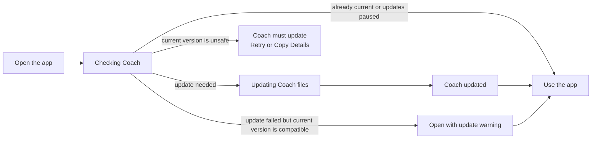
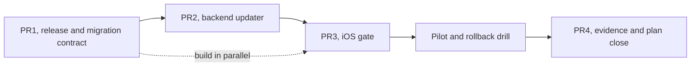

# Automatic Coach Updates

> Status: Superseded by [v2](platform-athlete-repo-updates-v2-hq-direct-push.md) (delivery
> mechanism only — the release + migration contract below still applies) · Owner: Tech Lead ·
> Verified: 2026-08-26

## Why we need this

Each athlete has a private GitHub repo containing their Coach files and training data. Today, improving
Coach HQ does not update repos that already exist. With Nats and Prateek now onboard, that would leave
different athletes running different versions and make problems hard to diagnose.

ADR 0002 keeps the repo-hosted runtime for V1, so the later database decision does not block this work.
V1 updates Coach-owned software and can run named, lossless data migrations. It never treats athlete data
as product files to replace.

## What the athlete sees

An ordinary check stays behind the launch screen. A failed check does not lock the athlete out by default:
the app opens with a warning while the installed release remains supported. Entry blocks only when the
server can prove that the app, repo, and data versions cannot safely work together.

## What happens behind the screen

The app sends the athlete's existing GitHub sign-in to Coach HQ. HQ compares only the files it owns,
checks the repo's data versions, and commits the complete safe change once. There is no operator account
or master key: Nats can only update Nats's repo and Prateek can only update Prateek's repo.

## How we diagnose a problem

| Identity | Answers | Visible in |
|---|---|---|
| App version | What is installed on the phone? | Settings |
| HQ version | What server code handled the check? | Settings and diagnostics |
| Coach-files release | What Coach software is in the repo? | Settings and the update commit |
| Data versions | Which athlete-file shapes are present? | Settings and diagnostics |
| Request ID | Which server log belongs to this attempt? | Warning screen and diagnostics |

The athlete can tap Copy Details and send these values. We can then reproduce the exact combination
without asking them to inspect GitHub.

## Adding or upgrading athlete files

Every migration declares an ID, the old and new versions, the files it may touch, and the facts it must
preserve. It validates the input, transforms fresh data in memory, validates the output, and lands with
the Coach update in one commit. The release marker records the applied migration ID. Running it twice
must make no further change.

| Example | From | To | Result |
|---|---|---|---|
| Add `latest_message.json` | File absent | Schema 1 | Create `{ "schema_version": 1, "message": null }`. |
| File already valid | Schema 1 | Schema 1 | Leave its athlete data untouched. |
| Future upgrade | Schema 1 | Schema 2 | Run one registered, preservation-tested transform. |
| File malformed | Unknown | Any | Make no commit and report the exact problem. |

New runtime code reads both the current and previous schema during rollout. Automatic migrations must be
forward-only and lossless; deleting fields, collapsing history, or reversing data requires its own reviewed
migration and rollout.

A real schema bump uses three steps: first ship readers that accept both old and new while still writing
old, then migrate and start writing new, then remove old-schema support only after every live repo passes.
The missing `latest_message.json` case can start at migration because its current reader already treats
absence as an empty schema-1 file.

## Locked safety rules

1. Ordinary releases can replace only `engine/`, `SOUL.claude.md`, `CLAUDE.md`, `.claude/`,
   `propagated/docs/`, and `.coach-engine-version`.
2. `user_data/` changes only through a named migration. Validators must prove shape, preserved IDs,
   counts, dates, and user-entered values, plus idempotency against real legacy fixtures.
3. The #454 leftovers (`sleep_log.json`, `opponent_notes.md`, archived seasons) remain untouched until
   that issue decides their ownership. The updater never silently adopts or deletes them.
4. Unexpected edits or a failed validator produce no write. Retry starts again from fresh GitHub HEAD.
5. Coach files, migrated data, and the release marker land in one atomic commit.
6. The existing Global Config holds `repo_update_mode=off | observe | enforce`; a missing or unreadable
   value defaults to `off`. The app bundles its supported ranges and caches the last verified repo/data
   versions. `off` and a network failure allow entry only when those known versions remain compatible;
   unknown or explicit incompatibility blocks entry.

## If a release is bad

1. Set `repo_update_mode` to `off` so compatible athletes can enter while rollout stops.
2. Publish the last compatibility release's Coach content as a new, higher release and apply it as a new
   commit on next contact. A rollback target must already read the migrated schema.
3. Never rewrite Git history or reverse-migrate athlete data. Any data repair ships as another forward migration.
4. Exercise this path on Akash's repo before Nats or Prateek receive the first enforced release.

## Delivery and rollout

| milestone | size | owner | done when |
|---|---:|---|---|
| M0, release contract | M | Tech Lead | A release contains only managed software plus registered migrations, classifies #454 leftovers, and cannot change silently. |
| M1, server updater | M | UI Expert | Safe code and data changes make one commit; unsafe changes make none; kill switch, degraded mode, and rollback release are proven. |
| M2, app gate | M | iOS Builder | The app shows current, updated, warning, incompatible, retry, and Copy Details states before entry. |
| M3, rollout | S | Tech Lead | Akash passes update, no-op, degraded, and rollback drills before Nats and Prateek receive the release. |

Critical path: release contract → server updater → app gate → Akash → Nats → Prateek.

## Deferred

- Workflow delivery becomes V2 when the first production fix cannot be delivered through the engine
  scripts called by existing workflows. V2 must add GitHub App Workflows permission and athlete re-consent.
- Background updates without athlete contact remain out of scope.
- Moving athlete data away from GitHub remains separate research in `docs/plans/backend-decision.md`.

## PR stack

PR2 and PR3 can be built together once PR1 fixes the contract. Before review, PR3 is rebased onto PR2 so
the code merges as one linear stack.

| PR | milestone | outcome | final base | files | owner | parallel with | done when |
|---|---|---|---|---|---|---|---|
| PR1 | M0 | Define Coach releases and forward migrations. | `main` | `platform/athlete-releases/**`, `platform/athlete-migrations/**`, `platform/scripts/carve-skeleton.mjs`, `platform/scripts/build-athlete-release.mjs`, `platform/tests/test-athlete-release.mjs`, `ui/scripts/build-repo-release.mjs`, `ui/package.json` | Tech Lead | none | The bundle preserves modes, rejects unversioned change, enforces compatibility-before-migration, validates invariants and idempotency, and records #454 paths as preserved. |
| PR2 | M1 | Add the authenticated updater, kill switch, and rollback release. | PR1 | `ui/api/repo-update.ts`, `ui/api/repo-update/**`, `ui/api/_lib/githubGitData.ts`, `ui/api/_lib/_tests/githubGitData.test.ts`, `docs/eng-docs/env-vars.md` | UI Expert | PR3 | Tests prove current, update, migration, degraded, incompatible, deletion, drift, conflict retry, kill switch, diagnostics, rollback, and forbidden paths. |
| PR3 | M2 | Gate app entry only on proven incompatibility. | PR2 | `ios/CoachHQ/CoachHQ/Services/RepoUpdateAPIClient.swift`, `ios/CoachHQ/CoachHQ/Services/RepoUpdateManager.swift`, `ios/CoachHQ/CoachHQ/Services/AppRouter.swift`, `ios/CoachHQ/CoachHQ/CoachHQApp.swift`, `ios/CoachHQ/CoachHQ/Views/SettingsView.swift`, `ios/CoachHQ/CoachHQTests/RepoUpdateManagerTests.swift` | iOS Builder | PR2, after PR1 | The app cannot enter on incompatibility, but opens with a visible warning on a compatible update failure or kill switch. |
| PR4 | M3 | Record live and rollback evidence, then close the plan. | PR3, then retarget to `main` | `docs/eng-docs/provision-runbook.md`, `docs/plans/platform-athlete-repo-updates-v1.md` | Tech Lead | none | Akash, Nats, and Prateek each update once and then no-op; rollback drill passes; #327 closes; this plan is deleted. |

PR1–PR3 use `Refs: #327`. PR1 also references #419 and #454; #419 closes when the migration policy
lands, while #454 stays open. PR4 remains draft until live checks finish, then uses `Fixes: #327`.

The endpoint returns `current | updated | degraded | incompatible` plus request ID, HQ deploy, old and
new Coach release, data versions, applied migration IDs, and commit. Release records retain file hashes,
executable modes, the current and previous payloads, supported schema ranges, and legacy baselines.
