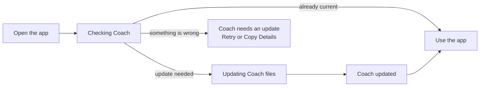
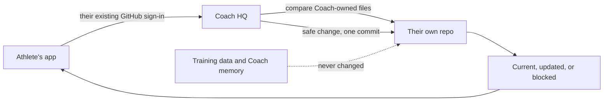
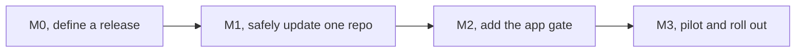

# Automatic Coach Updates

> Status: Current · Owner: Tech Lead · Verified: 2026-08-25

## Why we need this

Each athlete has a private GitHub repo containing their Coach files and training data. Today, improving
Coach HQ does not update repos that already exist. With Nats and Prateek now onboard, that would leave
different athletes running different versions and make problems hard to diagnose.

V1 updates Coach-owned software only. It never changes an athlete's training history, Coach memory,
weekly plan, workout templates, or generated dashboard data.

## What the athlete sees

An ordinary check stays behind the launch screen. When files change, the athlete sees a short update
message. If the update cannot finish, the app does not open until they retry successfully.

## What happens behind the screen

HQ never receives a key that can open everybody's repos. Each update uses the signed-in athlete's own
access, so Nats can only update Nats's repo and Prateek can only update Prateek's repo.

## How we diagnose a problem

| Identity | Answers | Visible in |
|---|---|---|
| App version | What is installed on the phone? | Settings |
| HQ version | What server code handled the check? | Settings and diagnostics |
| Coach-files release | What Coach files are in this repo? | Settings and the update commit |
| Request ID | Which server log belongs to this attempt? | Error screen and diagnostics |

The athlete can tap Copy Details and send these values. We can then reproduce the exact combination
without asking them to inspect GitHub or describe technical steps.

## Locked safety rules

1. Only the files that make Coach run can update. The allowed list is fixed and tested.
2. Training history, Coach memory, weekly plans, dashboard data, workflows, templates, plugins, and
   migrations are outside V1.
3. If a Coach-owned file was changed unexpectedly, stop and show the blocked screen. Never overwrite it.
4. All changed files and the new version land in one commit. Half an update is impossible.
5. A rollback restores the previous content through a new release. Git history is never rewritten.
6. A server or GitHub outage blocks entry in V1. This is an accepted first-version tradeoff.

## Delivery and rollout

| milestone | size | owner | done when |
|---|---:|---|---|
| M0, release | M | Tech Lead | A release contains only the allowed files and cannot change silently. |
| M1, server update | M | UI Expert | Current repos no-op, safe changes make one commit, and unsafe changes make no commit. |
| M2, app gate | M | iOS Builder | The app shows checking, updated, blocked, retry, and diagnostic states before entry. |
| M3, rollout | S | Tech Lead | Akash's repo passes first, followed by Nats and Prateek. Each second launch makes no commit. |

Critical path: release → server update → app gate → Akash → Nats → Prateek.

## Deferred

- GitHub workflow updates need extra permission and athlete approval, so they stay manual for now.
- Background updates without the athlete opening the app remain out of scope.
- Moving athlete data away from GitHub remains separate research in `docs/plans/backend-decision.md`.

## Build handoff

This section is for the engineers implementing the plan.

| id | files | deps | owner |
|---|---|---|---|
| M0 | `platform/athlete-releases/**`, `platform/scripts/carve-skeleton.mjs`, `platform/scripts/build-athlete-release.mjs`, `platform/tests/test-athlete-release.mjs`, `ui/scripts/build-repo-release.mjs`, `ui/package.json` | none | Tech Lead |
| M1 | `ui/api/repo-update.ts`, `ui/api/repo-update/**`, `ui/api/_lib/githubGitData.ts`, `ui/api/_lib/_tests/githubGitData.test.ts`, `docs/eng-docs/env-vars.md` | M0 | UI Expert |
| M2 | `ios/CoachHQ/CoachHQ/Services/RepoUpdateAPIClient.swift`, `ios/CoachHQ/CoachHQ/Services/RepoUpdateManager.swift`, `ios/CoachHQ/CoachHQ/Services/AppRouter.swift`, `ios/CoachHQ/CoachHQ/CoachHQApp.swift`, `ios/CoachHQ/CoachHQ/Views/SettingsView.swift`, `ios/CoachHQ/CoachHQTests/RepoUpdateManagerTests.swift` | M1 | iOS Builder |
| M3 | `docs/eng-docs/provision-runbook.md`, issue `#327`, this plan | M2 | Tech Lead |

The server contract is versioned. It returns current, updated, or blocked plus the request ID, HQ deploy,
old and new Coach-files release, and resulting commit. Release records preserve file hashes and executable
modes; older repos update only when their Coach-owned files still match their recorded starting version.
The managed paths are `engine/`, `SOUL.claude.md`, `CLAUDE.md`, `.claude/`, `propagated/docs/`, and
`.coach-engine-version`.
