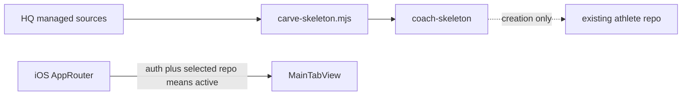
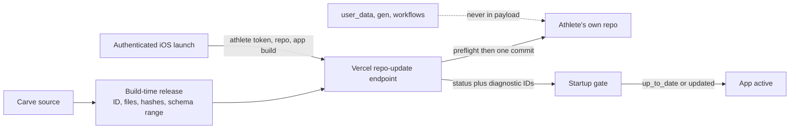
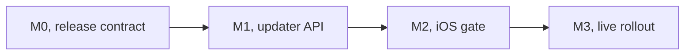

# Athlete Repo Updates V1

> Status: Current · Owner: Tech Lead · Verified: 2026-08-25

## Context

Nats and Prateek now have live athlete repos, while `platform/scripts/carve-skeleton.mjs` only changes
new repos. V1 keeps the repo-hosted runtime from ADR 0002, but never gives HQ a master key: every read
and write still uses that athlete's GitHub token per ADR 0001. Permanent non-goals are workflows,
`user_data/`, `gen/`, templates, plugins, and data migrations.

## Current state

`ui/api/auth/_lib/resolve-auth.ts` already accepts the refreshed iOS bearer token plus
`X-Coach-Repo`, and `ui/api/_lib/githubGitData.ts` already makes one atomic multi-file commit.
`ios/CoachHQ/CoachHQ/Services/AppRouter.swift` has no repo-readiness input, Settings shows only the app
build, and `.coach-engine-version` carries an HQ SHA rather than a controlled repo release.

## Goal state

The normal no-op check stays under the launch screen. A real update shows `Updating Coach files`, then
`Coach updated`; any failure blocks entry with Retry and Copy Diagnostics. Settings always shows app
version/build, backend deploy SHA, Coach-files release, last check, and request ID.

## Locked decisions and contract

1. Check every authenticated cold launch before `.active`; V1 blocks on backend, GitHub, drift, or
   schema failure. `AppRouter` continues deriving state, now from auth plus a published repo-update state.
2. The server owns the payload. iOS sends `X-Coach-App-Version` and `X-Coach-App-Build`; it never ships
   files or receives a reusable HQ credential.
3. Managed paths are `engine/`, `SOUL.claude.md`, `CLAUDE.md`, `.claude/`, `propagated/docs/`, and
   `.coach-engine-version`. A deletion is legal only when the previous manifest owned that path.
4. Each release has a controlled ID, manifest SHA, file hashes and modes, supported data-schema range,
   and HQ SHA. The backend identity is separately `VERCEL_GIT_COMMIT_SHA`; a deploy does not bump the
   repo release. Executable hooks and wrappers must remain executable.
5. The endpoint returns contract version, `up_to_date | updated | blocked`, request ID, backend SHA,
   from/to repo releases, manifest SHA, and commit SHA. Logs add duration and a stable error code, never
   tokens or file contents.
6. Legacy `hq_sha` markers are accepted only when their managed tree matches a generated baseline from
   that HQ commit. Drift blocks with no write. Retry reruns preflight against fresh HEAD; rollback ships
   the prior content as a new release and never rewrites history.

## Milestones

| id | size | files | deps | owner | done when |
|---|---:|---|---|---|---|
| M0 | M | `platform/athlete-releases/**`, `platform/scripts/carve-skeleton.mjs`, `platform/scripts/build-athlete-release.mjs`, `platform/tests/test-athlete-release.mjs`, `ui/scripts/build-repo-release.mjs`, `ui/package.json` | none | Tech Lead | The build bundles the exact managed carve subset, rejects payload drift without a release bump, and reproduces supported legacy baselines. |
| M1 | M | `ui/api/repo-update.ts`, `ui/api/repo-update/**`, `ui/api/_lib/githubGitData.ts`, `ui/api/_lib/_tests/githubGitData.test.ts`, `docs/eng-docs/env-vars.md` | M0 | UI Expert | Tests prove no-op, update, deletion, executable modes, drift, schema block, conflict retry, forbidden paths, diagnostics, and one atomic commit. |
| M2 | M | `ios/CoachHQ/CoachHQ/Services/RepoUpdateAPIClient.swift`, `ios/CoachHQ/CoachHQ/Services/RepoUpdateManager.swift`, `ios/CoachHQ/CoachHQ/Services/AppRouter.swift`, `ios/CoachHQ/CoachHQ/CoachHQApp.swift`, `ios/CoachHQ/CoachHQ/Views/SettingsView.swift`, `ios/CoachHQ/CoachHQTests/RepoUpdateManagerTests.swift` | M1 | iOS Builder | The app cannot enter `.active` before success and renders checking, updated, blocked, retry, and diagnostic states. |
| M3 | S | `docs/eng-docs/provision-runbook.md`, issue `#327`, this plan | M2 | Tech Lead | Owner repo updates once and then no-ops, followed by Nats and Prateek; all three commits touch only managed paths, then this plan is deleted. |

Critical path: M0 → M1 → M2 → owner repo → Nats → Prateek.

## Risks and deferred

- Strict gating makes a Vercel or GitHub outage an app outage; that is accepted for V1.
- Workflow delivery stays deferred because it requires added GitHub App permission and athlete approval.
- Background fan-out and a master GitHub App private key stay rejected; updates happen only on athlete contact.
- Moving athlete data off GitHub remains separate research in `docs/plans/backend-decision.md`.
